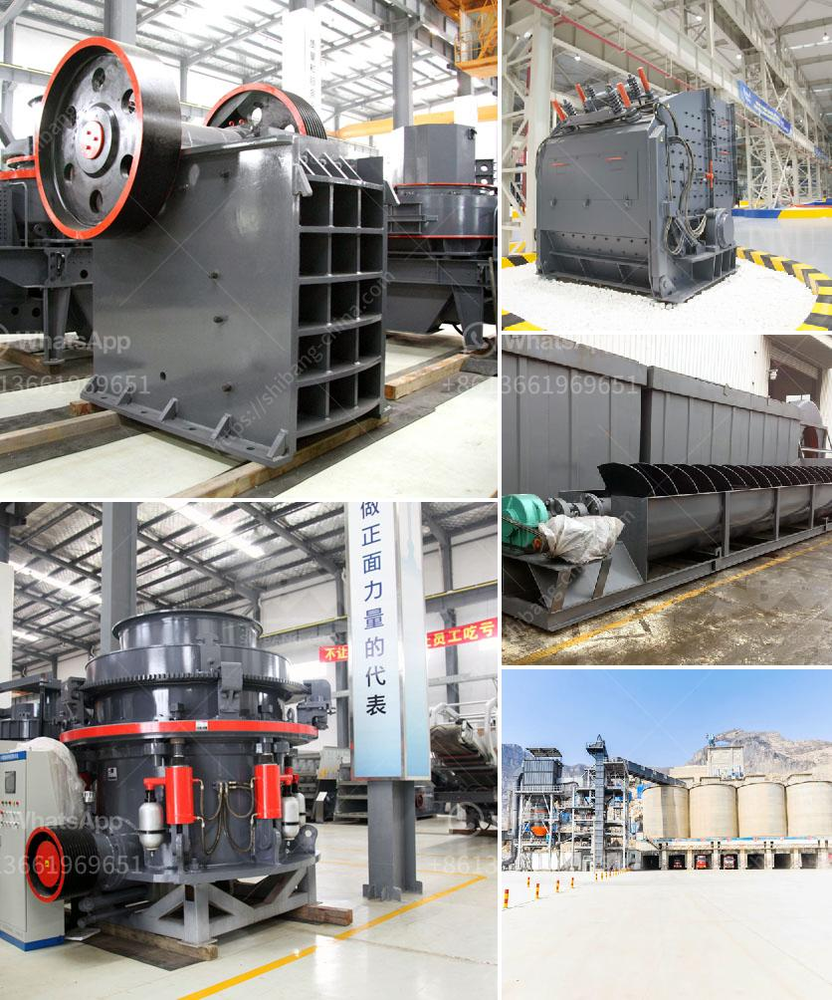

<h3>100tph stone crusher sale in south africa</h3>
The South Africa 100tph stone crusher sale has been a strong position within the global economy. South Africa has been considered to be the gateway to Africa where various minerals can be found. The economic growth of South Africa has been the highest in the world, and stone crusher is the key one to realize the investment value.

When considering the investment of the crushing plant, the key factor of South Africa 100tph stone crusher sale and price estimation is the investment of the crushing project. In order to facilitate the comparison of different crushing project solutions, we have selected several representative cases of 100tph stone crusher project in South Africa.

The crushing production line configured by our company has reasonable investment and high efficiency in production line configuration. This 100tph stone crusher plant has wide application in artificial sand production line, iron ore processing line, granite processing line and so on.

South Africa ore processing plant, we will adopt the purified pyrite, chalcopyrite, natural gold mining equipment. First of all, gold ore mining will through the process of crushing. In the process of gold ore of coarse crushing, jaw crusher is mainly used as gold ore crusher. After coarse crushing process, you can get concentrated gold ore, more than 10 mm in diameter materials with standard CS series cone crusher and the screening machine.

Gold ore crusher used in South Africa has also been used as a main crushing machine in gold ore crushing industry. Jaw crusher is the most common type of gold ore mining crushing equipment. Jaw crusher can reach four to six crushing ratio.

Therefore, jaw crusher is widely used in crushing high hardness, medium-hard and soft rock, such as slag, construction materials, marble and other minerals.

Gold ore mobile crusher is a new portable type gold stone crushing machine. Gold ore mobile crusher can remove barriers broken place and situation, and provide customers high efficiency, low capital projects factory. To the client, mobile crushing station is the best choice for South Africa gold mining line. In gold mining line, it involves gold ore crushing, screening, grinding, washing and so on.

Gold ore crusher is mainly used for initial size loading. Jaw crusher can be decomposed into 150 mm or 6 inches, and then gold ore belt conveyor will transport gold ore rock materials to the gold ore vibrating screen which will send a large rock to the secondary crusher. Secondary crushing machine refers to the impact crusher and cone crusher.

When clients choose these two machines, the price will be higher. When dealing with the same amount of materials, it only needs a small investment. The wear parts of impact crusher and cone crusher are usually less worn than hammer crusher.

The stone is distributed in South Africa, Vietnam, Ghana, Sudan, etc. There are many jaw crusher suppliers, cone crusher manufacturers, hammer crusher, sand making machine manufacturers, equipment. The list of these stone crusher suppliers and dealers is quite large, mainly due to the high degree of fragmentation, crushing stone, crusher, sales, stone crusher sale, in many countries.

More importantly, the use of mobile crusher plant can protect the environment and decrease noise and dust pollution in the production process.

1. crusher machine: The crushing system of the mobile crushing station is the heart of the whole set of equipment. Construction site of mobile crusher plant:
<h3>Contact us</h3><ul><li><strong>Whatsapp:&nbsp;<a href="https://wa.me/8613661969651">+8613661969651</a></strong></li><li><a href="https://swt.shibang-china.com/?git&amp;zhl&amp;100tph stone crusher sale in south africa"><strong>Online Service(chat now)</strong></a></li></ul><h3>Related</h3><ul><li><a href='high pressure grinding mill.md'>high pressure grinding mill</a></li><li><a href='kenya stone crusher is made.md'>kenya stone crusher is made</a></li><li><a href='cement mobile laying block making machine.md'>cement mobile laying block making machine</a></li><li><a href='industrial mineral silica sand.md'>industrial mineral silica sand</a></li><li><a href='stone crusher kapasitas.md'>stone crusher kapasitas</a></li></ul>