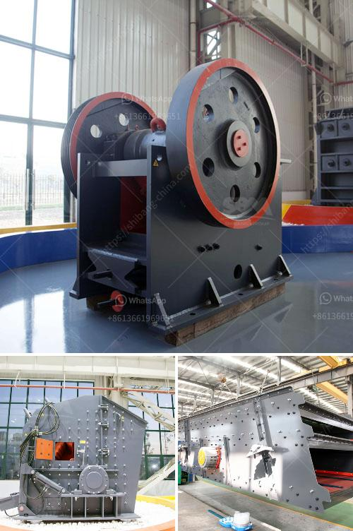

<h3>150 ton per hour gold wash plant</h3>
In the world of gold mining, where profit margins are often razor-thin and productivity is crucial, implementing a reliable and efficient gold wash plant is essential. One such advanced solution is the 150-ton per hour gold wash plant, designed to make the gold recovery process more efficient and increase profitability for miners. In this article, we will explore the key features and benefits of this cutting-edge equipment.

The 150-ton per hour gold wash plant is a highly versatile and robust solution that offers exceptional gold recovery rates. It utilizes a bumper trommel design and features a high-capacity screening system combined with a robust scrubbing and washing mechanism. These features ensure efficient separation of gold particles from gravel, clay, and other impurities found in the ore.

The wash plant incorporates a hopper at the beginning of the process, where excavated material is dumped. The material then moves onto a feeder, which evenly distributes it onto the screen deck, allowing different-sized particles to be separated. The oversized material flows into the scrubber section, where water and rotating paddles agitate the material, breaking up clay and releasing gold particles. Following this, the material moves to the next stage of the process, a trommel drum fitted with a screen mesh, which further classifies and washes the material.

1. Increased Productivity: With a processing capacity of 150 tons per hour, this gold wash plant significantly enhances productivity compared to traditional placer mining methods. Miners can process more materials in less time, enabling them to extract larger quantities of gold and increase their overall profitability.

2. Improved Efficiency: The advanced design of the wash plant ensures efficient gold recovery rates, reducing the loss of fine gold particles during the washing and separation process. Miners can recover a higher percentage of gold, thus maximizing their returns.

3. Versatility: The 150-ton per hour gold wash plant is suitable for various gold mining applications, including placer mining and hard rock mining. It can be used in conjunction with other mining equipment, such as trommels, sluices, and conveyors, to create a complete gold recovery system tailored to specific site requirements.

4. Easy to Operate: This wash plant is designed with simplicity in mind, enabling miners to operate the equipment with ease. Its user-friendly control panel allows for efficient monitoring and adjustment of the various parameters, ensuring optimal performance.

The 150-ton per hour gold wash plant is a game-changer for gold miners around the world. Its cutting-edge design, high processing capacity, and efficiency improvements offer miners the opportunity to significantly increase their gold recovery rates and overall profitability. By choosing this advanced wash plant, miners can extract more gold in less time, all while minimizing operational costs and maximizing returns on their investment.
<h3>Contact us</h3><ul><li><strong>Whatsapp:&nbsp;<a href="https://wa.me/8613661969651">+8613661969651</a></strong></li><li><a href="https://swt.shibang-china.com/?git&amp;zhl&amp;150 ton per hour gold wash plant"><strong>Online Service(chat now)</strong></a></li></ul><h3>Related</h3><ul><li><a href='kaolin portable crusher provider in nigeria.md'>kaolin portable crusher provider in nigeria</a></li><li><a href='conveyor belt design manual pdf.md'>conveyor belt design manual pdf</a></li><li><a href='crusher and screen for sale philippines.md'>crusher and screen for sale philippines</a></li><li><a href='crushing complete crushing plant 150tph 200tph.md'>crushing complete crushing plant 150tph 200tph</a></li><li><a href='zircon sand mining companies list in canada.md'>zircon sand mining companies list in canada</a></li></ul>