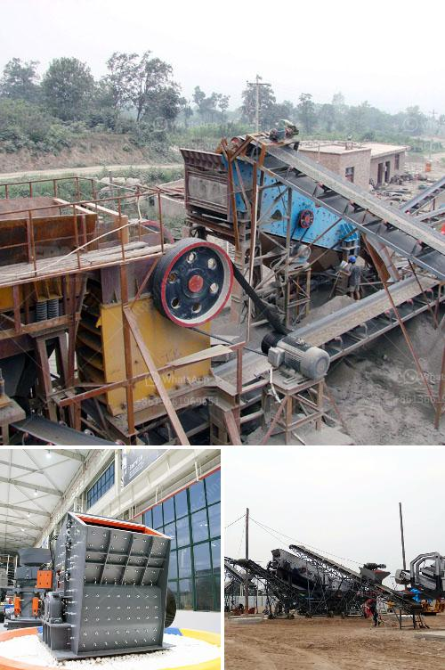

<h3>16 mesh silica sand crusher</h3>
16 mesh silica sand crusher is a high-performance equipment designed and developed by XSM Heavy Industry. It is widely used in the construction, mining, metallurgical and other industries. It is necessary for the crushing process of various materials and plays an important role in the sand making production line.

Silica sand, also known as quartz sand, has a high melting point and hard texture. It is widely used in ceramics, refractories, metallurgy, construction, chemicals, plastics, rubber, abrasives, glass and other industries. As the demand for silica sand continues to increase, the need for efficient and high-quality crushers has become a major concern for customers.

The 16 mesh silica sand crusher adopts a high chromium alloy material with a good wear resistance, which effectively ensures the service life of the equipment. The equipment is highly efficient, low in energy consumption, and has a high crushing ratio, which effectively reduces the silicon content in the finished product and improves the application value of the product.

The 16 mesh silica sand crusher has a long crushing chamber which delivers aggressive crushing action to nip even hard stone for quick processing and consistent performance. When fed into the crusher, the large stones are evenly crushed in the crushing chamber with the help of a rotating hammer and a crushing tooth plate, achieving the purpose of crushing.

In addition, the 16 mesh silica sand crusher can be installed with a hopper and automatic feeding mechanism, which makes the production process more convenient and improves efficiency. It is also equipped with a hydraulic system, which can effectively solve the bearing heating problem caused by frequent shutdowns and prolong the service life of the equipment.

Overall, the 16 mesh silica sand crusher is a high-quality crushing equipment that is reliable in operation, energy-efficient, and environmentally friendly. It is an ideal choice for customers in the sand and gravel industry. With the continuous expansion of the market, the application range of silica sand will continue to expand, and the demand for high-quality and efficient crushers will also increase. XSM Heavy Industry will continue to strive for excellence and provide customers with better crushing equipment.
<h3>Contact us</h3><ul><li><strong>Whatsapp:&nbsp;<a href="https://wa.me/8613661969651">+8613661969651</a></strong></li><li><a href="https://swt.shibang-china.com/?git&amp;zhl&amp;16 mesh silica sand crusher"><strong>Online Service(chat now)</strong></a></li></ul><h3>Related</h3><ul><li><a href='coal mill in malaysia.md'>coal mill in malaysia</a></li><li><a href='argentine hammer mill.md'>argentine hammer mill</a></li><li><a href='petroleum coke process.md'>petroleum coke process</a></li><li><a href='kaolin grindig companies in nigeria.md'>kaolin grindig companies in nigeria</a></li><li><a href='portable stone crusher for sale india price.md'>portable stone crusher for sale india price</a></li></ul>