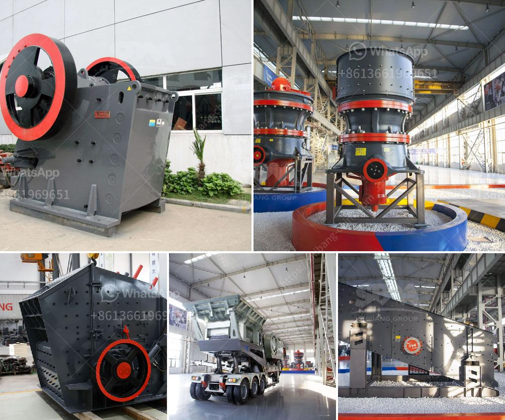

<h3>200tph cone crusher</h3>
The cone crusher is a crushing machine that uses compressive force to crush materials. It is widely used in metallurgy, construction, mining and other industries, and can be used as an intermediate crushing or fine crushing equipment for many types of ores and rocks.

One of the outstanding features of the cone crusher is its high efficiency, with capacity up to 200 tph. This makes it a great choice for crushing hard and abrasive materials. In addition, the cone crusher also has low energy consumption, compared to other crushing equipment.

The 200 tph cone crusher is equipped with advanced spring safety system that ensures efficient and safe operation. Its hydraulic system also allows automatic adjusting of the crusher settings to compensate for any variations in the feed material and to ensure the quality of the final product.

Furthermore, the 200 tph cone crusher is designed to be user-friendly and easy to maintain. It has a durable construction that results in long-lasting performance and requires minimal maintenance. This reduces downtime and improves the overall productivity of the crushing operation.

The 200 tph cone crusher is also equipped with an overload protection system, which helps ensure that the machine and its components are protected from damage due to overloading. This feature is especially important in applications where the crusher is used for crushing hard and abrasive materials.

In terms of size and weight, the 200 tph cone crusher is quite compact and portable. Its small footprint allows it to be easily transported and installed in tight spaces. This makes it a great choice for both stationary and mobile crushing applications.

The 200 tph cone crusher is available in two different models, the standard and the short-head. Each model has different specifications and capabilities, so users can choose the one that best meets their specific needs. Both models are equipped with efficient crushing chambers and high crushing forces, which results in high quality and consistent final products.

In conclusion, the 200 tph cone crusher is a reliable and efficient crushing machine that is ideal for demanding crushing applications. It is equipped with high-quality components and advanced technology that provide unparalleled performance. Whether used for intermediate or fine crushing, the 200 tph cone crusher is designed to ensure maximum productivity and minimal downtime.
<h3>Contact us</h3><ul><li><strong>Whatsapp:&nbsp;<a href="https://wa.me/8613661969651">+8613661969651</a></strong></li><li><a href="https://swt.shibang-china.com/?git&amp;zhl&amp;200tph cone crusher"><strong>Online Service(chat now)</strong></a></li></ul><h3>Related</h3><ul><li><a href='list of used machines coal mining.md'>list of used machines coal mining</a></li><li><a href='gemstone mining crusher in zambia.md'>gemstone mining crusher in zambia</a></li><li><a href='i need for a stone crushing plant.md'>i need for a stone crushing plant</a></li><li><a href='used quarry machine germany.md'>used quarry machine germany</a></li><li><a href='standard conveyor belts.md'>standard conveyor belts</a></li></ul>