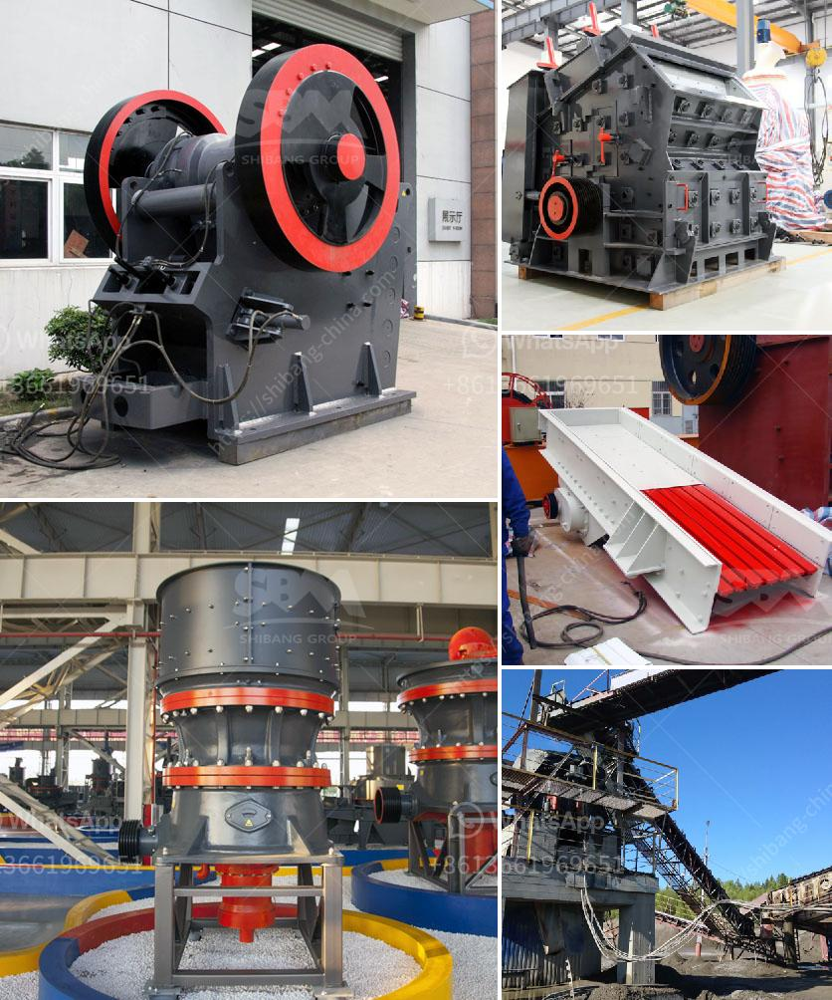

<h3>200tph old cone crusher plant india hyderabad</h3>
The cone crusher plant is widely used in stone mining, metallurgy industry, building material, highway, railway and chemical industry for the purpose of crushing and mining stones. With years of experience in manufacturing advanced cone crusher plant technologies, Aimix has been developing and optimizing its machinery for many years. As a result, we have achieved great success in designing and producing good quality cone crushers for various applications.

Among the many cone crusher manufacturers in India, Aimix's cone crusher plants are widely considered to be some of the best. Aimix has become the preferable choice for many firms due to its innovative designs. Aimix's cone crushers are characterized by their heavy-duty design and are therefore very robust and durable. They also have a very large feeding capacity and high crushing efficiency. In addition to this, the cone crusher plant features a unique combination of crusher speed, throw, and cavity design.

One of the unique features of the cone crusher plant is the remote intelligence system, which can monitor and operate the whole system from a remote computer. This eliminates the need for ice plants to have their operators on-site, saving time and money. The remote intelligence system also allows for the adjustment of the crusher settings remotely, maximizing operational efficiency and reducing downtime.

The cone crusher plant's hydraulic system is another key feature that allows adjustment of the crusher settings while crushing, which dramatically increases productivity and lowers costs. The hydraulic system also allows for easy and safe maintenance, reducing downtime and ensuring efficient operation.

The cone crusher plant is available in different sizes and configurations to meet the requirements of different applications. The primary crusher is designed with a large feed opening and a sturdy structure to ensure reliable operation. The secondary crusher is designed with a special crushing chamber that helps to obtain even smaller crushed stones.

In addition to its great performance, the cone crusher plant is also environmentally friendly, as it features a dust suppression system that reduces dust emissions during the crushing process. This is particularly important in urban areas where air pollution is a concern.

Furthermore, Aimix offers excellent after-sales service and technical support to its customers. With a wide network of service technicians and spare parts availability, Aimix ensures that its cone crusher plants are always well maintained and operating at their best.

In conclusion, the 200tph old cone crusher plant in India Hyderabad is highly efficient and robust, equipped with intelligent automation systems, which greatly improve operational efficiency and reduce downtime. With its excellent performance, reliability, and environmentally friendly features, this cone crusher plant is a great investment for any ice plant owner in Hyderabad. Aimix's cone crusher plants are highly recommended for their high quality, advanced technology, and excellent after-sales service.
<h3>Contact us</h3><ul><li><strong>Whatsapp:&nbsp;<a href="https://wa.me/8613661969651">+8613661969651</a></strong></li><li><a href="https://swt.shibang-china.com/?git&amp;zhl&amp;200tph old cone crusher plant india hyderabad"><strong>Online Service(chat now)</strong></a></li></ul><h3>Related</h3><ul><li><a href='belt conveyor belt suppliers in oman.md'>belt conveyor belt suppliers in oman</a></li><li><a href='crushing and screening of manganese ore.md'>crushing and screening of manganese ore</a></li><li><a href='high pressure grinding mill.md'>high pressure grinding mill</a></li><li><a href='cost of copper ore processing plant.md'>cost of copper ore processing plant</a></li><li><a href='roller crusher china.md'>roller crusher china</a></li></ul>