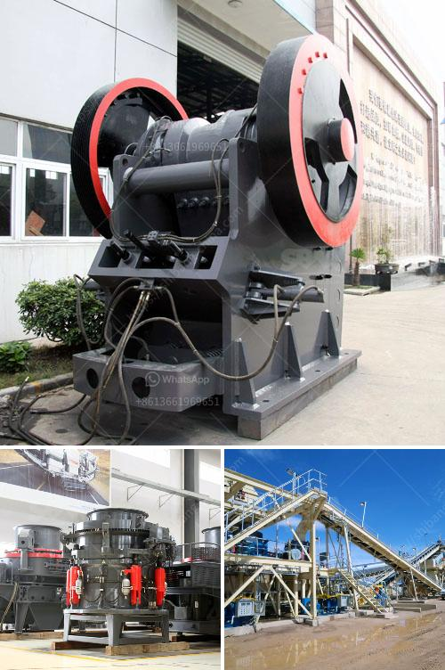

<h3>3 roller raymond mill</h3>
The 3 roller Raymond mill is a commonly used milling equipment in the field of industrial milling. It can be used to grind all kinds of non-metallic ores into fine powder with high fineness, and can also be used in the fields of chemical, metallurgy, building materials, mining, etc. The advantages of the 3 roller Raymond mill are high efficiency, low investment cost, and environmental protection. 

The 3 roller Raymond mill adopts a vertical structure and is equipped with a complete system. It does not need additional equipment to process materials, which greatly reduces the investment cost. The milling roller and grinding ring are made of wear-resistant materials, which have a longer service life and higher grinding efficiency. The finished powder has uniform particle size, good classification effect, and high powder yield. 

In addition, the 3 roller Raymond mill has a wide range of applications. It can be used to grind various non-metallic ores such as limestone, marble, barite, dolomite, potassium feldspar, bentonite, kaolin, graphite, etc. The finished product can be adjusted from 80 mesh to 600 mesh, which meets the requirements of different industries. 

Furthermore, the 3 roller Raymond mill has excellent environmental performance. It is equipped with a pulse dust collector, which can effectively collect dust and reduce pollution during the grinding process. The noise is low during operation, and the entire production line is fully enclosed, which effectively reduces noise pollution. In addition, the equipment is equipped with a high-pressure centrifugal fan, which can effectively improve the ventilation and bring fresh air, reducing the temperature of the grinding chamber and prolonging the service life of the equipment. 

The 3 roller Raymond mill has a simple operation process and convenient maintenance. The grinding roller can be turned out of the machine with a hydraulic device for replacement and maintenance, which saves time and effort. The electrical system adopts centralized control, and the mill can be controlled by a single operator, which greatly reduces labor costs. 

In conclusion, the 3 roller Raymond mill is a powerful milling equipment that combines grinding, classification, and collection. It has the advantages of high efficiency, low investment cost, wide application range, environmental protection, simple operation, and convenient maintenance. With the continuous improvement of technology, the performance of the 3 roller Raymond mill will be further optimized and provide better service in various industries.
<h3>Contact us</h3><ul><li><strong>Whatsapp:&nbsp;<a href="https://wa.me/8613661969651">+8613661969651</a></strong></li><li><a href="https://swt.shibang-china.com/?git&amp;zhl&amp;3 roller raymond mill"><strong>Online Service(chat now)</strong></a></li></ul><h3>Related</h3><ul><li><a href='feldspar powder plants in andhra pradesh.md'>feldspar powder plants in andhra pradesh</a></li><li><a href='differences between jaw and gyratory crushers.md'>differences between jaw and gyratory crushers</a></li><li><a href='bauxite screening machine.md'>bauxite screening machine</a></li><li><a href='salt crusher plant process price.md'>salt crusher plant process price</a></li><li><a href='gravel manufacturing company in thiruvallur district.md'>gravel manufacturing company in thiruvallur district</a></li></ul>