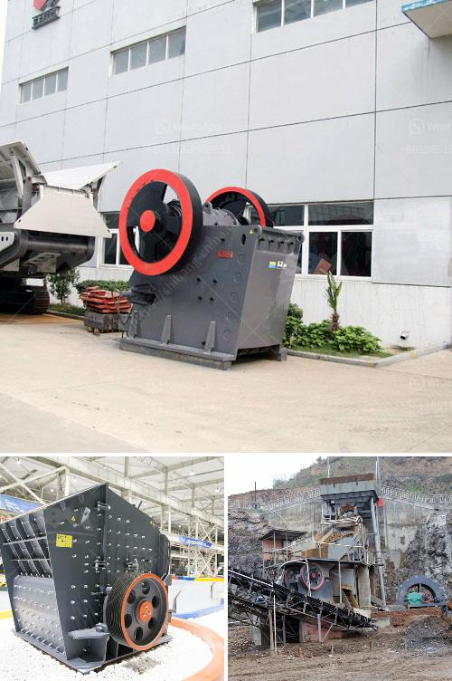

<h3>30 tons per hour cost</h3>
In modern industrial operations, maximizing efficiency is key to optimizing productivity and profitability. One crucial factor in this regard is the throughput capacity, expressed as tons per hour. In this article, we explore the cost-saving potential of a high throughput rate of 30 tons per hour. By examining its implications across various industries, we shed light on the potential benefits it can bring.

With a capability of processing 30 tons per hour, businesses can experience significant productivity gains. This attribute proves particularly useful in industries such as manufacturing, mining, and recycling, where higher output rates translate to increased revenue generation. Companies can streamline their operations and produce more goods within the same timeframe, leading to reduced lead times, increased order fulfillment, and improved customer satisfaction.

One crucial aspect of 30 tons per hour is its ability to optimize operational efficiency. By harnessing technologies and equipment capable of handling such high throughput, businesses can minimize labor and operational costs. These systems may include advanced conveyors, sorting machines, and automated production lines that streamline the process. With reduced manual intervention, potential errors are minimized, improving overall operational efficiency, and reducing downtime.

The economic impact of achieving consistent 30 tons per hour output cannot be overstated. By optimizing operations and producing more within the same time frame, businesses can benefit from economies of scale. This increased production capacity allows them to spread fixed costs over a greater number of units, reducing the cost per ton. Additionally, higher productivity can help negotiate better prices with suppliers, reduce stock holding costs, and optimize transportation and logistics, resulting in substantial cost savings.

Apart from financial advantages, the operational efficiency gained by maintaining a throughput of 30 tons per hour also contributes to environmental sustainability. By maximizing the use of resources and reducing waste, businesses can minimize their environmental footprint. For instance, in recycling or waste management operations, faster processing rates reduce the amount of waste sent to landfill, contributing positively to sustainability goals. Moreover, by using energy-efficient equipment and processes, businesses can further minimize their carbon emissions, supporting their efforts towards sustainable practices.

The quest for improved productivity and cost efficiency is a constant challenge for today's industrial enterprises. Achieving a throughput of 30 tons per hour has the potential to be a game-changer, providing substantial cost savings across various industries. By harnessing this level of productivity, businesses can unlock significant operational efficiency gains, reduce costs per unit, negotiate better prices with suppliers, and contribute to a sustainable future. Overall, investing in equipment, technology, and processes that can achieve this high throughput capacity is a strategic move that can drive both short-term profitability and long-term sustainability.
<h3>Contact us</h3><ul><li><strong>Whatsapp:&nbsp;<a href="https://wa.me/8613661969651">+8613661969651</a></strong></li><li><a href="https://swt.shibang-china.com/?git&amp;zhl&amp;30 tons per hour cost"><strong>Online Service(chat now)</strong></a></li></ul><h3>Related</h3><ul><li><a href='vsi crusher for crush sand.md'>vsi crusher for crush sand</a></li><li><a href='price jaw crusher 100tph india.md'>price jaw crusher 100tph india</a></li><li><a href='dolomite crusher manufacturer in usa.md'>dolomite crusher manufacturer in usa</a></li><li><a href='200tph old cone crusher plant india hyderabad.md'>200tph old cone crusher plant india hyderabad</a></li><li><a href='aggregate crusher types.md'>aggregate crusher types</a></li></ul>