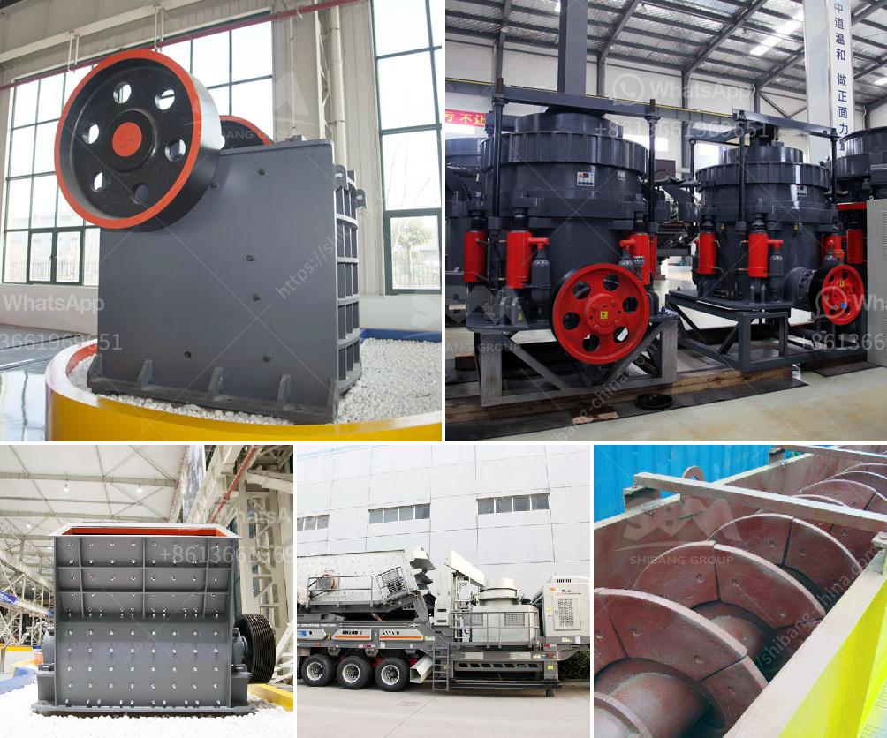

<h3>3tph ball mill for gold ore processing</h3>
The 3tph ball mill is a key equipment for regrinding. It is widely used for the cement, silicate product, new type building material, fire-proof material, chemical fertilizer, black and non-ferrous metal, glass, ceramics and etc. Our ball mill can grind ore or other materials that can be grinded either by wet process or by dry process.

This ball mill is suitable for grinding various ores and other materials, and it is widely used in mineral processing, building materials and chemical industries. It can be divided into dry and wet grinding methods. According to the different ways of discharging, it can be divided into two types: grid type and overflow type.

The ball mill is designed with the advanced technology and possesses high performance. The 3tph ball mill consists of a cylindrical drum, sometimes tapered at one end, and usually has a charge of steel balls ranging in size up to 125mm for larger mills. Product size can be as small as 0.005mm, but product size is dependant upon the time the charge spends in the grinding zone and therefore the reduction rate is a function of the throughput.

It is crucial to operate a 3tph ball mill with the correct operation and maintenance procedures. Before starting the ball mill, check whether the connecting bolt, gears, couplings are tightening; check whether the oil of the oil tank and the reducer is in the adequacy, and whether the lubrication system and instrument signal are normal. Then start the ball mill. Pay attention to the motor starting sequence. The startup sequence should follow the provisions of the instruction manual.

After starting the ball mill, the power of the ball mill is increased gradually to ensure the normal operation of the ball mill. It is necessary to ensure that the critical speed of the ball mill is maintained constant during the operation. If the rotation speed of the ball mill exceeds a certain limit, the rotation speed of the ball mill will be in an unbalanced state, and the ball in the ball mill will collide with each other, resulting in a chaotic state that cannot be controlled.

The ball mill is widely used in the production of ore grinding, cement grinding, production of metal powders, and other fields. It is widely used in building materials, chemical industry, mineral processing, grinding and other fields. The 3tph ball mill is a special equipment for gold ore processing. This kind of ball mill is especially suitable for gold ore processing.

The 3tph ball mill can obtain high-quality concentrate from the gold ore, which has better grinding effect on the gold ore.

The gold ore powder processed by this equipment has better fineness, and the product is more uniform.

If you have a higher demand for grinding fineness, the grid type ball mill is a good choice, and the price is relatively high; if you need to reduce the load on the grinding machines, the overflow type ball mill is recommended. These two types of ball mills are specially designed for gold ore processing. They have different advantages and targeted applications, and can meet the grinding requirements of different materials.

In conclusion, the 3tph ball mill is a versatile and easy-to-use machine that helps in grinding and mixing materials for use in various sectors. The importance of this machine cannot be underestimated as it carries out essential tasks in the gold ore processing process. So, whether you are a businessman involved in the mining industry or are integrating the usage of gold in your product, this machine is a must-have for you to ensure optimum productivity and efficiency.
<h3>Contact us</h3><ul><li><strong>Whatsapp:&nbsp;<a href="https://wa.me/8613661969651">+8613661969651</a></strong></li><li><a href="https://swt.shibang-china.com/?git&amp;zhl&amp;3tph ball mill for gold ore processing"><strong>Online Service(chat now)</strong></a></li></ul><h3>Related</h3><ul><li><a href='list of used machines coal mining.md'>list of used machines coal mining</a></li><li><a href='stone crusher usa.md'>stone crusher usa</a></li><li><a href='quarry crusher equipment process.md'>quarry crusher equipment process</a></li><li><a href='feldspar crusher arabia.md'>feldspar crusher arabia</a></li><li><a href='used crusher machine germany.md'>used crusher machine germany</a></li></ul>