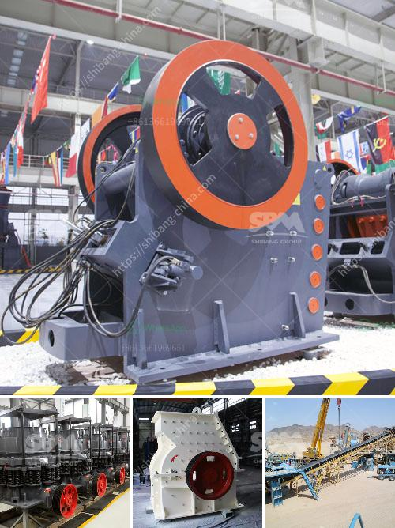

<h3>advantages of single toggle jaw crusher</h3>
Single toggle jaw crusher is a versatile and reliable machine that is used in many industries. It is widely used in construction, mining, quarrying, and recycling applications, making it a preferred choice for many tasks. The single toggle jaw crusher has a compact and simple design structure that enhances its operation and makes maintenance convenient. However, the single toggle jaw crusher is limited in its scope of application due to its small and compact size.

One of the major advantages of a single toggle jaw crusher is its simplicity in design and construction. The moving jaw pivots at the top of the crusher and can be removed or replaced easily, allowing for maintenance and cleaning of the crusher. The toggle plate is also easily accessible, making adjustments to the size of the material being crushed simple and quick.

Another advantage of the single toggle jaw crusher is its high throughput capacity. With a high reduction ratio and a large feed opening size, the single toggle jaw crusher can handle even the toughest materials, making it a reliable and efficient machine. This reduces the need for multiple crushers to achieve the desired size, resulting in cost savings and increased productivity.

The single toggle jaw crusher also has an advantage of low energy consumption and low maintenance costs. This reduces both the environmental impact and operating costs of the machine. With fewer moving parts and a more compact design, the single toggle jaw crusher requires less maintenance and repairs, resulting in lower downtime and decreased maintenance costs.

Furthermore, the single toggle jaw crusher has a long and reliable lifespan. Due to its robust construction and high-quality materials, the single toggle jaw crusher can withstand even the toughest conditions. Its durability ensures that it can handle heavy-duty applications and continuous operation, resulting in a longer lifespan and reduced need for replacements.

In addition to its technical advantages, there are also economic advantages to using a single toggle jaw crusher. The compact size and reduced weight of the machine enable easy transportation and relocation, allowing for increased flexibility and cost-effectiveness. This is particularly beneficial for mobile or portable crushing operations where the crusher needs to be moved frequently.

Overall, the single toggle jaw crusher offers many advantages over traditional overhead eccentric crushers. It has a simpler design, high throughput capacity, low energy consumption, low maintenance costs, and a long lifespan. These advantages make the single toggle jaw crusher a viable option for processing abrasive and hard rock materials, as well as for recycling materials and construction waste.

In conclusion, the single toggle jaw crusher is a versatile and reliable machine that offers many advantages over traditional crushing machines. With its compact size, simple structure, high throughput capacity, and low maintenance costs, it is a worthwhile investment for any operation. Whether used in construction, mining, quarrying, or recycling applications, the single toggle jaw crusher is a valuable addition to any crushing operation.
<h3>Contact us</h3><ul><li><strong>Whatsapp:&nbsp;<a href="https://wa.me/8613661969651">+8613661969651</a></strong></li><li><a href="https://swt.shibang-china.com/?git&amp;zhl&amp;advantages of single toggle jaw crusher"><strong>Online Service(chat now)</strong></a></li></ul><h3>Related</h3><ul><li><a href='calculate crusher wear abrasion.md'>calculate crusher wear abrasion</a></li><li><a href='sale of running stone crusher in philippines.md'>sale of running stone crusher in philippines</a></li><li><a href='trackmounted mobile crusher.md'>track-mounted mobile crusher</a></li><li><a href='gypsum board manufacturing equipment.md'>gypsum board manufacturing equipment</a></li><li><a href='small scale iron ore pallet plant.md'>small scale iron ore pallet plant</a></li></ul>