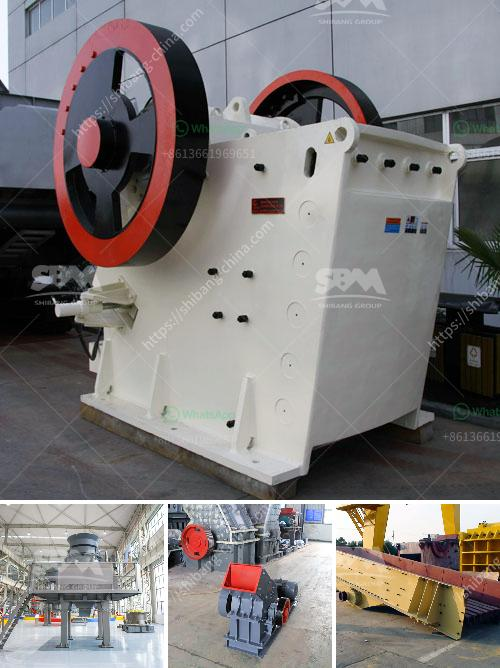

<h3>africa sand washing plant for rent and sale</h3>
With the rapid urbanization and infrastructural development happening in Africa, the demand for high-quality construction materials is at an all-time high. Sand, being an essential ingredient in construction, holds great significance in meeting this growing demand. However, the indiscriminate extraction of sand from rivers and beaches has led to severe environmental degradation in many African countries. In this context, the provision of sand washing plants for rent and sale presents a sustainable solution that ensures responsible sand mining practices.

Sand washing plants are designed to remove dirt, silt, and other impurities from sand, making it suitable for construction purposes. By employing a combination of mechanical processes such as screening, classification, and dewatering, these plants facilitate the production of clean and well-graded sand. In addition to ensuring the availability of high-quality sand, sand washing plants also contribute to preserving aquatic ecosystems and minimizing environmental damage caused by illegal sand mining.

One of the primary reasons for the popularity of sand washing plants in Africa is their adaptability to various terrains and operating conditions. These plants can be easily transported and set up at locations where sand mining is permitted. Moreover, they are equipped with advanced technologies that enable efficient sand washing while minimizing water consumption. As water scarcity continues to be a pressing issue in many African countries, these plants play a crucial role in conserving this precious resource.

The availability of sand washing plants for rent and sale brings immense economic benefits to local communities and stakeholders involved in the construction industry. Renting or purchasing a sand washing plant allows construction companies and contractors to obtain a steady and reliable supply of clean sand, eliminating the need to rely on potentially unreliable external sources. This, in turn, leads to cost savings and streamlined operations, resulting in enhanced productivity and profitability.

Furthermore, sand washing plants create employment opportunities for the local workforce. From the setup and operation of the plant to maintenance and support services, various job roles are created, contributing to poverty alleviation and socioeconomic development. Additionally, the presence of sand washing plants encourages responsible mining practices by discouraging illegal and unregulated sand extraction, leading to a more sustainable and environmentally conscious construction industry.

In conclusion, the availability of sand washing plants for rent and sale in Africa offers a sustainable solution to the challenges posed by the extensive demand for sand in the construction sector. These plants not only ensure the production of high-quality, well-graded sand but also contribute to environmental preservation and socioeconomic development. By embracing this innovative technology, African countries can strike a balance between meeting their construction needs and safeguarding their natural resources for future generations.
<h3>Contact us</h3><ul><li><strong>Whatsapp:&nbsp;<a href="https://wa.me/8613661969651">+8613661969651</a></strong></li><li><a href="https://swt.shibang-china.com/?git&amp;zhl&amp;africa sand washing plant for rent and sale"><strong>Online Service(chat now)</strong></a></li></ul><h3>Related</h3><ul><li><a href='bauxite screening machine.md'>bauxite screening machine</a></li><li><a href='cost of granite crusher.md'>cost of granite crusher</a></li><li><a href='calcium carbonate plant in bulacan.md'>calcium carbonate plant in bulacan</a></li><li><a href='coal screening chrushing machines.md'>coal screening chrushing machines</a></li><li><a href='jual mesin hammer mill crusher for sale.md'>jual mesin hammer mill crusher for sale</a></li></ul>