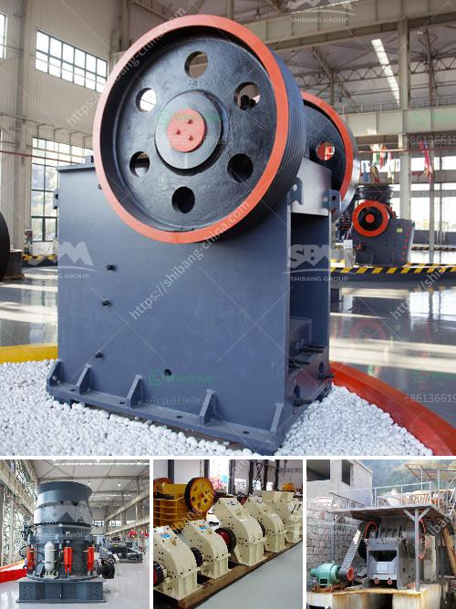

<h3>aggregate crusher 200 meter capacity</h3>
Aggregate crushers are essential pieces of equipment in the construction industry. These machines are specifically used to reduce the size of large rocks, gravel, or gravel-like materials into smaller, more manageable sizes. One popular type of aggregate crusher is the jaw crusher.

A jaw crusher works by using a pair of jaws, one stationary and the other moving, to crush materials. The rocks or gravel is fed into the top of the crusher and is crushed between the two jaws. As the moving jaw moves closer to the stationary jaw, the material is crushed into smaller pieces. The crushed material then exits the crusher through a discharge opening at the bottom.

One particular type of jaw crusher that is widely used is the aggregate crusher with a capacity of 200 meters. This crusher is highly adaptable to a wide range of requirements, providing the perfect solution for construction companies and contractors who need to crush a large quantity of aggregates.

The aggregate crusher comes equipped with heavy-duty parts to ensure a long lifespan. The crusher consists of a thick steel frame, which securely holds the crusher's wear parts in place. The hopper is easily accessible and promotes a steady feed to the crusher chamber.

The crusher's electric motor drives the belts and pulleys, allowing the jaws to move back and forth in a synchronized motion. This motion ensures consistent and uniform crushing of the aggregate.

With a capacity of 200 meters, this aggregate crusher is capable of crushing large quantities of rocks and gravel efficiently. Whether it is for road construction, building foundations, or landscaping projects, this crusher can tackle any task with ease.

In conclusion, the aggregate crusher with a capacity of 200 meters is an essential machine in the construction industry. Its high adaptability and efficiency make it the perfect solution for crushing large quantities of materials into smaller, more manageable sizes. Construction companies and contractors can rely on this crusher to meet their aggregate crushing needs with ease.
<h3>Contact us</h3><ul><li><strong>Whatsapp:&nbsp;<a href="https://wa.me/8613661969651">+8613661969651</a></strong></li><li><a href="https://swt.shibang-china.com/?git&amp;zhl&amp;aggregate crusher 200 meter capacity"><strong>Online Service(chat now)</strong></a></li></ul><h3>Related</h3><ul><li><a href='belt conveyor for stone aggregate.md'>belt conveyor for stone aggregate</a></li><li><a href='nigeria hammer mill.md'>nigeria hammer mill</a></li><li><a href='crushing machine manufacturers cape town.md'>crushing machine manufacturers cape town</a></li><li><a href='prices of conveyor belt.md'>prices of conveyor belt</a></li><li><a href='mobile vibrating screen.md'>mobile vibrating screen</a></li></ul>