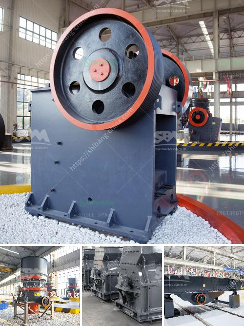

<h3>aggregate crusher plant</h3>
Aggregate crushing plants are used to process sand, gravel, and rock for specific markets. These plants fulfill the shaping and sizing purposes to obtain the final product. While these plants are typically associated with the construction industry, they can also be utilized in various other industries as well.

The aggregate crusher plant consists of jaw crushers, hydraulic cone crusher, VSI crushers, impact crushers, vibrating feeders, vibrating screens, belt conveyors, and other equipment. The type and size of aggregate crushers vary, depending on the desired output material. Jaw crushers are used for primary crushing of large rock pieces. Impact crushers and VSI crushers are suitable for medium to fine crushing operations. Meanwhile, cone crushers are preferred for secondary and tertiary crushing stages.

The primary goal of aggregate crusher plants is to obtain different rock sizes or mineral mining. By crushing the rocks into small transformable materials, aggregate plants aim to produce a final product that is viable for different uses. This includes base material for roads, as well as concrete and asphalt production.

One of the important factors to consider in setting up aggregate crusher plants is the type of raw material used for the crushing process. Some plants are equipped with primary crushers that break down the raw rock into smaller sizes. Other plants use pre-screens or scalping screens before the primary crusher to remove fine material or contaminants from the feed. This screening process helps to increase the efficiency and quality of the final product.

Aggregate crusher plants also utilize screening equipment to separate various sizes of crushed material. This ensures that different size fractions are produced, in accordance with the specific requirements of the customer. Additionally, vibrating screens help remove impurities from the final products, ensuring a high-quality end result.

In addition to the various types of crushers and screening equipment, aggregate plants may also incorporate washing equipment for further processing. Sand and gravel can be washed to remove clay and other unwanted materials, resulting in a cleaner and more marketable product.

Efficiency is a key factor in the design and operation of aggregate crusher plants. Well-designed plants optimize the production process, minimize downtime, and reduce maintenance and repair costs. This includes proper equipment selection, regular maintenance, and correct sizing of equipment to maximize productivity.

Aggregate crusher plants are typically operated in a controlled manner. Dust suppression measures, including water sprays, can be applied to minimize dust emissions. Noise control measures, such as noise enclosures or sound barriers, can be installed to reduce noise pollution. These measures ensure environmental sustainability by minimizing the impact of crushing operations on surrounding areas.

In conclusion, aggregate crusher plants play a crucial role in the construction industry and other sectors. These plants process raw materials into various sizes of aggregates, which are used for different purposes. With careful planning and efficient operation, aggregate crusher plants can contribute to the sustainable development of infrastructure and promote environmental conservation.
<h3>Contact us</h3><ul><li><strong>Whatsapp:&nbsp;<a href="https://wa.me/8613661969651">+8613661969651</a></strong></li><li><a href="https://swt.shibang-china.com/?git&amp;zhl&amp;aggregate crusher plant"><strong>Online Service(chat now)</strong></a></li></ul><h3>Related</h3><ul><li><a href='small rock crushers in turkey.md'>small rock crushers in turkey</a></li><li><a href='model project of soap stone powder.md'>model project of soap stone powder</a></li><li><a href='coarse ash grinding mill equipment.md'>coarse ash grinding mill equipment</a></li><li><a href='stone crusher punjab ropar.md'>stone crusher punjab ropar</a></li><li><a href='equipment jaw crusher for sale philippine.md'>equipment jaw crusher for sale philippine</a></li></ul>