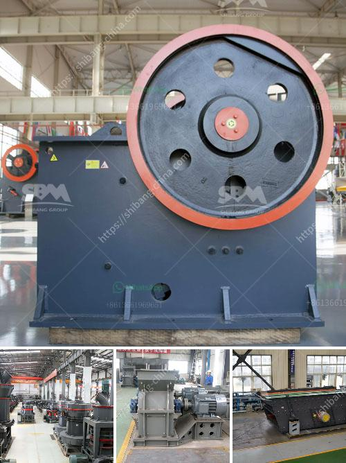

<h3>aggregate crusher plants machinery</h3>
Aggregate crusher plants are important equipment for aggregate production. Aggregate commonly is classified into two categories: fine aggregate and coarse aggregate. Fine aggregate is the materials that could pass the No.4 sieve, and most could be retained on a No. 200 sieve. Coarse aggregate is a relatively big materials that will get through a 3-inch screen and be retained on the No.4 screen.

Aggregate crusher plants utilize mechanical power to crush rocks into smaller pieces. Screening equipment then separates these crushed rocks into different sizes. They are capable of producing different size aggregates, ranging from sand to small stones. Their ability to produce quality aggregate materials efficiently and economically makes them essential in the construction industry.

The aggregate crusher plant machinery has different types. The aggregate crusher plants produced by Fote Machinery have jaw crusher, cone crusher, impact crusher, hammer crusher, mobile crusher, etc. All these machines are chosen according to the different needs of customers.

Different types of aggregate crusher plants are: Primary crushing equipment: Jaw crusher is a must-have device in all aggregate crusher plants because it is used to crush stones into different sizes as the first stage of aggregate crushing process. Secondary crushing equipment: Cone crusher or impact crusher is used for the secondary crushing process. Both of them play important roles in achieving the desired aggregate size and shape. Tertiary crushing equipment: Hammer crusher or VSI crusher is used as tertiary crushing machines. They produce fine aggregates and cubical-shaped particles. Screening equipment: The screening equipment screens the qualified aggregate into different piles based on their size.

The performance characteristics of aggregate crusher plants are: High crushing efficiency: The construction industry requires large quantities of aggregate in order to meet the rapid growth in infrastructure development. Aggregate crusher plants have the ability to produce required quantity and quality of aggregate within the specified time frame. Good particle shape: Aggregate crusher plants can produce uniform particle shapes, which helps to improve the mechanical properties of concrete and reduce material consumption. Low production cost: Aggregate crusher plants are energy-efficient and require low maintenance, minimizing the operating costs associated with the production of aggregates.

The aggregate crusher plants machinery plays an important role in the aggregate processing industry. As a leading manufacturer of aggregate processing equipment, Fote Machinery offers advanced and reasonable solutions for any size-reduction requirements, including quarry, aggregate, grinding production, and complete stone crushing plant. We also supply individual crushers and screens, as well as key components and a wide range of consumables. With more than 40 years of experience, we have stood the test of time and are trusted by customers worldwide for our reliable products and excellent customer service.

In conclusion, aggregate crusher plants machinery is an essential part of the construction industry. They are used to crush rocks into smaller sizes, which results in the production of high-quality aggregate materials for various construction purposes. Fote Machinery is a trusted manufacturer of aggregate crusher plants machinery, providing efficient and cost-effective solutions for aggregate production needs. With our expertise and dedication to customer satisfaction, we are committed to helping our customers achieve success in their projects.
<h3>Contact us</h3><ul><li><strong>Whatsapp:&nbsp;<a href="https://wa.me/8613661969651">+8613661969651</a></strong></li><li><a href="https://swt.shibang-china.com/?git&amp;zhl&amp;aggregate crusher plants machinery"><strong>Online Service(chat now)</strong></a></li></ul><h3>Related</h3><ul><li><a href='grinding mill price.md'>grinding mill price</a></li><li><a href='sand washing machine lsx.md'>sand washing machine lsx</a></li><li><a href='used jaw crusher for sale in zimbabwe.md'>used jaw crusher for sale in zimbabwe</a></li><li><a href='belt conveyor belt suppliers in oman.md'>belt conveyor belt suppliers in oman</a></li><li><a href='land rock crusher sale.md'>land rock crusher sale</a></li></ul>