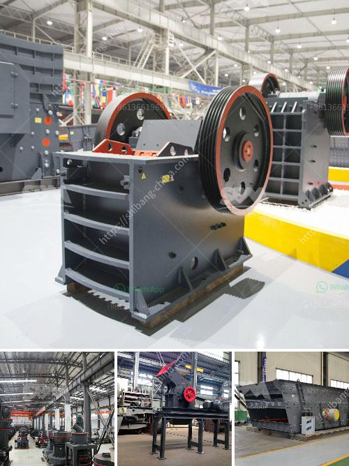

<h3>aggregate crusher types</h3>
Aggregate crushers are machines used to crush rocks, crushed stone, gravel, sand, or other construction materials into smaller, uniform pieces. These machines can process a wide range of materials, from hard and abrasive rocks to soft, sandy and dusty materials, and are commonly used in quarries, mining, construction and recycling industries.

There are several types of aggregate crushers available in the market, each with different crushing principles and applications. Let's explore some of the most common types:

Jaw crushers are primarily used as primary crushers to reduce the size of large, hard and abrasive materials such as granite, basalt, and ores. They are widely used in mining, quarrying, recycling, and construction industries. Jaw crushers use a compressive force to crush the material between two vertical jaws, also known as an oscillating motion.

Cone crushers are commonly used for secondary and tertiary crushing stages in the aggregate production process. They are also extensively used in the mining industry. Cone crushers utilize a rotating mantle and a concave bowl, which produce a compressive force to break the rock material. These crushers are capable of producing cubic-shaped particles and are often used for the production of high-quality aggregates.

Impact crushers are versatile machines that can be used in primary, secondary, and tertiary crushing stages. They are typically used in quarrying, mining, recycling, and construction applications. Impact crushers work by impacting the material with hammers, which are fixed on a spinning rotor. The material then collides with the hammers, breaking into smaller pieces. This type of crusher is known for producing a high reduction ratio and a uniform shape of the finished product.

VSI (Vertical Shaft Impact) crushers are widely used in the mining and construction industry for producing artificial sand and aggregate. These crushers use a high-speed rotor and anvils for impact crushing rather than compression force. VSI crushers can produce finely graded cubical particles. They are often used to shape the final product by creating a more uniform and smooth texture.

Roll crushers are used for primary and secondary crushing of materials with a compressive strength of up to 200 MPa. They consist of one or two horizontally mounted rolls, which rotate in opposite directions. The material is crushed by the compression forces generated between the rolls. Roll crushers provide a more consistent reduction ratio and are typically used for softer materials.

In conclusion, aggregate crushers are essential machines in various industries for crushing rocks, gravel, and other construction materials into smaller, uniform pieces. The choice of crusher type depends on the material properties, desired product size, production capacity, and budget. By understanding the different types of crushers available, one can select the most appropriate crushing equipment for a particular application.
<h3>Contact us</h3><ul><li><strong>Whatsapp:&nbsp;<a href="https://wa.me/8613661969651">+8613661969651</a></strong></li><li><a href="https://swt.shibang-china.com/?git&amp;zhl&amp;aggregate crusher types"><strong>Online Service(chat now)</strong></a></li></ul><h3>Related</h3><ul><li><a href='manufacturing company for ball mill.md'>manufacturing company for ball mill</a></li><li><a href='coal mill of cement plant.md'>coal mill of cement plant</a></li><li><a href='grinding of limestone crusher.md'>grinding of limestone crusher</a></li><li><a href='chinese jaw crusher.md'>chinese jaw crusher</a></li><li><a href='rent a portable conveyor belt system malaysia.md'>rent a portable conveyor belt system malaysia</a></li></ul>