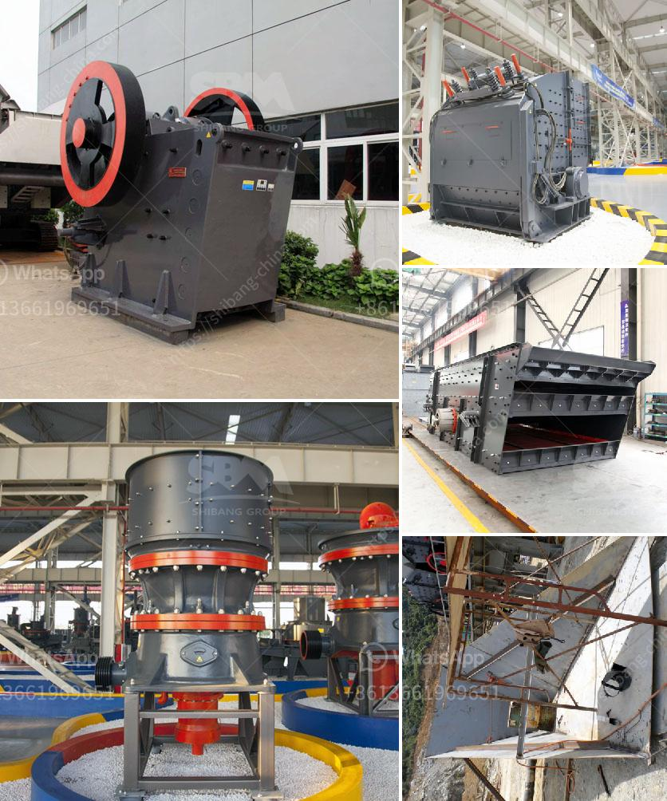

<h3>aggregate crushing cost analysis in india</h3>
India is one of the largest global consumers of aggregates and the demand for these construction materials is on the rise. With booming infrastructure development projects and a thriving real estate sector, the country is witnessing an increased demand for aggregates, particularly crushed stones. Despite the ample supply of raw materials, the cost of aggregate crushing in India remains a concern for both producers and end-users.

Aggregate crushing cost analysis involves various factors such as the quality and type of materials, availability, transportation costs, and popularity. The cost analysis helps estimate the total cost of production, including direct and indirect expenses, and assists in making informed decisions for aggregate producers.

One of the primary cost factors in aggregate crushing is the raw material itself. India has abundant natural resources, including granite, basalt, limestone, and river gravel, which serve as raw materials for creating aggregates. However, the selection of the right type of material and its quality greatly impacts the crushing process' efficiency and cost. High-quality, durable materials can reduce wear and tear on crushing equipment, leading to lower maintenance costs and increased lifespan.

Transportation costs also play a significant role in the overall cost analysis of aggregates. India's vast geographical area presents challenges in transporting aggregates from quarry sites to construction projects. The longer the distance, the higher the transportation expenses. Additionally, poor road infrastructure and traffic congestion can further escalate the transportation cost. Improving transportation efficiency through better road connectivity and infrastructure development can help reduce the burden of transportation costs on aggregate producers.

Moreover, the popularity of certain types of aggregates influences their cost analysis. Different construction projects require different types of aggregates. For example, certain projects may demand aggregates with specific properties, such as high strength or low water absorption. The availability and demand for such specialized aggregates can impact their cost, as producers need to meet the market's requirements and specifications. Understanding consumer preferences and market trends is crucial in estimating the cost analysis.

To optimize aggregate crushing cost analysis, producers can adopt various strategies. Firstly, investing in modern and efficient crushing equipment can improve productivity and reduce maintenance costs. Upgrading to advanced technologies can also enhance energy efficiency and decrease operating expenses. Additionally, conducting regular maintenance and adopting preventive measures can prolong machinery's lifespan and ensure uninterrupted production.

Furthermore, aggregate producers can explore alternative transportation methods to lower costs. Utilizing waterways, railways, or even conveyor belts within quarry sites can reduce the dependence on road transportation, leading to cost savings. Collaborating with logistic partners and adopting advanced tracking systems can help optimize transportation efficiency and minimize associated expenses.

Effective utilization of technology and automation can significantly impact the cost analysis of aggregate crushing in India. By implementing digital technologies, such as data analytics and remote monitoring systems, producers can optimize their operations, identify areas for improvement, and reduce overall costs. Automation can streamline production processes, minimize human error, and enhance productivity, ultimately reducing the cost per unit of aggregate production.

In conclusion, aggregate crushing cost analysis in India holds critical importance for both producers and end-users. Factors such as raw materials, transportation costs, and market demand influence the overall cost analysis. Efficient crushing equipment, improved transportation infrastructure, and utilization of technology can help optimize the cost of aggregate crushing and contribute to the growth of the construction industry in India.
<h3>Contact us</h3><ul><li><strong>Whatsapp:&nbsp;<a href="https://wa.me/8613661969651">+8613661969651</a></strong></li><li><a href="https://swt.shibang-china.com/?git&amp;zhl&amp;aggregate crushing cost analysis in india"><strong>Online Service(chat now)</strong></a></li></ul><h3>Related</h3><ul><li><a href='mobile crushing plant in peru.md'>mobile crushing plant in peru</a></li><li><a href='coal mining equipment south africa for sale.md'>coal mining equipment south africa for sale</a></li><li><a href='cement production procedure in vertical mill.md'>cement production procedure in vertical mill</a></li><li><a href='used mining equipment uk.md'>used mining equipment uk</a></li><li><a href='impact crushers nigeria.md'>impact crushers nigeria</a></li></ul>