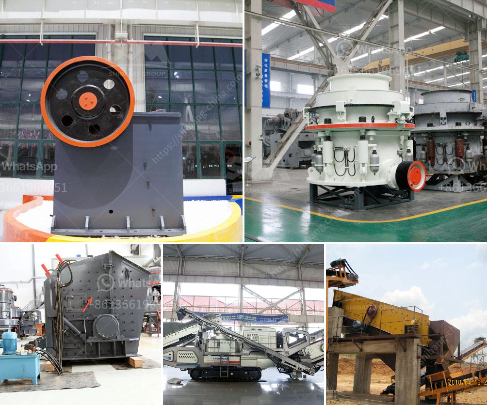

<h3>aggregate production</h3>
Aggregate production refers to the process of extracting and synthesizing different types of rocks and minerals to create a mixture commonly used in construction projects. It involves sourcing materials from various locations, processing them, and eventually producing the desired aggregate for use in roads, buildings, and other infrastructure.

The process of aggregate production begins with the identification and extraction of suitable materials. Quarries are commonly used as the primary source for aggregates, as they provide a wide range of rock types, such as limestone, granite, and sandstone, which are ideal for construction purposes. These raw materials are typically obtained through blasting, drilling, or excavation methods.

Once the materials are extracted, they undergo a series of processes to transform them into usable aggregates. The first step is crushing, where the raw materials are broken down into smaller pieces using heavy machinery. This initial crushing stage is essential for reducing the size of the rocks and increasing their surface area, making it easier to process them further.

After crushing, the aggregates go through additional stages, such as screening and washing, to remove any impurities and ensure uniformity in size and shape. Screening involves separating the aggregates into different size fractions using screens or sieves, while washing helps remove fine particles, silt, and clay from the materials.

Once the aggregates have been processed and cleaned, they are ready for use in various construction applications. The most common use of aggregates is in the production of concrete. Aggregates make up 60-80% of the volume of concrete, providing its strength and durability. Different aggregate sizes are used for different purposes in concrete mixtures, such as coarse aggregates for structural elements and fine aggregates for surface finishes.

Aggregates are also used in asphalt production for road construction. They serve as a crucial component in creating a strong and stable road surface, as they provide the necessary strength, durability, and resistance to wear and tear. Additionally, aggregates are employed in the production of railroad ballast, which supports and stabilizes the railway tracks.

The demand for aggregates is continuously growing due to the expansion of infrastructure projects worldwide. As a result, aggregate production has become an increasingly important sector in the construction industry. However, the process of aggregate production poses several environmental challenges that need to be addressed.

The extraction and processing of raw materials can have negative impacts on the environment, such as air and noise pollution, land degradation, and loss of biodiversity. To mitigate these effects, companies involved in aggregate production are implementing sustainable practices, including proper waste management, reclamation of quarries, and using eco-friendly production techniques.

In conclusion, aggregate production plays a vital role in the construction industry by providing the necessary materials for infrastructure projects. It involves sourcing, extracting, and processing different types of rocks and minerals to create aggregates with specific properties. While the demand for aggregates continues to rise, sustainable practices are being adopted to minimize the environmental impact of aggregate production.
<h3>Contact us</h3><ul><li><strong>Whatsapp:&nbsp;<a href="https://wa.me/8613661969651">+8613661969651</a></strong></li><li><a href="https://swt.shibang-china.com/?git&amp;zhl&amp;aggregate production"><strong>Online Service(chat now)</strong></a></li></ul><h3>Related</h3><ul><li><a href='laying of conveyor belting.md'>laying of conveyor belting</a></li><li><a href='contnious ball mill drawing.md'>contnious ball mill drawing</a></li><li><a href='approach to the problem of a mineral crusher.md'>approach to the problem of a mineral crusher</a></li><li><a href='grinding of ceramic minerals.md'>grinding of ceramic minerals</a></li><li><a href='design drawing of hopper for crusher.md'>design drawing of hopper for crusher</a></li></ul>