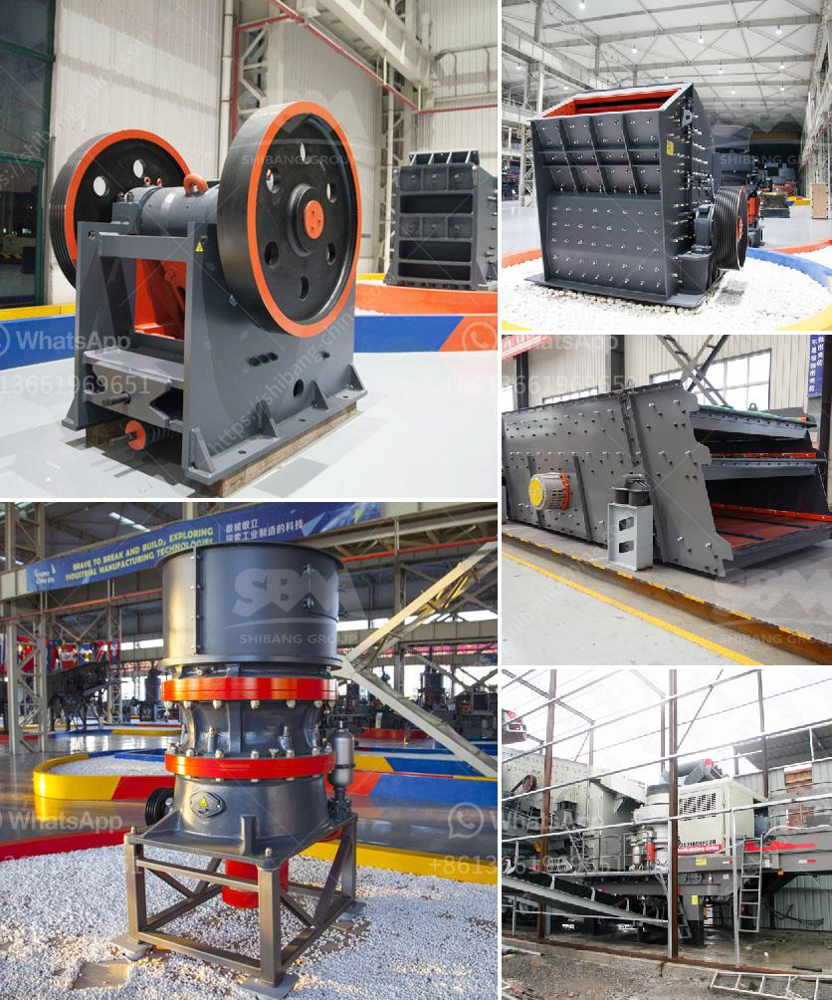

<h3>aggregate washing machine</h3>
An aggregate washing machine is a machine designed to clean a wide range of aggregates for various purposes. Aggregate washing machines are used in many different industries, including construction and mining. Some of the most common types of these machines include screw conveyors, log washers, and horizontal screens.

One of the main reasons why aggregate washing machines are used is to remove dirt, dust, or other unwanted particles from the aggregates. This helps to improve the quality of the final product and ensures that it meets the required specifications. Additionally, washing the aggregates can also help to remove contaminants such as clay or organic matter, which can negatively affect the performance of the final product.

One of the most commonly used types of aggregate washing machines is the screw conveyor. These machines consist of a rotating screw inside a tub or trough. As the screw rotates, it lifts and transports the aggregates, washing them in the process. The dirty water and any remaining particles are then discharged through an outlet at the opposite end of the machine.

Another popular type of aggregate washing machine is the log washer. These machines are typically used in mining operations and are designed to clean and scrub the aggregates. The log washer consists of a cylinder with paddles or blades that rotate against the aggregate. As the aggregates are scrubbed, any dirt or unwanted particles are removed. The dirty water is then discharged, leaving behind clean aggregates.

Horizontal screens are also commonly used in aggregate washing machines. These machines consist of a vibrating screen that separates the aggregates based on size. The aggregates are fed onto the screen, and the smaller particles fall through the sieve, while the larger particles are transported along the screen. Water is sprayed onto the screen to wash and clean the aggregates, with the dirty water being collected and discharged separately.

There are several benefits to using aggregate washing machines. Firstly, they help to improve the quality of the final product by removing unwanted particles and contaminants. This can result in a higher quality end product that meets the required specifications. Additionally, washing the aggregates can also help to improve the performance of the final product, as it removes clay or organic matter that can negatively affect the product's properties.

Furthermore, aggregate washing machines can also help to reduce waste and environmental impact. By effectively cleaning and reusing the water used in the washing process, these machines can help to minimize water consumption. This is especially important in areas where water scarcity is a concern.

In conclusion, aggregate washing machines play a vital role in industries such as construction and mining. They are used to clean and scrub aggregates, removing unwanted particles and contaminants and improving the overall quality of the final product. These machines offer various benefits, including enhancing product performance, reducing waste, and minimizing water consumption. Overall, they are essential tools in the aggregate industry, ensuring that the aggregates meet the required specifications and are of the highest quality.
<h3>Contact us</h3><ul><li><strong>Whatsapp:&nbsp;<a href="https://wa.me/8613661969651">+8613661969651</a></strong></li><li><a href="https://swt.shibang-china.com/?git&amp;zhl&amp;aggregate washing machine"><strong>Online Service(chat now)</strong></a></li></ul><h3>Related</h3><ul><li><a href='high capacity r ore raymond mill with competitive price.md'>high capacity r ore raymond mill with competitive price</a></li><li><a href='iron processing plant manufacturer machine line.md'>iron processing plant manufacturer machine line</a></li><li><a href='stone crusher 60 to 100 tonnes per hour.md'>stone crusher 60 to 100 tonnes per hour</a></li><li><a href='economic analysis of conveyor system.md'>economic analysis of conveyor system</a></li><li><a href='quarry stone for sale in malta.md'>quarry stone for sale in malta</a></li></ul>