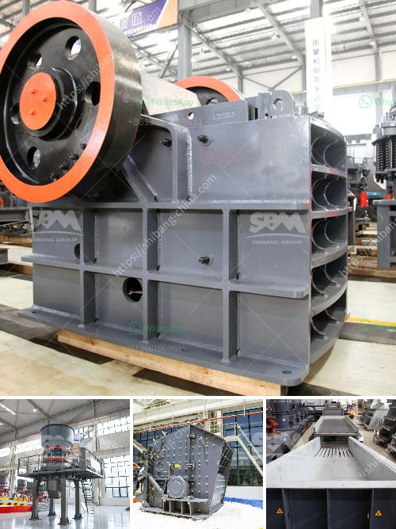

<h3>aggregate washing screens in south africa</h3>
Aggregate washing screens are an integral part of the construction industry in South Africa. These screens play a vital role in separating fine particles from the coarse ones, thereby ensuring the quality and consistency of aggregate materials used in various construction projects.

In a country like South Africa, which witnesses a significant amount of construction activities, aggregate washing screens are in high demand. They are used in a variety of applications, including the production of concrete, asphalt, and road base materials. Their primary function is to remove excess water and wash off any impurities from the aggregate materials.

One of the key advantages of aggregate washing screens is their ability to increase the quality of the final product. By utilizing water and mechanical action, these screens effectively remove dirt, dust, clay, and other impurities from the aggregate particles. This not only improves the visual appeal of the material but also enhances its durability and strength, making it suitable for construction purposes. Moreover, clean and properly graded aggregate materials contribute to better concrete workability and reduce the risk of segregation.

Aggregate washing screens are also instrumental in conserving water resources. South Africa, like many other countries, faces water scarcity issues. The use of washing screens allows for the recycling and reusing of water, thereby reducing water consumption in the construction process. This not only helps in the sustainable use of water but also minimizes the environmental impact of the construction industry.

Furthermore, aggregate washing screens are designed to increase production efficiency. They are equipped with advanced technologies such as vibrating screens, hydrocyclones, and dewatering screens, which help in optimizing the screening and washing process. These screens have adjustable settings that allow operators to control the size and shape of the final product, ensuring compliance with specific project requirements.

In South Africa, various manufacturers and suppliers offer a wide range of aggregate washing screens. These screens are available in different sizes, configurations, and capacities to cater to the diverse needs of the construction industry. They can be operated as standalone units or integrated into larger production systems, providing flexibility and scalability.

The maintenance and upkeep of aggregate washing screens are crucial for their efficient operation. Regular cleaning, inspection, and servicing of these screens are necessary to prevent the buildup of material and ensure smooth functioning. Manufacturers often provide guidelines and support for maintenance activities, helping operators to maximize the lifespan of their equipment.

In conclusion, aggregate washing screens play a crucial role in the construction industry of South Africa. They improve the quality of aggregate materials, conserve water resources, and enhance production efficiency. As the demand for infrastructure development continues to rise, the importance of these screens will only increase further. Therefore, it is essential for construction companies and industry professionals to invest in reliable and efficient aggregate washing screens to meet the growing needs of the market and contribute to sustainable construction practices.
<h3>Contact us</h3><ul><li><strong>Whatsapp:&nbsp;<a href="https://wa.me/8613661969651">+8613661969651</a></strong></li><li><a href="https://swt.shibang-china.com/?git&amp;zhl&amp;aggregate washing screens in south africa"><strong>Online Service(chat now)</strong></a></li></ul><h3>Related</h3><ul><li><a href='industrial cone crusher.md'>industrial cone crusher</a></li><li><a href='stone crusher plant 100tph layout.md'>stone crusher plant 100tph layout</a></li><li><a href='marble powder mill machinery.md'>marble powder mill machinery</a></li><li><a href='ball mill design calculation pdf.md'>ball mill design calculation pdf</a></li><li><a href='hydraulic cone crushers.md'>hydraulic cone crushers</a></li></ul>