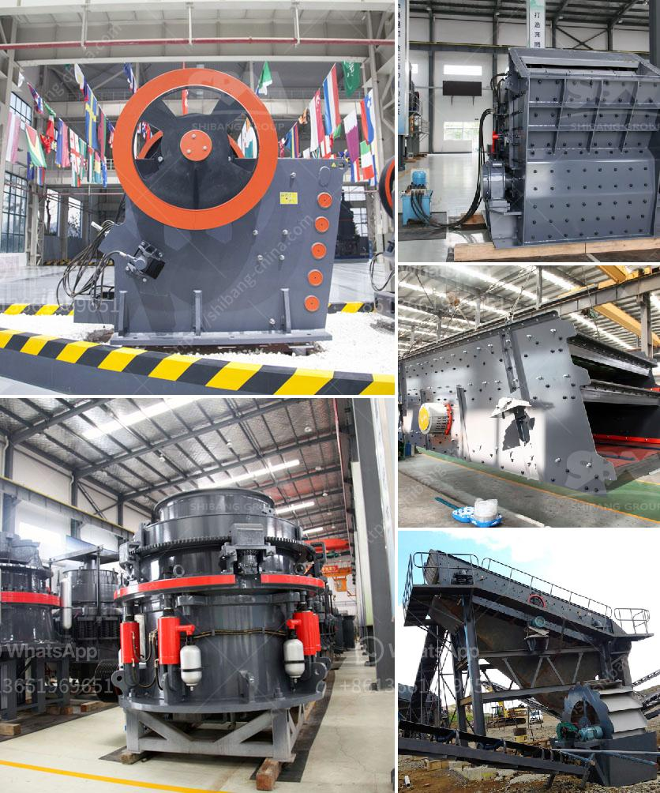

<h3>alluvial gold mining equipment china</h3>
Alluvial gold mining is the process of extracting gold from sedimentary deposits, primarily through the use of equipment such as gold panning sieves, sluice boxes, and dredges. China has been a major country for alluvial gold mining for over a century, producing significant amounts of the precious metal.

China has large and thriving alluvial gold mining operations, particularly in the provinces of Hainan, Shaanxi, Yunnan, and Guangdong. These areas are rich in gold-bearing rivers and streams that have been mined for centuries. The history of alluvial gold mining in China dates back to the Han Dynasty (206 BC–220 AD) and reached its peak during the Song Dynasty (960 AD–1279 AD). For centuries, Chinese miners have developed innovative mining techniques, and their expertise has been passed down through generations.

One of the key factors contributing to the success of alluvial gold mining in China is the availability of specialized equipment. Chinese manufacturers have been producing gold mining equipment such as trommels, centrifugal concentrators, gold panning sieves, and shaking tables for decades. These innovative machines are specifically designed to extract gold particles from alluvial deposits efficiently.

Trommels are commonly used in alluvial gold mining operations as they allow for effective screening of gold-bearing material. They consist of a rotating drum with a series of screens of different sizes, enabling the separation of gold particles based on their size and weight. Trommels are particularly useful for large-scale mining operations, as they can process large volumes of material quickly.

Centrifugal concentrators are another popular piece of equipment used in alluvial gold mining. They utilize the principles of centrifugal force and fluid dynamics to separate gold particles from the surrounding sediments. These machines are highly efficient and can process large quantities of material in a short period. They are especially useful in areas with high concentrations of fine gold particles.

Gold panning sieves are a traditional tool used by alluvial gold miners. These hand-held sieves have specially designed mesh screens that allow smaller particles to pass through while retaining larger gold particles. They are an essential tool for miners working in remote areas where mechanized equipment may not be available.

Shaking tables are also commonly used in alluvial gold mining to separate gold particles based on their density. These tables have a horizontal shaking motion that allows for the efficient separation of gold from lighter sediments. Shaking tables are particularly useful for fine gold particles that may be missed by other methods.

The availability of specialized alluvial gold mining equipment in China has played a significant role in the country's success as a major gold producer. With the advancement of technology, manufacturers continue to produce innovative equipment to improve the efficiency and productivity of alluvial gold mining. As demand for gold continues to rise, the equipment industry in China is poised to meet the needs of both domestic and international mining operations.

In conclusion, China has a long and illustrious history of alluvial gold mining. The availability of specialized equipment, such as trommels, centrifugal concentrators, gold panning sieves, and shaking tables, has contributed to the country's success in the industry. With advancements in technology, Chinese manufacturers continue to produce innovative equipment that improves the efficiency and productivity of alluvial gold mining. As a result, China remains a major player in the global gold mining market.
<h3>Contact us</h3><ul><li><strong>Whatsapp:&nbsp;<a href="https://wa.me/8613661969651">+8613661969651</a></strong></li><li><a href="https://swt.shibang-china.com/?git&amp;zhl&amp;alluvial gold mining equipment china"><strong>Online Service(chat now)</strong></a></li></ul><h3>Related</h3><ul><li><a href='usa used equipment grinding mill minerals 3 tph 200 mesh.md'>usa used equipment grinding mill minerals 3 tph 200 mesh</a></li><li><a href='impact crusher pdf.md'>impact crusher pdf</a></li><li><a href='mobile coal crusher for sale in south africa.md'>mobile coal crusher for sale in south africa</a></li><li><a href='grinding machine for salt in pakistan.md'>grinding machine for salt in pakistan</a></li><li><a href='quartz stone dust equipment.md'>quartz stone dust equipment</a></li></ul>