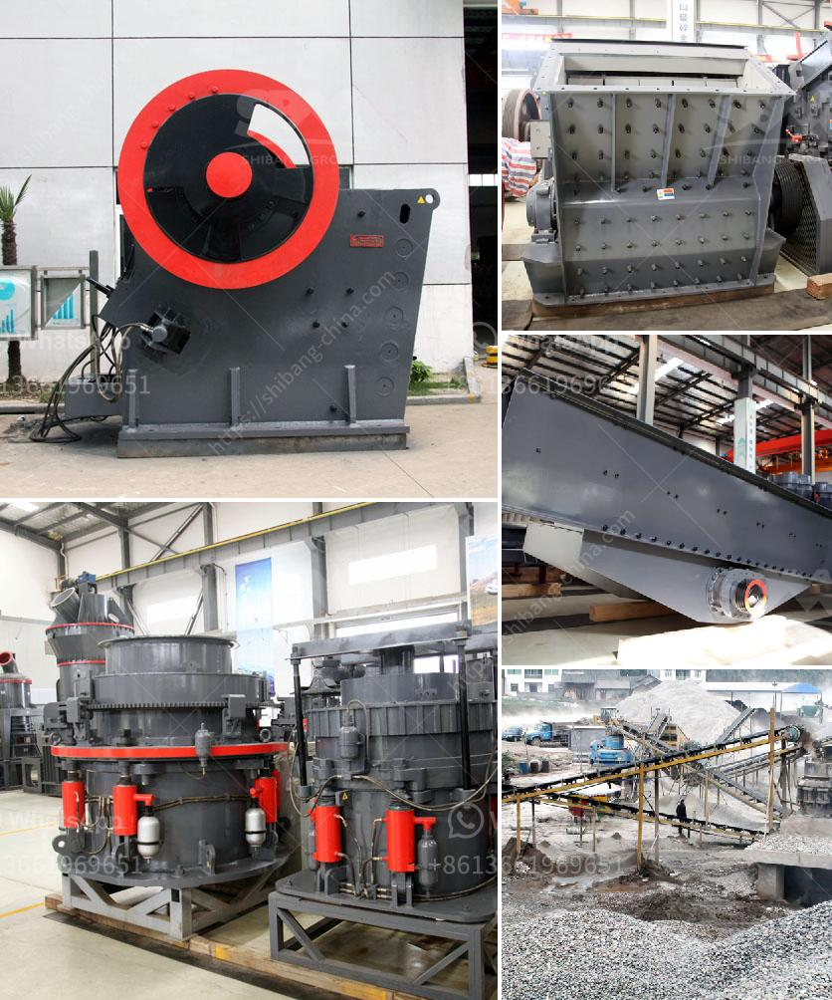

<h3>alwar raymond mill manufacturers</h3>
The industrial boom in the early 20th century drastically transformed the economic landscape of various regions across the globe. The city of Alwar, located in the state of Rajasthan, India, witnessed a similar revolution. Drawing on its rich mineral resources, such as limestone, marble, and talc, Alwar emerged as a prominent manufacturing hub, particularly in the textile and mining industries. At the heart of this industrial growth, stood the Raymond Mill Manufacturers, a pioneer in the production of fabrics and textile products, as well as a key player in the mining sector.

The Raymond Mill Manufacturers, also known as the Raymond Group, started their journey in 1925 by setting up a small woollen mill in Thane. Since then, this organization has been constantly evolving and adapting to the changing market trends, making it one of the largest integrated manufacturers of fabrics in India. With multiple manufacturing units spread across the country, Alwar became the focal point for one of their most significant establishments – the Raymond Apparel Ltd, which specializes in the production of high-quality wool and wool-blended garments.

One of the primary reasons behind the success of Alwar Raymond Mill Manufacturers is their commitment to innovation and technological advancements. They keep up with the latest machinery and equipment to ensure optimum productivity without compromising on quality. Their state-of-the-art manufacturing facilities have become a benchmark for excellence in the industry. By incorporating cutting-edge technologies, the Raymond Mill Manufacturers have been able to maintain their competitive edge in the market and meet the ever-growing demands of their customers.

Apart from contributing significantly to the textile industry, the Raymond Mill Manufacturers have also played a critical role in the mining sector. Alwar is blessed with abundant mineral resources, and the Raymond Group has been instrumental in harnessing this wealth. By engaging in responsible and sustainable mining practices, they have not only met the raw material requirements for their own textile operations but have also contributed to the overall economic development of the region. Through their mining activities, the Raymond Group has created numerous job opportunities, directly and indirectly, benefiting the local population.

The impact of Alwar Raymond Mill Manufacturers on the local economy extends beyond direct employment and business growth. As a responsible corporate citizen, they engage in various CSR (Corporate Social Responsibility) activities that help uplift the community. From funding education and healthcare initiatives to promoting environmental conservation, the Raymond Group has always prioritized the well-being of the communities they operate in. Their commitment to corporate ethics and social responsibility has earned them not just economic success but also the trust and admiration of the people.

In conclusion, the Alwar Raymond Mill Manufacturers have been integral to the industrial growth and economic transformation of the region. Their relentless pursuit of excellence, focus on innovation, and commitment to community welfare have set them apart as leaders in the textile and mining sectors. With their dedication to sustainable development and responsible mining practices, the Raymond Group continues to empower the local economy, creating employment opportunities and supporting the overall progress of Alwar and its surrounding areas.
<h3>Contact us</h3><ul><li><strong>Whatsapp:&nbsp;<a href="https://wa.me/8613661969651">+8613661969651</a></strong></li><li><a href="https://swt.shibang-china.com/?git&amp;zhl&amp;alwar raymond mill manufacturers"><strong>Online Service(chat now)</strong></a></li></ul><h3>Related</h3><ul><li><a href='coal washing plant spirals pdf.md'>coal washing plant spirals pdf</a></li><li><a href='sand washing machine lsx.md'>sand washing machine lsx</a></li><li><a href='crusher machine supplier malaysia.md'>crusher machine supplier malaysia</a></li><li><a href='china clay manufacturing process.md'>china clay manufacturing process</a></li><li><a href='mica powder making.md'>mica powder making</a></li></ul>