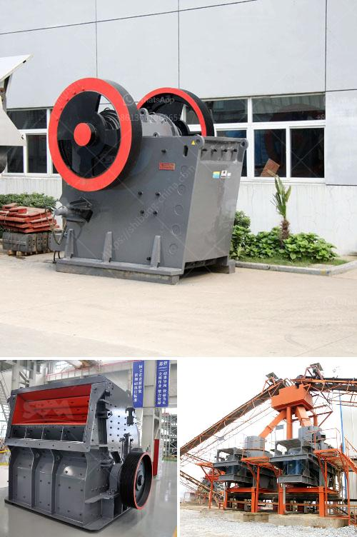

<h3>america stone crushing machines manufacturers</h3>
As the mining industry continues to boom in America, there is a growing demand for stone crushing machines across the country. This is primarily due to the increasing number of construction projects in the US, as well as the expanding commercial and residential sectors. Presently, there are around 425 million construction projects in the US, ranging from highways and bridges to office buildings and housing complexes. This surge in construction activities is driving the demand for stone crushers, thus stimulating the stone crushing machines market in America.

Stone crushing equipment is used to reduce the size, or to change the shape of the raw material mix by breaking down the stones into small pieces, so that they are easily differentiated for the desired end use. With stringent regulations set in place by the federal government regarding emission controls, the stone crushing equipment manufacturers are focusing on developing green alternatives to traditional machines. These machines are eco-friendly and ensure minimal dust and noise emissions.

Several renowned manufacturers in America offer efficient and reliable stone crushing machines, ensuring high productivity and low downtime. The machines are capable of crushing high volumes of materials such as stones, gravel, etc. efficiently and reliably, while reducing waste and minimizing emissions. These machines are used in various sectors such as mining, construction, highways, railways, and metallurgy.

One of the leading stone crushing machine manufacturers in America, Terex MPS, has introduced its new modular range of cone crushing equipment, which they claim will offer high productivity and quality, at affordable prices. Expert engineers at Terex MPS analyze the material and customize the machines accordingly, ensuring optimum performance. They also offer superior after-sales service, including installation, training, and maintenance.

Another major player in the industry, Eagle Crusher Company, offers a wide range of stone crushing machines which are highly efficient and have a longer lifespan compared to traditional crushers. They specialize in portable rock crushing machines, providing products that are both versatile and highly productive in various applications. Their machines are easy to operate and maintain, which minimizes downtime and reduces overall operational costs.

The stone crushing machines market in America is anticipated to witness exponential growth over the forecast period due to the rising infrastructure development and increasing construction activities across the region. Additionally, the availability of the latest stone crushing machines at competitive prices has further fueled the market growth in the country.

In conclusion, the stone crushing machines manufacturers in America have contributed to the growth of the construction industry and infrastructure projects across the country. With the increasing number of construction projects in the US, the demand for these machines is set to skyrocket in the coming years. Manufacturers are focusing on developing innovative, eco-friendly, and cost-effective stone crushing machines to cater to the growing demands of the market.
<h3>Contact us</h3><ul><li><strong>Whatsapp:&nbsp;<a href="https://wa.me/8613661969651">+8613661969651</a></strong></li><li><a href="https://swt.shibang-china.com/?git&amp;zhl&amp;america stone crushing machines manufacturers"><strong>Online Service(chat now)</strong></a></li></ul><h3>Related</h3><ul><li><a href='mini concrete crusher hire high wycombe.md'>mini concrete crusher hire high wycombe</a></li><li><a href='total costing of stone crusher in maharashtra.md'>total costing of stone crusher in maharashtra</a></li><li><a href='grinding ball mill.md'>grinding ball mill</a></li><li><a href='quartz stone machine of india.md'>quartz stone machine of india</a></li><li><a href='price of mining conveyor belt in south africa.md'>price of mining conveyor belt in south africa</a></li></ul>