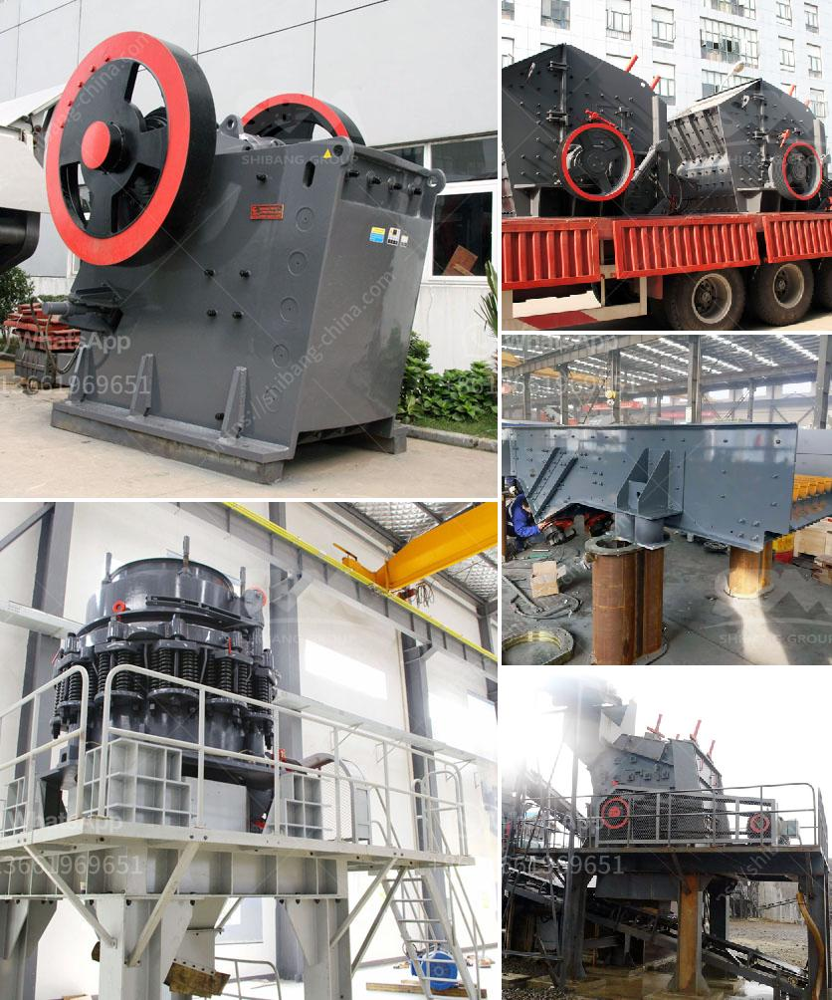

<h3>american stone crusher price</h3>
The American stone crusher price is commonly applied in various construction and mining applications. Our team of professionals have come together to outline the factors influencing this pricing trend.

First and foremost, the demand for construction material plays a significant role in determining the price of stone crushers in America. As the construction industry continues to grow, the need for stone crushers increases. These machines are essential in breaking down large rocks into smaller, more manageable pieces that can be used in construction projects.

Moreover, the availability and quality of natural stone reserves also impact the price of stone crushers. In America, there is a wide range of natural stone resources, including granite, marble, limestone, and sandstone. These materials vary in terms of hardness and durability, influencing the overall cost of stone crushers.

Next, technological advancements also contribute to the American stone crusher price. With the rapid development of technology, stone crushers are becoming more efficient, productive, and environmentally friendly. Advanced features such as hydraulic systems, automation, and energy-saving capabilities have been introduced to enhance the performance of these machines. Although these technological advancements increase the initial cost of stone crushers, they result in higher productivity, reduced maintenance, and overall lower operating costs in the long run.

Furthermore, market competition is another crucial factor affecting the American stone crusher price. Various manufacturers are vying for a share in the stone crusher market, leading to price fluctuations. Market competition encourages manufacturers to offer competitive prices to attract customers, driving the overall price down. This benefits consumers who can compare different manufacturers and select the most cost-effective stone crusher for their specific needs.

Additionally, labor and transportation costs are important considerations when setting the price of stone crushers. Labor costs encompass wages, benefits, and other associated expenses. The cost of hiring skilled operators and maintaining a qualified workforce can significantly impact the final price of stone crushers. Similarly, transportation costs, including fuel and logistical expenses, contribute to the overall price.

Lastly, macroeconomic factors, like inflation and currency exchange rates, can influence the pricing of American stone crushers. Inflation affects the cost of raw materials, equipment, and labor, consequently increasing the price of stone crushers. Fluctuations in currency exchange rates also impact the final price, particularly for imported stone crushers and components.

In conclusion, the American stone crusher price is determined by various factors, including demand, availability of natural stone, technological advancements, market competition, labor and transportation costs, and macroeconomic factors. Buyers should thoroughly consider these factors and compare options from different manufacturers to make an informed decision about acquiring the most suitable stone crusher for their needs.
<h3>Contact us</h3><ul><li><strong>Whatsapp:&nbsp;<a href="https://wa.me/8613661969651">+8613661969651</a></strong></li><li><a href="https://swt.shibang-china.com/?git&amp;zhl&amp;american stone crusher price"><strong>Online Service(chat now)</strong></a></li></ul><h3>Related</h3><ul><li><a href='economic analysis of conveyor system.md'>economic analysis of conveyor system</a></li><li><a href='products hpc cone crusher.md'>products hpc cone crusher</a></li><li><a href='gold sand processing technology.md'>gold sand processing technology</a></li><li><a href='crusher for stone stone.md'>crusher for stone stone</a></li><li><a href='price conveyor price rock crusher.md'>price conveyor price rock crusher</a></li></ul>