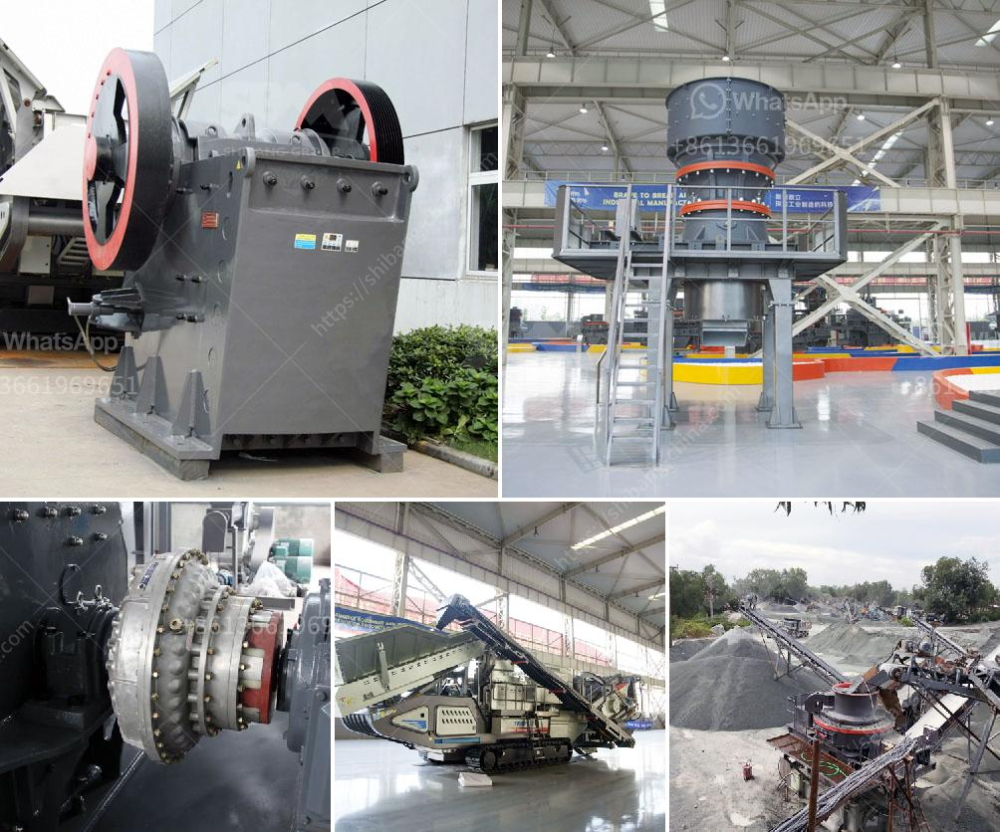

<h3>approach to the problem of a mineral crusher</h3>
In the world of rock and mineral processing, crushers play a crucial role in reducing the size of raw materials into smaller, more manageable pieces. However, these powerful machines are not without their challenges. One common issue encountered by mineral crusher operators is the constant wear and tear on the machinery, leading to frequent breakdowns and costly repair costs. In this article, we will explore a new approach to address this problem and improve the efficiency and longevity of mineral crushers.

The primary problem faced by mineral crusher operators is the high level of abrasiveness and hardness of the minerals being processed. As the minerals are fed into the crusher, they exert extreme pressure on the surfaces, causing excessive wear and subsequent damage to the machine's components. This wear and tear not only hinders the crusher's productivity but also leads to increased operational costs.

The traditional approach to combating this issue has relied heavily on reactive maintenance, which involves repairing or replacing damaged parts as they occur. While this may provide short-term solutions, it often results in frequent unplanned downtime and significantly impacts overall productivity. Moreover, the constant wear can compromise the integrity of the entire crusher structure, further exacerbating the problem.

To tackle these challenges more efficiently, a proactive approach that focuses on preventive maintenance should be adopted. Implementing a comprehensive maintenance plan and investing in high-quality parts can significantly enhance the durability of the mineral crushers.

Conducting routine inspections of the crusher helps identify potential problems before they escalate into major failures. These inspections should include a thorough examination of critical components such as the crusher liners, bearings, and seals.

By selecting wear-resistant materials for critical parts, such as the lining plates and hammers, the vulnerability to abrasive wear can be substantially reduced. Innovations in material science have introduced new alloys and composite materials that offer superior wear resistance and extended lifespan.

Proper lubrication is vital to the smooth operation of any crusher. Routine application of the appropriate lubricants reduces friction, wear, and heat generation, thereby extending the life of the machine.

Educating operators about the correct handling and operation of the mineral crusher can help minimize the incidents of avoidable wear and damage. Operators should be trained to recognize and address potential issues promptly.

Investing in real-time monitoring technology enables operators to keep track of critical parameters, such as temperature, vibration, and pressure, allowing for early detection of abnormal behavior. Timely intervention can prevent catastrophic failures and significantly reduce downtime.

By implementing a proactive maintenance strategy that incorporates regular inspections, the use of advanced wear materials, proper lubrication, operator training, and real-time monitoring technology, the longevity and efficiency of mineral crushers can be dramatically improved. Taking a holistic approach to the problem will not only minimize operational costs but also enhance productivity and ensure a smoother operation in the long run.
<h3>Contact us</h3><ul><li><strong>Whatsapp:&nbsp;<a href="https://wa.me/8613661969651">+8613661969651</a></strong></li><li><a href="https://swt.shibang-china.com/?git&amp;zhl&amp;approach to the problem of a mineral crusher"><strong>Online Service(chat now)</strong></a></li></ul><h3>Related</h3><ul><li><a href='dolomite stone crusher plant.md'>dolomite stone crusher plant</a></li><li><a href='crusher machines supplier in philippines.md'>crusher machines supplier in philippines</a></li><li><a href='crusher machine kenya.md'>crusher machine kenya</a></li><li><a href='mini crusher roller mill.md'>mini crusher roller mill</a></li><li><a href='capacity 1 to 5 tons per hour price.md'>capacity 1 to 5 tons per hour price</a></li></ul>