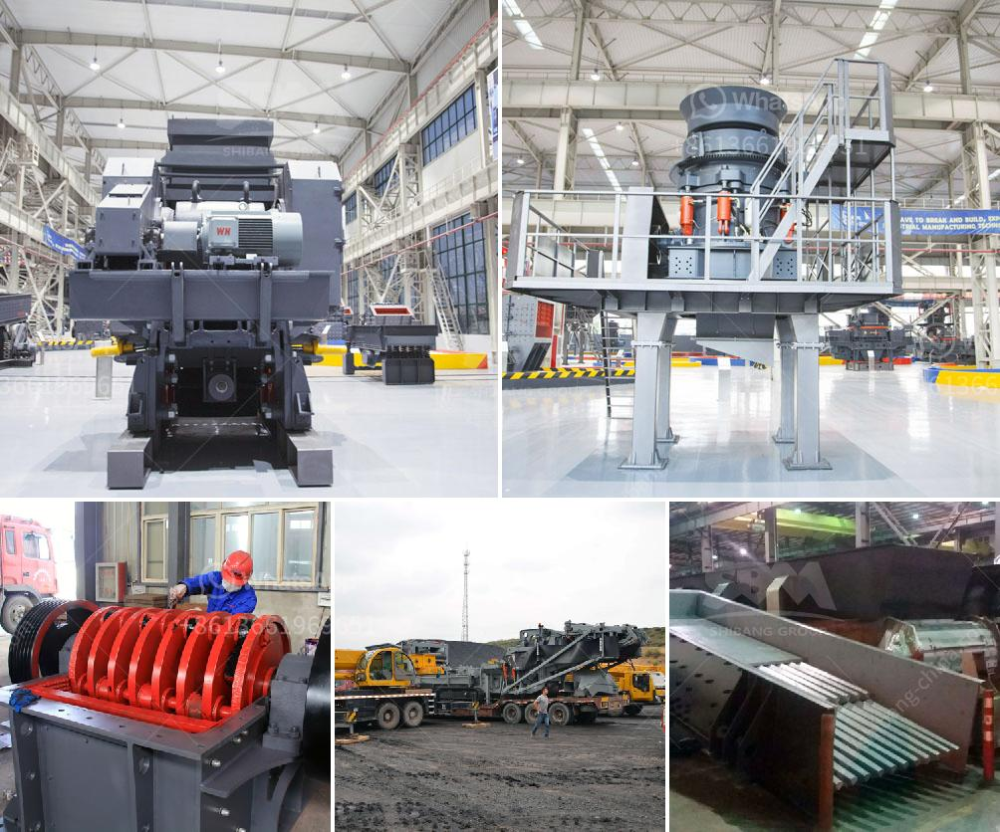

<h3>argentine hammer mill</h3>
The Argentine hammer mill is a type of crusher that is used to crush and shred grains and other raw materials for processing. This machine is specifically designed for use in the agricultural industry, where it is used to grind and crush different types of grains such as maize, wheat, barley, and oats.

One of the key features of the Argentine hammer mill is its heavy-duty construction. It is built using high-quality materials that make it durable and capable of withstanding the harsh conditions of the farming environment. The machine is also specifically designed to handle high volumes of grain at a time, making it an ideal choice for large-scale milling operations.

The hammer mill operates by rotating a shaft that is fitted with several hammers. These hammers have sharp edges that are used to crush and grind the grains into smaller particles. As the hammers rotate, they create a continuous grinding action, ensuring that the grains are evenly crushed and ground.

In addition to its primary function of grinding grains, the Argentine hammer mill also has other applications. It can be used to pulverize other materials such as wood chips, agricultural residues, and even small branches. This makes it a versatile machine that can be used in various industries beyond agriculture.

The Argentine hammer mill also offers several advantages over other types of mills. Firstly, it is highly efficient, allowing farmers to process large amounts of grain in a short period. This can significantly increase productivity and save time and labor costs. Additionally, the machine is easy to operate and maintain, requiring minimal training and upkeep.

Another advantage of the Argentine hammer mill is its versatility. It can be powered by a variety of sources, including electric motors, diesel engines, and even tractors. This flexibility allows farmers to choose the most suitable power source depending on their specific needs and availability of resources.

Furthermore, the machine is designed with safety in mind. It is equipped with various safety features, such as guards and emergency stop buttons, to ensure the safety of the operators. This is especially crucial in agricultural settings, where workers are exposed to potential hazards and accidents.

Overall, the Argentine hammer mill is a reliable and efficient machine that plays a crucial role in the agricultural industry. Its heavy-duty construction, high productivity, and versatility make it an indispensable tool for farmers and millers alike. Whether it is used for grinding grains or processing other materials, this machine offers a cost-effective and high-quality solution to meet the demands of modern farming practices.
<h3>Contact us</h3><ul><li><strong>Whatsapp:&nbsp;<a href="https://wa.me/8613661969651">+8613661969651</a></strong></li><li><a href="https://swt.shibang-china.com/?git&amp;zhl&amp;argentine hammer mill"><strong>Online Service(chat now)</strong></a></li></ul><h3>Related</h3><ul><li><a href='sand sieve machine.md'>sand sieve machine</a></li><li><a href='dolomite crusher manufacturer in usa.md'>dolomite crusher manufacturer in usa</a></li><li><a href='vertical ultra fine pulverizer.md'>vertical ultra fine pulverizer</a></li><li><a href='metal pulverizer crusher suppliers.md'>metal pulverizer crusher suppliers</a></li><li><a href='iron processing plant in mexico.md'>iron processing plant in mexico</a></li></ul>