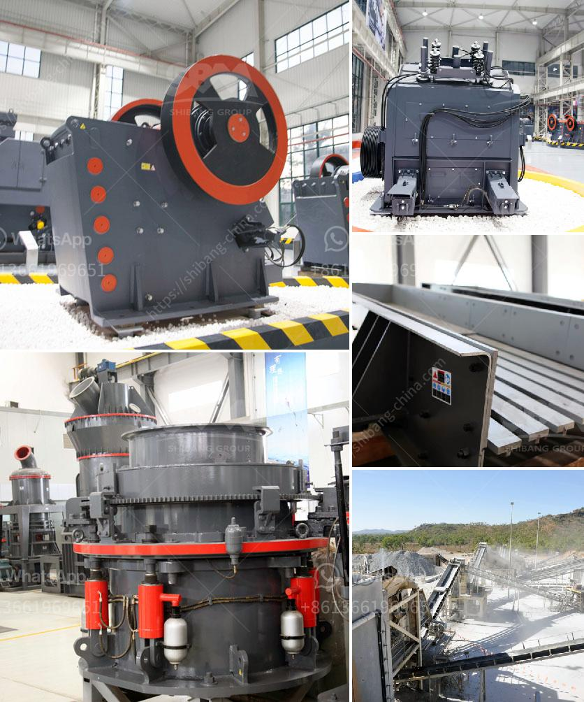

<h3>artificaial sand machine germany</h3>
With fast-paced infrastructure development and urbanization, the demand for sand has skyrocketed in recent years. However, the extraction of natural sand from rivers, lakes, and oceans has led to environmental degradation and a shortage of this vital resource. In response to these challenges, Germany has pioneered the development of Artificial Sand Machines, revolutionizing the construction industry.

Artificial sand, also known as manufactured sand, is produced by crushing rocks, stones, and aggregates into fine particles. The process involves multiple stages, including crushing, screening, and washing, to create consistently shaped sand that meets the required specifications. These artificial sand machines have gained popularity due to their numerous advantages.

Firstly, the use of artificial sand reduces the reliance on natural sand, which is becoming scarce. This helps to protect the environment by preserving riverbeds and preventing soil erosion caused by excessive sand mining. Additionally, artificial sand production is not dependent on weather conditions and can be manufactured throughout the year, ensuring a consistent supply for construction projects.

Secondly, artificial sand offers improved quality and durability over natural sand. The crushing process in artificial sand machines ensures that the particles are consistently sized and shaped, resulting in stronger and more durable concrete. This enhanced quality of artificial sand makes it ideal for various construction applications, including roads, buildings, and bridges.

Thirdly, the use of artificial sand also contributes to cost savings. With the increasing scarcity of natural sand, the cost of extraction and transportation has surged. In contrast, the production of artificial sand can be done locally, reducing transportation costs and enabling construction projects to be completed more efficiently and economically.

Germany, known for its technological advancements, has been at the forefront of developing and refining artificial sand machines. These machines are equipped with advanced technology and automation, ensuring precise and consistent production of high-quality artificial sand. German manufacturers have also incorporated eco-friendly features in their machines, minimizing energy consumption and reducing carbon emissions.

Overall, the development and implementation of artificial sand machines in Germany have greatly transformed the construction industry. Besides addressing environmental concerns, these machines offer a reliable and sustainable solution to meet the ever-increasing demand for sand. As other countries observe the success of Germany's initiatives, the adoption of artificial sand machines will likely increase worldwide, ushering in a new era of sustainable construction.
<h3>Contact us</h3><ul><li><strong>Whatsapp:&nbsp;<a href="https://wa.me/8613661969651">+8613661969651</a></strong></li><li><a href="https://swt.shibang-china.com/?git&amp;zhl&amp;artificaial sand machine germany"><strong>Online Service(chat now)</strong></a></li></ul><h3>Related</h3><ul><li><a href='coal vertical mill.md'>coal vertical mill</a></li><li><a href='chrome ore crushers and screeners for hire in south africa.md'>chrome ore crushers and screeners for hire in south africa</a></li><li><a href='limestone quarrying process.md'>limestone quarrying process</a></li><li><a href='continuous ball mill manufactures in gujrat.md'>continuous ball mill manufactures in gujrat</a></li><li><a href='ball and pebble mills.md'>ball and pebble mills</a></li></ul>