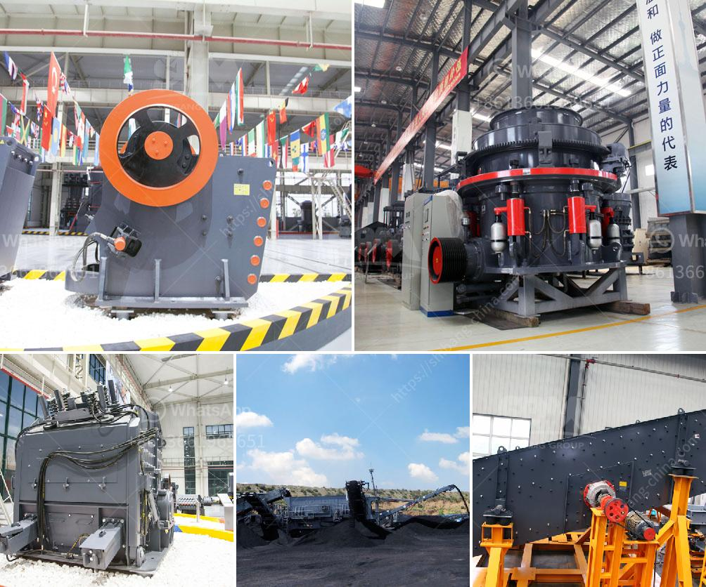

<h3>automation conveyor belts</h3>
In today's fast-paced world, industries are constantly seeking innovative ways to improve productivity and efficiency. One such technological advancement that has transformed the manufacturing sector is automation conveyor belts. These automated systems have revolutionized the way goods are processed, transported, and distributed, making production processes faster, safer, and more streamlined.

Automation conveyor belts are essentially mechanical systems that consist of an endless belt looped around rollers, driven by a motor. They are designed to move goods and materials from one point to another, eliminating the need for human intervention or manual handling. These systems can be customized to cater to the specific requirements of a wide range of industries, including automotive, food and beverage, pharmaceuticals, logistics, and many others.

One of the key advantages of automation conveyor belts is their ability to enhance production efficiency. By automating the transportation of goods, these systems ensure a continuous flow of materials, eliminating bottlenecks and reducing downtime. With precise control over speed and movement, manufacturers can optimize the flow of materials, resulting in increased productivity and output.

Moreover, automation conveyor belts enable companies to improve workplace safety. Manual material handling can lead to injuries, strain, and fatigue among workers. By automating this process, the risk of accidents and injuries is significantly reduced. Workers can be allocated to more skilled and intricate tasks, while the automated conveyor belt system takes care of the monotonous and repetitive work, creating a safer and more ergonomic work environment.

Another notable benefit of automation conveyor belts is their ability to enhance product quality. These systems offer gentle and controlled transportation of goods, reducing the likelihood of damage or breakage. By eliminating human error and providing consistent movement, the risk of defects and faulty products is greatly minimized. This, in turn, improves customer satisfaction and reduces waste, as fewer products need to be discarded due to damage during transportation.

In addition to improving efficiency and quality, automation conveyor belts enable manufacturers to save on labor costs. By reducing the need for manual labor, companies can allocate their workforce to higher-value tasks that require skilled expertise. This not only maximizes the efficiency of human resources but also reduces labor-related expenses over time.

The adaptability of automation conveyor belts is another notable advantage. These systems can be easily integrated into existing production lines, allowing manufacturers to upgrade their operations without significant disruptions. Additionally, automation conveyor belts can be customized to accommodate various shapes, sizes, and weights of products, providing flexibility and versatility in handling different types of materials.

In conclusion, automation conveyor belts have revolutionized the manufacturing industry by streamlining production processes, improving efficiency, enhancing workplace safety, and ensuring high product quality. These systems have become indispensable in modern manufacturing facilities, meeting the growing demands for faster, safer, and cost-effective operations. As industries continue to evolve, it is clear that automation conveyor belts will remain at the forefront of technological advancements, driving growth and innovation in the manufacturing sector.
<h3>Contact us</h3><ul><li><strong>Whatsapp:&nbsp;<a href="https://wa.me/8613661969651">+8613661969651</a></strong></li><li><a href="https://swt.shibang-china.com/?git&amp;zhl&amp;automation conveyor belts"><strong>Online Service(chat now)</strong></a></li></ul><h3>Related</h3><ul><li><a href='grinding machine for salt in pakistan.md'>grinding machine for salt in pakistan</a></li><li><a href='stone crusher indonesia dan jerman.md'>stone crusher indonesia dan jerman</a></li><li><a href='iron ore magnetic separation from titanium process.md'>iron ore magnetic separation from titanium process</a></li><li><a href='granite stone quarrying equipment.md'>granite stone quarrying equipment</a></li><li><a href='stone crusher plant tph layout.md'>stone crusher plant tph layout</a></li></ul>