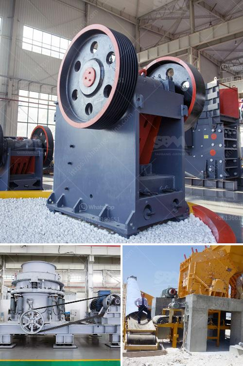

<h3>bal mill snsttlled capacity</h3>
The ball mill is a crucial piece of equipment for grinding materials in various industries. It is primarily used in the mineral processing industry to grind ores and other materials, such as iron ore, gold ore, copper ore, cement, clinker, limestone, and more. With its wide range of applications, the ball mill has become an indispensable tool for manufacturers worldwide.

One key factor to consider when selecting a ball mill is its installed capacity. The installed capacity determines the mill's efficiency and processing capabilities. A higher installed capacity means the mill can handle a larger amount of materials, resulting in increased productivity.

Ball mills are available with various installed capacities, ranging from as low as a few hundred kilograms to several tons. However, for most industrial applications, a ball mill with a capacity between 100 and 300 tons is commonly used.

The choice of the specific installed capacity depends on several factors, including the size of the processing plant, the desired output, and the characteristics of the materials being processed. Higher-capacity ball mills are suitable for large-scale operations, such as mining and cement manufacturing, where a huge amount of materials need to be processed continuously.

An installed capacity of 100 to 300 tons ensures that the ball mill can handle the grinding requirements efficiently without significant downtime for maintenance or equipment failures. It allows for continuous operation, thereby maximizing production and minimizing downtime, leading to cost savings.

Moreover, a higher installed capacity provides flexibility in processing different types of materials with varying hardness levels. It enables manufacturers to adapt to changing production demands and process a wide range of materials without the need for frequent equipment upgrades.

In conclusion, the installed capacity of a ball mill plays a vital role in determining its efficiency and productivity. For most industrial applications, a ball mill with a capacity between 100 and 300 tons is ideal. This range ensures that the mill can handle large volumes of materials, resulting in increased productivity, cost savings, and operational flexibility. Manufacturers across various industries should carefully consider the installed capacity of a ball mill when selecting equipment for their processing needs.
<h3>Contact us</h3><ul><li><strong>Whatsapp:&nbsp;<a href="https://wa.me/8613661969651">+8613661969651</a></strong></li><li><a href="https://swt.shibang-china.com/?git&amp;zhl&amp;bal mill snsttlled capacity"><strong>Online Service(chat now)</strong></a></li></ul><h3>Related</h3><ul><li><a href='fly ash grinding mill.md'>fly ash grinding mill</a></li><li><a href='trommel screen suppliers in india.md'>trommel screen suppliers in india</a></li><li><a href='sand washinng plant makers in srilanka.md'>sand washinng plant makers in srilanka</a></li><li><a href='nepal jaw crusher or sale.md'>nepal jaw crusher or sale</a></li><li><a href='mobile coal crusher for sale in south africa.md'>mobile coal crusher for sale in south africa</a></li></ul>