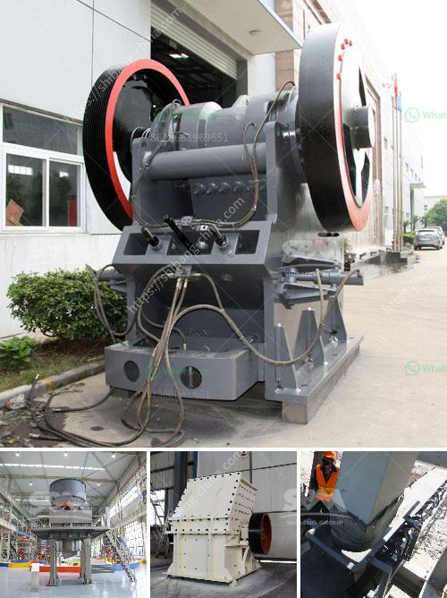

<h3>ball and pebble mills</h3>
Ball and pebble mills are both cylindrical-shaped grinding mills that are used to grind various materials into fine powders. These mills are often used in mineral processing, paint production, cement production, and other industrial applications.

Ball mills, also known as tumbling mills, are predominantly used to crush ore particles and finely grind them to a specific size. They consist of a hollow cylinder that rotates on its axis, which contains grinding media such as balls made of steel or ceramics. The rotation of the cylinder causes the grinding media to collide with the ore particles, thus reducing their size. The material to be ground is fed into the mill through a hollow trunnion, which is further discharged through a grate at the other end of the mill.

Pebble mills, on the other hand, are primarily used as secondary grinding mills in flotation circuits. They are similar in design to ball mills, but instead of using grinding balls, they use pebbles made of ceramic or natural rock materials. These pebbles act as the grinding media and grind the ore particles by impact and attrition. Pebble mills are often used when there is high variability in ore properties or when there is a need for selective grinding, as they can provide more control over the final product size.

One key advantage of ball and pebble mills is their versatility. They can be easily adapted to different materials and grinding conditions, allowing for various types of grinding processes. For instance, wet grinding is often preferred in ball mills, where a slurry is added to the grinding chamber to aid in the grinding process. This can be particularly beneficial for materials that are sensitive to heat or those that require a fine dispersion.

In addition to their versatility, ball and pebble mills are also known for their energy efficiency. They can grind materials to finer sizes compared to other types of mills, reducing the need for additional grinding stages. Moreover, their relatively low rotational speeds minimize wear and tear on the mill's internal components, leading to lower maintenance costs. Their simple design also ensures easy installation and operation, making them suitable for both small-scale and large-scale production facilities.

However, despite their advantages, ball and pebble mills also have limitations. As with any grinding process, there is the risk of overgrinding, which can result in a lower recovery rate of valuable minerals or an undesirable increase in the proportion of fine particles in the final product. Additionally, the choice of grinding media and the operating conditions can affect the efficiency and performance of these mills.

In conclusion, ball and pebble mills are widely used in various industries for grinding materials into fine powders. Their versatility, energy efficiency, and ease of operation make them popular choices for mineral processing, paint production, and other industrial applications. However, careful consideration must be given to the selection of grinding media and the operating conditions to ensure optimal performance and desired grinding outcomes.
<h3>Contact us</h3><ul><li><strong>Whatsapp:&nbsp;<a href="https://wa.me/8613661969651">+8613661969651</a></strong></li><li><a href="https://swt.shibang-china.com/?git&amp;zhl&amp;ball and pebble mills"><strong>Online Service(chat now)</strong></a></li></ul><h3>Related</h3><ul><li><a href='dubai stone crushing auction.md'>dubai stone crushing auction</a></li><li><a href='mineral mining and processing plant in south africa.md'>mineral mining and processing plant in south africa</a></li><li><a href='ball mills price.md'>ball mills price</a></li><li><a href='equipment jaw crusher for sale philippine.md'>equipment jaw crusher for sale philippine</a></li><li><a href='cone crushers for sale in philippines.md'>cone crushers for sale in philippines</a></li></ul>