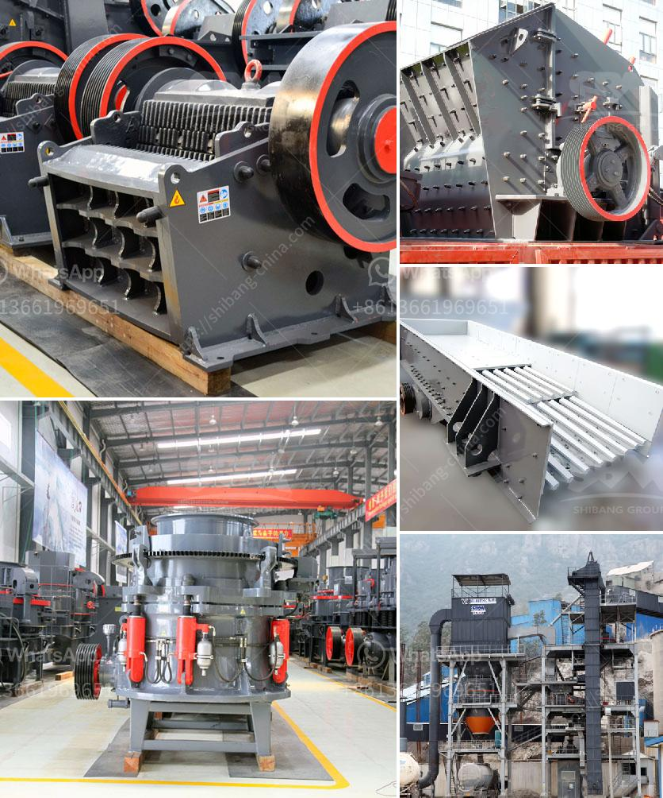

<h3>ball crusher gold machine</h3>
The ball crusher gold machine is a state-of-the-art technology, designed to extract gold from the difficult-to-mine and highly dispersed ore bodies. It utilizes an innovative combination of mechanical crushing and chemical leaching to provide a highly efficient method for gold recovery. This machine has the potential to revolutionize gold mining and greatly increase productivity in the industry.

One of the key features of the ball crusher gold machine is its ability to crush the ore into fine particles. Traditionally, gold mining has relied on manual labor or machinery that could only break down the ore into small fragments. However, with the ball crusher gold machine, the ore is finely pulverized, enabling more efficient gold extraction.

Another standout feature of the ball crusher gold machine is its chemical leaching capability. After the ore is crushed, a cyanide solution is added to dissolve the gold. This chemical process ensures maximum gold recovery from the ore. Additionally, the crushed ore is mixed with water to create a slurry, which is then pumped through specially designed tanks and filters to separate the gold from the residual materials.

The ball crusher gold machine also incorporates a high-tech control system, which allows for precise and consistent processing. This ensures that the gold recovery rate is maximized, reducing wastage and increasing profit margins for mining companies.

Furthermore, the machine is designed to be environmentally friendly. It employs water recycling systems to minimize water consumption, and the use of chemical reagents is carefully controlled to prevent any environmental harm.

In summary, the ball crusher gold machine represents a significant advancement in gold mining technology. It offers a more efficient and effective method for extracting gold from difficult ore bodies, while also reducing environmental impact. With its state-of-the-art crushing and leaching capabilities, this machine has the potential to revolutionize the gold mining industry and pave the way for increased productivity and profitability.
<h3>Contact us</h3><ul><li><strong>Whatsapp:&nbsp;<a href="https://wa.me/8613661969651">+8613661969651</a></strong></li><li><a href="https://swt.shibang-china.com/?git&amp;zhl&amp;ball crusher gold machine"><strong>Online Service(chat now)</strong></a></li></ul><h3>Related</h3><ul><li><a href='used ball mill for sale india.md'>used ball mill for sale india</a></li><li><a href='smallfine powder grinding machine nigeria.md'>smallfine powder grinding machine nigeria</a></li><li><a href='stone mining crusher in jharkhand.md'>stone mining crusher in jharkhand</a></li><li><a href='aggregate washing machine.md'>aggregate washing machine</a></li><li><a href='fine powder grinding machine philippines.md'>fine powder grinding machine philippines</a></li></ul>