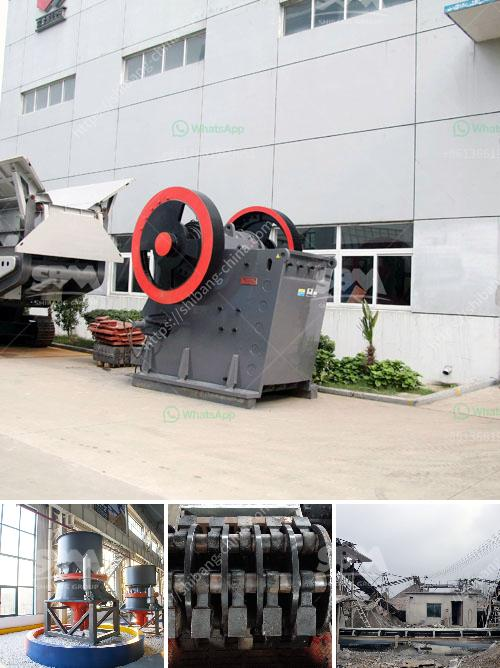

<h3>ball mill cost for 100ton cement plant</h3>
Cement production plays a vital role in building infrastructure and ensuring the efficient functioning of various industries. The cement industry is the backbone of the construction sector and contributes significantly to the economic growth of a country. Ball mills are commonly used to grind materials into extremely fine powders in various industries, including cement production.

A ball mill is a cylindrical machine that rotates horizontally around its axis, with grinding media such as steel balls, ceramic pebbles, or natural pebbles. As the material to be ground moves through the mill, it is exposed to a combination of forces that break it down into smaller particles. These particles are then used to create cement, which is a crucial component in the construction industry.

When considering the cost of a ball mill for a 100-ton cement plant, several factors need to be taken into account. The first factor is the size and capacity of the mill. The larger the mill, the more materials it can process at one time, which significantly increases efficiency. Typically, a larger mill will be more expensive than a smaller one due to the additional construction materials and components required.

Another important factor to consider is the type of mill lining. Different types of lining materials, such as rubber, metal, or ceramic, can affect the performance and longevity of the mill. Rubber linings are more cost-effective and durable, making them a popular choice in the cement industry.

Additionally, the cost of grinding media is an essential consideration. The type and quality of grinding media used in a ball mill can significantly impact its performance and overall cost. High-quality grinding media can be more expensive but usually lasts longer, resulting in lower replacement costs over time.

Furthermore, the requirement for maintenance and spare parts should also be considered when calculating the cost of a ball mill for a cement plant. Regular maintenance, including lubrication, inspection, and replacement of worn-out parts, is crucial for the optimal performance and longevity of the mill. Spare parts availability and pricing can vary depending on the manufacturer and supplier, so it is essential to choose a reliable provider.

In conclusion, the cost of a ball mill for a 100-ton cement plant can vary significantly depending on various factors. These factors include the size and capacity of the mill, the type of mill lining, the quality of grinding media, and the maintenance and spare parts requirements. It is crucial to evaluate these factors carefully to determine the most cost-effective option for the specific needs of the cement plant. Investing in a high-quality and efficient ball mill can ultimately lead to significant cost savings and improved productivity in the cement production process.
<h3>Contact us</h3><ul><li><strong>Whatsapp:&nbsp;<a href="https://wa.me/8613661969651">+8613661969651</a></strong></li><li><a href="https://swt.shibang-china.com/?git&amp;zhl&amp;ball mill cost for 100ton cement plant"><strong>Online Service(chat now)</strong></a></li></ul><h3>Related</h3><ul><li><a href='grinding machine for making fine powder.md'>grinding machine for making fine powder</a></li><li><a href='ball mills 7 x 12 usa.md'>ball mills 7 x 12 usa</a></li><li><a href='cost of copper ore processing plant.md'>cost of copper ore processing plant</a></li><li><a href='silica sand washing machine in south africa.md'>silica sand washing machine in south africa</a></li><li><a href='stone crushing sample business plan.md'>stone crushing sample business plan</a></li></ul>