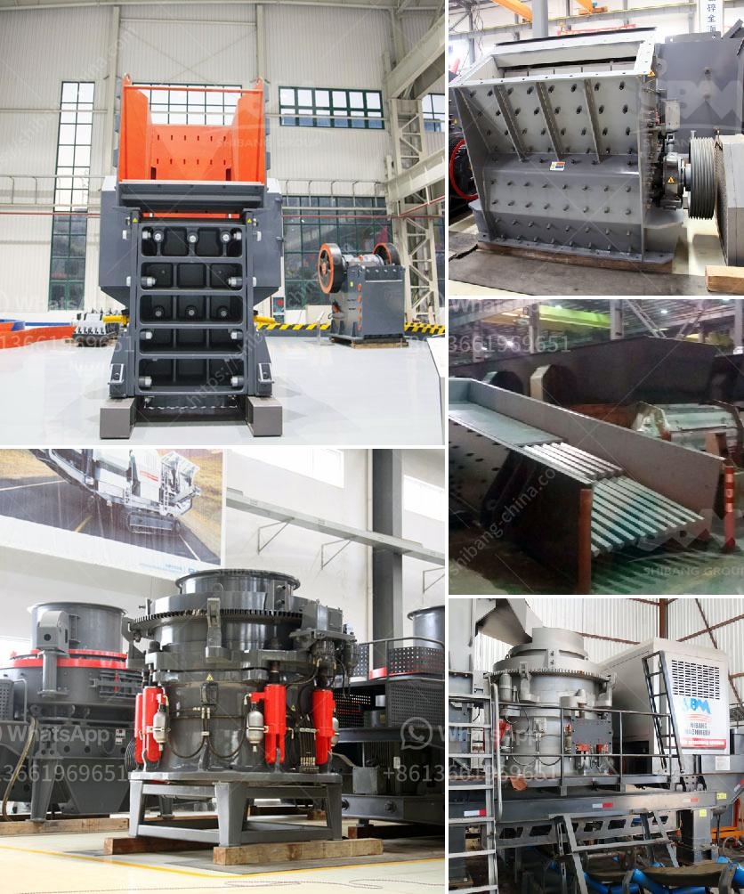

<h3>ball mill crusher efficiency</h3>
The ball mill crusher is an efficient grinding tool, which is capable of grinding various types of material into fine powder. The ball mill crusher is usually used to grind hard or brittle material like limestone, quartz, granite, iron ore, copper ore, gold ore, limestone, cement clinker, coal, etc.

Ball mills work by rotating around a horizontal axis, partially filled with the material to be ground, plus the grinding medium. Different materials are used as media, including ceramic balls, flint pebbles, and stainless steel balls. An internal cascading effect reduces the material to a fine powder.

The efficiency of the ball mill crusher depends on various factors, such as the nature of the material, size of the feed, speed of rotation, the diameter of the mill, and the grinding media. The particles are reduced in size through a combination of impact, attrition, and compression forces.

One of the main factors affecting the efficiency of the ball mill crusher is the nature of the material being crushed. Different materials have different characteristics, such as hardness, viscosity, and moisture content, which can affect the grindability and efficiency of the grinding process. For example, harder materials require more energy to grind and may result in higher wear of the grinding media.

The size of the feed also affects the efficiency of the ball mill crusher. A smaller feed size will result in a finer product, while a larger feed size may lead to a coarser product. The optimal feed size depends on the specific material properties and the desired final product size.

The speed of rotation of the ball mill crusher also plays a significant role in its efficiency. Higher rotation speeds offer more kinetic energy to the grinding media, leading to more effective grinding. However, excessively high speeds can cause wear and tear on the mill lining and grinding media.

The diameter of the mill and the grinding media also influence the efficiency of the ball mill crusher. A larger diameter mill will require more grinding media, resulting in greater impact and grinding action. On the other hand, a smaller diameter mill with a higher mass of media will have a greater grinding surface area, resulting in more efficient grinding.

Maintaining the proper operational conditions, such as the correct level of filling the mill and the proper material charge, is crucial for maximizing the efficiency of the ball mill crusher. Overfilling the mill can lead to excessive wear of the mill lining and grinding media, while underfilling may result in inefficient grinding.

In conclusion, the efficiency of the ball mill crusher is influenced by various factors, including the nature of the material, size of the feed, speed of rotation, diameter of the mill, and the grinding media. Understanding these factors and implementing appropriate measures can help maximize the efficiency and productivity of the ball mill crusher, resulting in finer product size and lower energy consumption.
<h3>Contact us</h3><ul><li><strong>Whatsapp:&nbsp;<a href="https://wa.me/8613661969651">+8613661969651</a></strong></li><li><a href="https://swt.shibang-china.com/?git&amp;zhl&amp;ball mill crusher efficiency"><strong>Online Service(chat now)</strong></a></li></ul><h3>Related</h3><ul><li><a href='ballast crusher for sale in kenya.md'>ballast crusher for sale in kenya</a></li><li><a href='germany hammer crusher.md'>germany hammer crusher</a></li><li><a href='movable gravel crusher.md'>movable gravel crusher</a></li><li><a href='limestone quarrying process.md'>limestone quarrying process</a></li><li><a href='machinery required to extract the platinum.md'>machinery required to extract the platinum</a></li></ul>