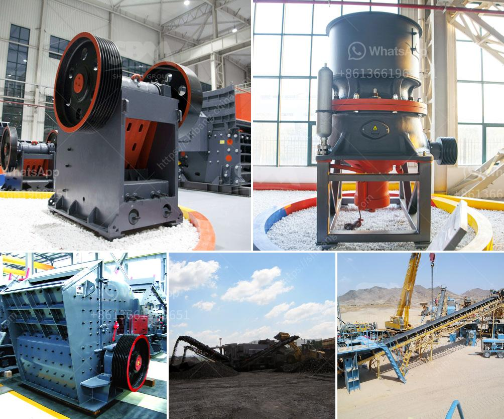

<h3>ball mill design calculation pdf</h3>
Ball mill design calculation pdf is primarily used in the grinding of raw materials in the cement industry. It is also used in the mining industry, where it is used to grind ores before flotation. It can also be used for dry and wet grinding of various ores and other materials such as limestone, clinker, coal, etc.

Ball mill design calculation pdf involves cylindrical shell rotating about a horizontal axis, with a feed and discharge end. The grinding media inside the cylinder are typically steel balls. As the shell rotates, the balls are lifted up on the rising side of the shell and then they cascade down, causing the material to be ground by impact and attrition.

To calculate the ball mill design calculation pdf, you need to have sufficient knowledge about the project objective and specifications, including the required capacity, material characteristics, and mill diameter. These parameters will help you determine the size and type of grinding media, mill speed, and critical speed of operation.

The critical speed is the speed at which the grinding media will centrifuge against the lining of the mill. It is typically defined as a percentage of the mill diameter. To ensure efficient operation, the mill should be operated at a speed that is 70-80% of the critical speed.

The design of the ball mill should include sizing of the liner, grinding media, mill length, and diameter. The liner thickness should be determined based on the mill diameter, hardness of the ore, and projected wear rate. The grinding media size and type will also influence the grinding efficiency and product fineness.

In conclusion, the ball mill design calculation pdf is essential for the efficient operation of any grinding mill. It is important to determine the appropriate mill size, power requirement, grinding media size, and type, liner thickness, and critical speed of operation. Proper design and calculation will optimize mill performance and maximize profitability in the cement and mining industries.
<h3>Contact us</h3><ul><li><strong>Whatsapp:&nbsp;<a href="https://wa.me/8613661969651">+8613661969651</a></strong></li><li><a href="https://swt.shibang-china.com/?git&amp;zhl&amp;ball mill design calculation pdf"><strong>Online Service(chat now)</strong></a></li></ul><h3>Related</h3><ul><li><a href='coal mining processes and machinary required.md'>coal mining processes and machinary required</a></li><li><a href='dry grinding ball mill.md'>dry grinding ball mill</a></li><li><a href='granite crusher supplier.md'>granite crusher supplier</a></li><li><a href='picture of a rock crusher machine.md'>picture of a rock crusher machine</a></li><li><a href='wet and dry ball mill.md'>wet and dry ball mill</a></li></ul>