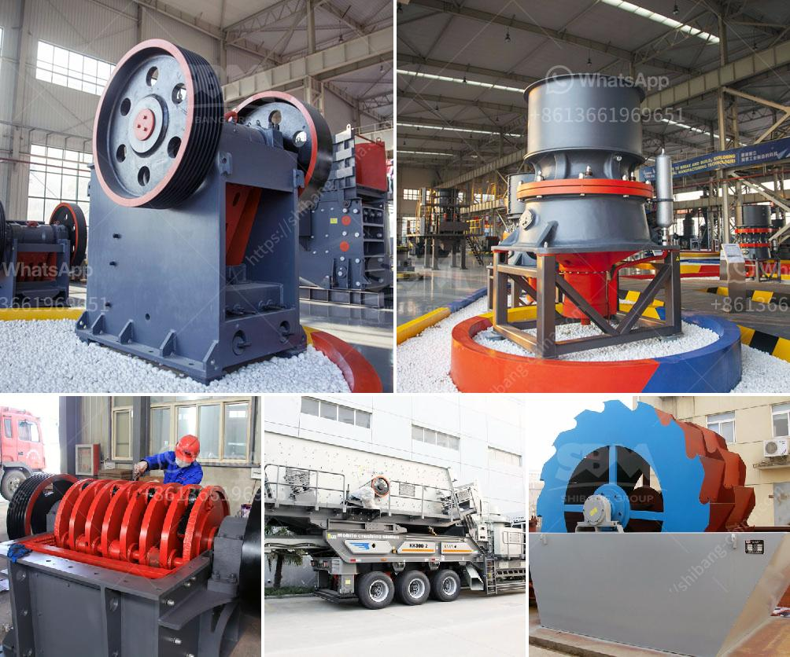

<h3>ball mill for aluminum powder</h3>
This article aims to discuss the usage of ball mill machinery for the production of aluminum powder by analyzing the essential characteristics of this milling equipment.

Aluminum powder has a wide range of applications in various industries, including aerospace, automotive, and pharmaceuticals. Its lightweight property and ability to resist corrosion make it a popular choice for manufacturing products such as firecrackers, paints, thermite, and many more.

To produce aluminum powder, finely ground aluminum is mixed with a variety of additives, such as solvents, binders, and lubricants, in a ball mill. This process leads to the production of aluminum flakes, which are then used in various industrial applications.

The ball mill is a key piece of equipment in the aluminum powder milling process. It is a relatively simple machine that primarily consists of a cylindrical container within which powdered aluminum is blended along with the necessary additives. The inside of the container is lined with grinding media, typically metallic balls, to facilitate the milling process.

Several factors contribute to the effectiveness of the ball mill in producing aluminum powder. Firstly, the speed at which the cylindrical container rotates influences the impact force generated by the grinding media. By adjusting the rotational speed, the desired consistency and fineness of the aluminum powder can be achieved.

Furthermore, the size and shape of the grinding media play a crucial role in the milling process. The selection of grinding media with the appropriate size and shape ensures efficient grinding and uniform dispersion of the aluminum particles. Different types of grinding media, such as steel balls, ceramic balls, or even pebbles, can be used based on the desired outcome and the sensitivity of the aluminum powder to contamination.

The milling process also comprises certain safety considerations, given the explosive nature of finely ground aluminum particles. It is crucial to ensure that the milling equipment is operated in a controlled environment to minimize any risk of accidents. Additionally, the use of suitable protective measures, including dust collection systems and proper ventilation, helps maintain a safe working environment.

In conclusion, the ball mill is an efficient and reliable tool that can effectively grind and blend aluminum powder into a uniform mixture. Various additives can be blended into the powder during the milling process to achieve the desired characteristics. The selection of appropriate grinding media and the control of milling parameters are crucial for obtaining the desired consistency and fineness of the aluminum powder. However, it is important to exercise caution and adhere to safety protocols while operating a ball mill due to the potentially hazardous nature of aluminum powder.
<h3>Contact us</h3><ul><li><strong>Whatsapp:&nbsp;<a href="https://wa.me/8613661969651">+8613661969651</a></strong></li><li><a href="https://swt.shibang-china.com/?git&amp;zhl&amp;ball mill for aluminum powder"><strong>Online Service(chat now)</strong></a></li></ul><h3>Related</h3><ul><li><a href='clay ball mill machine.md'>clay ball mill machine</a></li><li><a href='feldspar powder plants in andhra pradesh.md'>feldspar powder plants in andhra pradesh</a></li><li><a href='gravel washing plant for sale in uk.md'>gravel washing plant for sale in uk</a></li><li><a href='small jaw crusher supplier.md'>small jaw crusher supplier</a></li><li><a href='cost of a primairy crusher.md'>cost of a primairy crusher</a></li></ul>