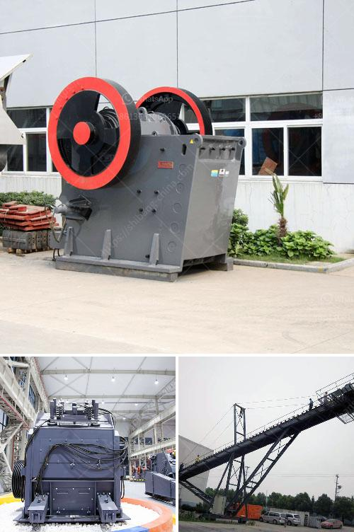

<h3>ball mill for lime slaking</h3>
Ball mill for lime slaking is a critical equipment in mineral processing plants. It is used to grind lime particles into powdered form for use in various industries and to purify the gypsum resulting from the lime slaking process.

Lime slaking, or slaking lime, is a process of adding water to quicklime to produce hydrated lime, also known as slaked lime or calcium hydroxide. This process is commonly referred to as slaking lime because it involves the production of a lime slurry, which can be thought of as a creamy mixture of water and lime particles.

The ball mill for lime slaking is a cylindrical device used to grind lime particles into fine powder. It is widely used in lime slaking process due to its high efficiency, strong adaptability to materials and continuous production capacity.

The ball mill has a cylindrical shell, rotating on a horizontal axis. This shell is filled with grinding media, such as stainless steel balls or ceramic balls. The sizes of the grinding media depend on the desired fineness of the lime powder and the ultimate use of the lime slurry.

Inside the ball mill, lime particles are subjected to the force of impact and friction by the grinding media, resulting in their breakage and reduction in size. The grinding process is facilitated by the use of a water injection system, which helps in the slaking of lime particles and the preparation of a consistent lime slurry.

The ball mill for lime slaking has an optimal operating speed, where the centrifugal force at the top of the mill is just balanced by the force of gravity. This creates a cascading motion that produces a highly efficient grinding action.

In addition to its role in lime slaking, the ball mill for lime slaking also has a secondary function as a classifier. The grinding media not only break down the lime particles but also classify them based on their size. This classification helps in ensuring the consistency and quality of the lime slurry produced by the mill.

The output of the ball mill for lime slaking can be controlled by adjusting various parameters such as the speed of the mill, the amount of grinding media, and the feed rate of lime into the mill. By optimizing these parameters, operators can achieve the desired fineness of the lime powder and the required consistency of the lime slurry.

In conclusion, the ball mill for lime slaking is a critical equipment in mineral processing plants. It provides an efficient and effective way to grind lime particles into a fine powder and produce a consistent lime slurry. The use of a ball mill for lime slaking enhances the efficiency of the slaking process and ensures the quality of the lime slurry produced.
<h3>Contact us</h3><ul><li><strong>Whatsapp:&nbsp;<a href="https://wa.me/8613661969651">+8613661969651</a></strong></li><li><a href="https://swt.shibang-china.com/?git&amp;zhl&amp;ball mill for lime slaking"><strong>Online Service(chat now)</strong></a></li></ul><h3>Related</h3><ul><li><a href='iron ore crusher units in orissa.md'>iron ore crusher units in orissa</a></li><li><a href='clay beneficiation.md'>clay beneficiation</a></li><li><a href='chrome mining process machines.md'>chrome mining process machines</a></li><li><a href='gold shaker wash plant trommel for sale used new.md'>gold shaker wash plant trommel for sale used new</a></li><li><a href='nigeria jaw crusher.md'>nigeria jaw crusher</a></li></ul>