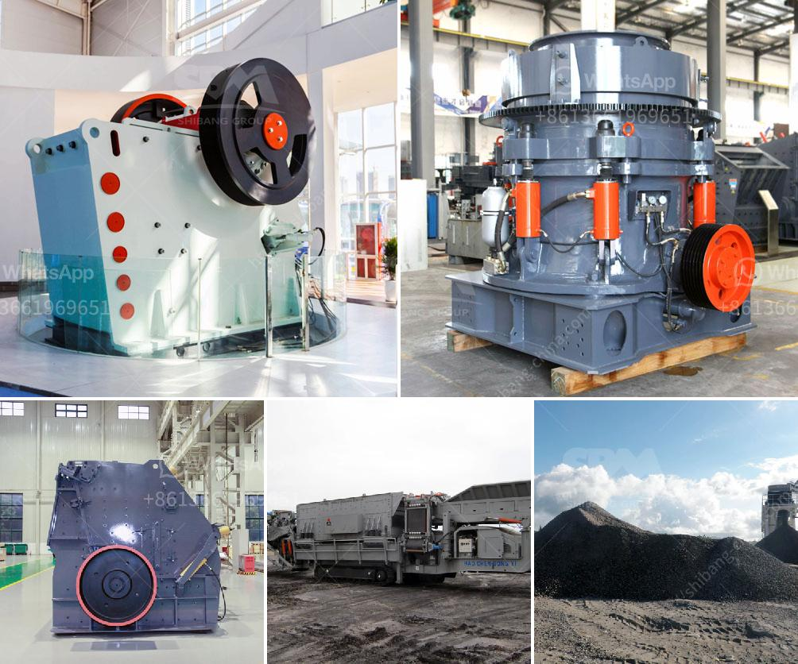

<h3>ball mill for manufacturing</h3>
A ball mill is a type of grinder used to grind, blend, and sometimes for mixing of materials for use in the process of mineral coating, paint, pyrotechnics, ceramics, and selective laser sintering. It works by the principle of impact and attrition: size reduction is done by impact as the balls drop from near the top of the shell.

The ball mill is a cylindrical drum (or cylindrical conical) turning around its horizontal axis. It is partially filled with grinding medium: metallic balls or rods (or hard pebbles). The material to be grind is added into the mill, and as the drum rotates, the balls grind the material into a powder.

Ball mills are commonly used in the manufacturing process for cement, coal preparation, power generation, ceramics, and metallurgy. They are also widely used in the construction industry for building material, chemical industry, refractory industry, pharmaceuticals, and lime industry.

One of the main advantages of the ball mill is its versatility. With a wide range of applications, it is suitable for both dry and wet grinding processes. The mill can be used for grinding a variety of ores and other materials, such as limestone, clinker, coal, and other minerals. Additionally, it can be used in both open-circuit grinding and closed-circuit grinding systems.

The efficiency of the ball mill depends on the size and weight of the grinding medium, the speed of rotation of the mill, and the quality and consistency of the material being ground. The size of the grinding medium can range from large steel balls to small ceramic balls, and the speed of rotation can vary from low to high, depending on the application.

In conclusion, the ball mill is a reliable and efficient tool for grinding materials in the manufacturing process. It offers numerous benefits, including versatility, high grinding efficiency, and low maintenance requirements. Whether used in cement production, coal preparation, or any other industry, the ball mill is a critical piece of equipment that can grind a wide range of materials to the desired fineness.
<h3>Contact us</h3><ul><li><strong>Whatsapp:&nbsp;<a href="https://wa.me/8613661969651">+8613661969651</a></strong></li><li><a href="https://swt.shibang-china.com/?git&amp;zhl&amp;ball mill for manufacturing"><strong>Online Service(chat now)</strong></a></li></ul><h3>Related</h3><ul><li><a href='industrial ball mills.md'>industrial ball mills</a></li><li><a href='mini crushers for sale.md'>mini crushers for sale</a></li><li><a href='coal machines for sale in south africa.md'>coal machines for sale in south africa</a></li><li><a href='mobile crusher on rent for iron ore.md'>mobile crusher on rent for iron ore</a></li><li><a href='grinding ball mill.md'>grinding ball mill</a></li></ul>