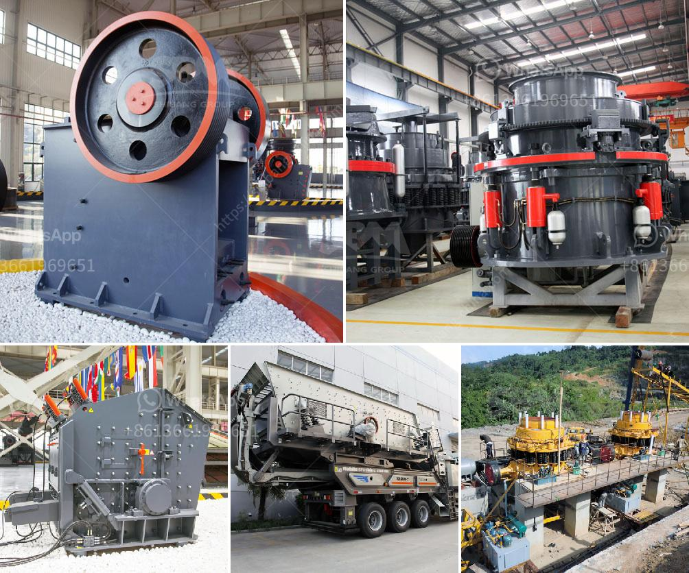

<h3>ball mill grinding micronizer</h3>
The ball mill grinding micronizer is a highly versatile and efficient tool for size reduction of particles in the mineral, chemical, and pharmaceutical industries. This device is primarily used for grinding and blending materials that are brittle, semi-hard or extremely hard, with a precision-controlled size distribution. With its simple design, ease of operation, and cost-effectiveness, the ball mill micronizer is an essential tool for many manufacturing processes.

The principle of operation of the ball mill grinding micronizer is relatively simple. The grinding chamber is filled with grinding media, which may be made of various materials such as steel, ceramic, or even natural stone. The material to be ground is introduced into the chamber, and the grinding media exert mechanical forces on the particles, resulting in their reduction in size. The rotation of the chamber, combined with the cascading motion of the grinding media, ensures an efficient grinding action.

One of the key advantages of the ball mill grinding micronizer is its ability to produce a narrow and well-defined particle size distribution. This is achieved by controlling various parameters such as the rotation speed of the mill, the size and shape of the grinding media, and the residence time of the material inside the chamber. By adjusting these parameters, manufacturers can produce particles of different sizes, ranging from a few microns to several millimeters, with a high degree of precision.

The ball mill micronizer is widely used in many industrial processes due to its versatility. It can be used for grinding a wide range of materials, including minerals, ores, chemicals, and pharmaceuticals. In the mining industry, the micronizer is employed to grind minerals to a fine powder, which is then used as feedstock for downstream processing. In the chemical and pharmaceutical industries, it is used to grind raw materials for their subsequent formulation into products such as pigments, cosmetics, and pharmaceutical tablets.

Furthermore, the ball mill grinding micronizer is known for its energy efficiency. Compared to other grinding mills, such as hammer mills or impact mills, the ball mill consumes less energy per unit of material processed. This makes it a cost-effective solution for manufacturers seeking to reduce their energy consumption and, consequently, their operating costs.

In conclusion, the ball mill grinding micronizer is a versatile and efficient tool for size reduction of particles. Its simple design, ease of operation, and cost-effectiveness make it an essential equipment in various industries, including mineral processing, chemical manufacturing, and pharmaceutical production. Whether grinding minerals, chemicals, or pharmaceuticals, the micronizer ensures a precise and uniform particle size distribution. Additionally, its energy efficiency contributes to cost savings for manufacturers. Overall, the ball mill grinding micronizer is a valuable investment for any manufacturing process that requires size reduction of particles.
<h3>Contact us</h3><ul><li><strong>Whatsapp:&nbsp;<a href="https://wa.me/8613661969651">+8613661969651</a></strong></li><li><a href="https://swt.shibang-china.com/?git&amp;zhl&amp;ball mill grinding micronizer"><strong>Online Service(chat now)</strong></a></li></ul><h3>Related</h3><ul><li><a href='grinding marble stone price.md'>grinding marble stone price</a></li><li><a href='stone jaw crusher ppt for seminar.md'>stone jaw crusher ppt for seminar</a></li><li><a href='belt conveyor belt suppliers in oman.md'>belt conveyor belt suppliers in oman</a></li><li><a href='sell 150 tph stone crusher.md'>sell 150 tph stone crusher</a></li><li><a href='crusher sri lanka.md'>crusher sri lanka</a></li></ul>