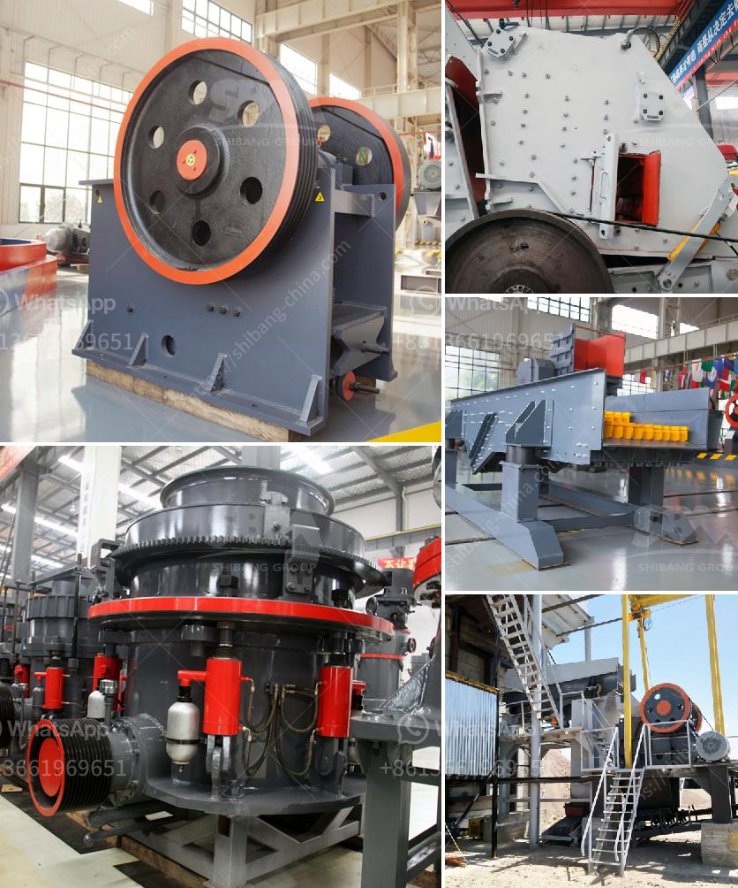

<h3>ball mill hammer mill roller mill machine</h3>
Ball mill, hammer mill, and roller mill are three common grinding equipment used in various industries. While they have relatively similar principles, they each have their unique advantages and disadvantages. This article will explore the differences between these machines and discuss their specific applications.

The ball mill is a cylindrical machine that is used to grind materials like ores, chemicals, ceramics, paints, and more. It is commonly used in mineral processing, building materials, metallurgy, and chemical industries. The ball mill works by rotating a cylinder with grinding balls, causing the balls to fall back into the cylinder and onto the material to be ground. The rotation is usually between 4 to 20 revolutions per minute, depending on the diameter of the mill. The larger the diameter, the slower the rotation, resulting in a finer grind size.

The hammer mill, on the other hand, is a machine used to shred or crush materials into smaller pieces. It consists of a rotor with hammers attached, which spin at high speed inside a chamber. The material is fed into the chamber and struck by the hammers, breaking it into smaller particles. Hammer mills are widely used in the food processing, pharmaceutical, and cosmetic industries, as well as in the chemical and agricultural sectors.

Finally, the roller mill is a versatile and efficient machine used in various industries to reduce and grind materials into smaller particles. It consists of two large metal rollers that rotate in opposite directions at different speeds. The material to be ground is fed between the rollers and is gradually crushed, sheared, and ground as it passes through the gap between them. Roller mills are commonly used in the agricultural, food processing, chemical, and mining industries.

When comparing these machines, several factors need to be considered. The ball mill is known for its high efficiency and uniform particle size distribution due to its ability to grind material continuously. However, it requires a significant amount of energy and is not suitable for grinding heat-sensitive materials. The hammer mill, on the other hand, is ideal for crushing fibrous, sticky, or soft materials, making it suitable for grinding spices, grains, and animal feed. However, it produces a wider particle size distribution compared to the ball mill.

The roller mill, on the other hand, offers better control over particle size distribution and is suitable for both wet and dry grinding. It is commonly used in the mining industry for producing finely ground ores and in the food industry for producing flour. However, it tends to be more expensive and has a higher maintenance cost compared to the other two machines.

In conclusion, the ball mill, hammer mill, and roller mill are three different grinding machines with their advantages and disadvantages. The ball mill is suitable for grinding a variety of materials, while the hammer mill and roller mill are suitable for crushing and grinding fibrous and soft materials. Ultimately, the choice of machine will depend on the specific needs of the application and the desired particle size distribution.
<h3>Contact us</h3><ul><li><strong>Whatsapp:&nbsp;<a href="https://wa.me/8613661969651">+8613661969651</a></strong></li><li><a href="https://swt.shibang-china.com/?git&amp;zhl&amp;ball mill hammer mill roller mill machine"><strong>Online Service(chat now)</strong></a></li></ul><h3>Related</h3><ul><li><a href='second hand cement mill in india.md'>second hand cement mill in india</a></li><li><a href='small cement plant for sale.md'>small cement plant for sale</a></li><li><a href='ball mills price.md'>ball mills price</a></li><li><a href='mini cement plant grinding project report.md'>mini cement plant grinding project report</a></li><li><a href='crusher machine for mineral powder.md'>crusher machine for mineral powder</a></li></ul>