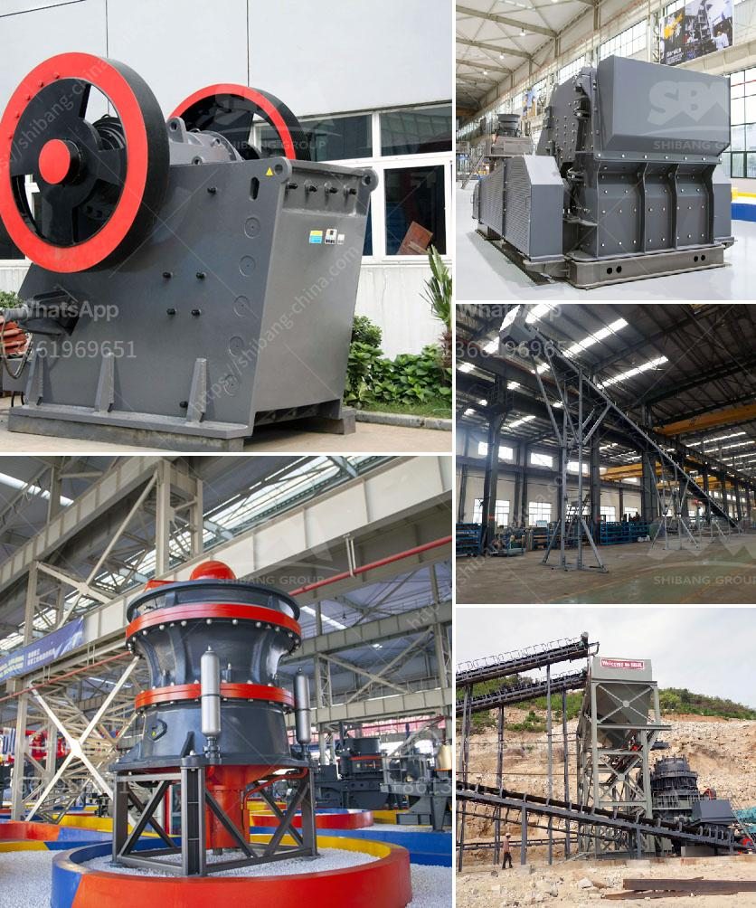

<h3>ball mill hammer</h3>
Ball mill and hammer mills are among the most commonly used mechanical equipment for reducing the size of materials in various industries. They are essential tools in the field of solid waste management, chemical processing, mineral processing, and mining. However, while both machines serve similar functions, they operate differently and have distinct advantages and disadvantages.

A ball mill is a type of grinder used to grind and blend materials for use in mineral dressing processes, paints, pyrotechnics, ceramics, and selective laser sintering. It works on the principle of impact and attrition: size reduction is done by impact as the balls drop from near the top of the shell. A ball mill consists of a hollow cylindrical shell rotating about its axis. The axis of the shell may be either horizontal or at a small angle to the horizontal. It is partially filled with balls. The grinding media are the balls, which may be made of steel, stainless steel, ceramic, or rubber.

On the other hand, a hammer mill works on the principle of impact: materials are impacted by the hammer bars and is thereby shredded and expelled through screens in the drum of a hammer mill. The size of the openings in the hammer mill screens determines the particle size and grinding efficiency. The hammer mill is used to grind various materials, including grains, herbs, wood chips, and other biomass materials.

One advantage of the ball mill is that it is suitable for grinding materials of all degrees of hardness. It can be used for both wet and dry grinding processes, which further expands its range of applications. Additionally, the relatively simple design and construction of a ball mill make it easy to maintain and operate. Also, since the balls are made of different materials and hardness, they can be used for sensitive materials, such as explosive powders.

On the other hand, a hammer mill offers several advantages as well. First, it is a versatile milling machine that can grind and shred various materials effectively and efficiently. Second, it is a cost-effective solution for grinding and reducing the size of materials. Third, it is easy to operate and maintain, with minimal requirements for operational expertise. Lastly, hammer mills are compact in size and can fit into small spaces, making them suitable for small-scale operations.

In conclusion, both ball mills and hammer mills are valuable tools in various industries. They have their own advantages and disadvantages, and the choice between them depends on the specific requirements of the application. Understanding the differences in operation, design, and capabilities helps in selecting the most suitable machine for a particular task. Regardless of the choice, regularly maintaining and optimizing the performance of these machines is crucial to ensure efficient and reliable operation.
<h3>Contact us</h3><ul><li><strong>Whatsapp:&nbsp;<a href="https://wa.me/8613661969651">+8613661969651</a></strong></li><li><a href="https://swt.shibang-china.com/?git&amp;zhl&amp;ball mill hammer"><strong>Online Service(chat now)</strong></a></li></ul><h3>Related</h3><ul><li><a href='stone crusher machine uk.md'>stone crusher machine uk</a></li><li><a href='how to extract gold from river sand.md'>how to extract gold from river sand</a></li><li><a href='supplier of vibrating screen in philippines.md'>supplier of vibrating screen in philippines</a></li><li><a href='quarry stone for sale in malta.md'>quarry stone for sale in malta</a></li><li><a href='jaw crusher typex.md'>jaw crusher typex</a></li></ul>