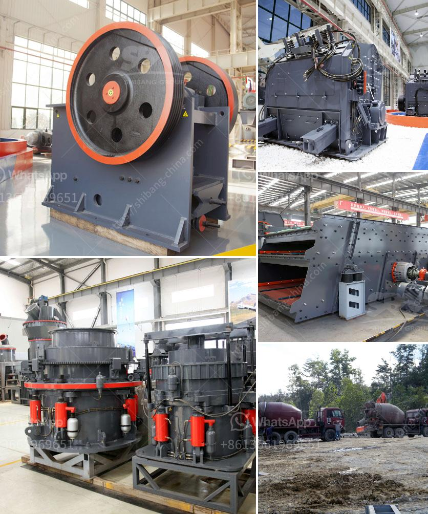

<h3>ball mill inching drive</h3>
A ball mill inching drive is a device used to rotate a ball mill grinding drum, typically installed on a conveyor belt gearbox or electromechanical coupling. The mill is used for grinding minerals or other materials, and it is widely used in the mining and construction industries.

The inching drive allows the mill to rotate slowly and steadily without causing any damage to the motor or other machinery parts. This is particularly important when starting up the mill, as a sudden jolt could potentially damage the equipment. The inching drive also provides flexibility in terms of controlling the mill's rotational speed during operation.

The inching drive consists of an electric motor with a gearbox and brake system. The motor is connected to the gearbox, which drives the mill drum. The brake system ensures that the drum stops quickly when the inching drive is disengaged. This prevents any unwanted movement of the drum while maintenance or repairs are being carried out.

Inching drives are commonly used in large ball mills where the power required to rotate the mill is in the range of several megawatts. These drives can be used to rotate the mill either clockwise or counterclockwise, depending on the specific requirements of the application.

Overall, the ball mill inching drive is an important piece of equipment for the grinding mill operation and maintenance. It ensures the smooth and safe rotation of the mill drum during operation, and allows for easy maintenance and repair. With proper care and maintenance, the inching drive can greatly prolong the lifespan and reliability of the ball mill, contributing to the overall efficiency and productivity of the grinding process.
<h3>Contact us</h3><ul><li><strong>Whatsapp:&nbsp;<a href="https://wa.me/8613661969651">+8613661969651</a></strong></li><li><a href="https://swt.shibang-china.com/?git&amp;zhl&amp;ball mill inching drive"><strong>Online Service(chat now)</strong></a></li></ul><h3>Related</h3><ul><li><a href='mineral crusher processing plants china.md'>mineral crusher processing plants china</a></li><li><a href='double stage hammer crusher for stone.md'>double stage hammer crusher for stone</a></li><li><a href='limestone quarrying process.md'>limestone quarrying process</a></li><li><a href='cost to setup mini cement plant in india.md'>cost to setup mini cement plant in india</a></li><li><a href='used stone crusher in germany for sale.md'>used stone crusher in germany for sale</a></li></ul>