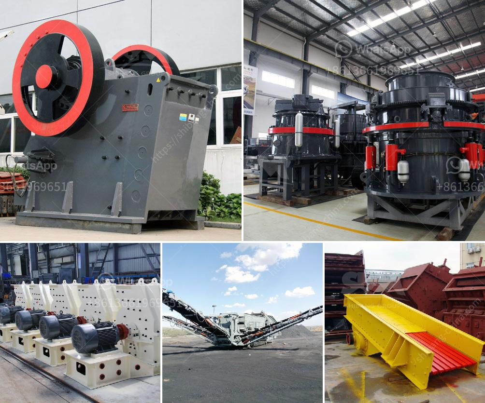

<h3>ball mill instrument equipment</h3>
The ball mill is a type of grinding equipment used in mineral processing plants, cement plants, and many other industrial applications. It rotates around a horizontal axis and uses grinding media to pulverize materials like ores, chemicals, ceramic raw materials and paints. The rotation speed of the ball mills determines the power draw and impacts the grinding efficiency. In general, ball mills are capable of grinding materials with a size range from 0.2mm to 75mm.

The ball mill instrument equipment is often used in mechanical alloying and mechanical milling. Alloying is a process that leads to the formation of new and superior materials with enhanced properties, such as improved strength or corrosion resistance. In mechanical alloying, the powder mixture is subjected to high-energy impacts, leading to a phase transformation and the formation of a homogeneous material.

The ball mill instrument equipment is also employed in mechanical milling, where different materials are milled and mixed together to form a composite powder. This technique is commonly used in the production of ceramic powders, where mixing of raw materials like oxides, carbides, or nitrides is required. Mechanical milling allows for the control of particle size, shape, and distribution, resulting in improved material properties.

The ball mill instrument equipment consists of a rotating cylinder filled with media (balls, ceramic pebbles, or stainless-steel balls) and the material to be ground. The cylinder is then rotated at a speed conducive to cascading or cataracting motion, impacting the grinding media against the material. As the rotation continues, the particles are ground down to the desired size.

One key advantage of the ball mill instrument equipment is its ability to continuously operate, allowing for the production of large quantities of materials. Additionally, the ball mill can be operated in a wet or dry state, making it suitable for a wide range of applications.

Several factors influence the efficiency of ball mill instrument equipment. Firstly, the speed of rotation plays a crucial role. Higher rotation speeds result in a greater impact force and more efficient grinding. However, excessively high speeds can lead to higher energy consumption and increased wear on the equipment.

The type and size of grinding media used in the ball mill instrument equipment also affect grinding efficiency. Different media materials have different properties, including hardness, density, and size. The ideal media should have a high density to ensure maximum grinding energy transfer, while also being hard enough to resist wear and tear.

In conclusion, the ball mill instrument equipment is a versatile grinding tool that can be used for a wide range of applications. Its ability to grind materials to a specific size and shape, combined with its continuous operation and the option to operate in wet or dry conditions, make it an essential piece of equipment in many industries. Improved understanding of the ball mill's operation and careful selection of the grinding media can maximize the efficiency and productivity of the equipment.
<h3>Contact us</h3><ul><li><strong>Whatsapp:&nbsp;<a href="https://wa.me/8613661969651">+8613661969651</a></strong></li><li><a href="https://swt.shibang-china.com/?git&amp;zhl&amp;ball mill instrument equipment"><strong>Online Service(chat now)</strong></a></li></ul><h3>Related</h3><ul><li><a href='easy operation kaolin grinding mill.md'>easy operation kaolin grinding mill</a></li><li><a href='mining process of mica crusher.md'>mining process of mica crusher</a></li><li><a href='stone quarry machines for sale.md'>stone quarry machines for sale</a></li><li><a href='sand washinng plant makers in srilanka.md'>sand washinng plant makers in srilanka</a></li><li><a href='crushing construction waste crusher.md'>crushing construction waste crusher</a></li></ul>