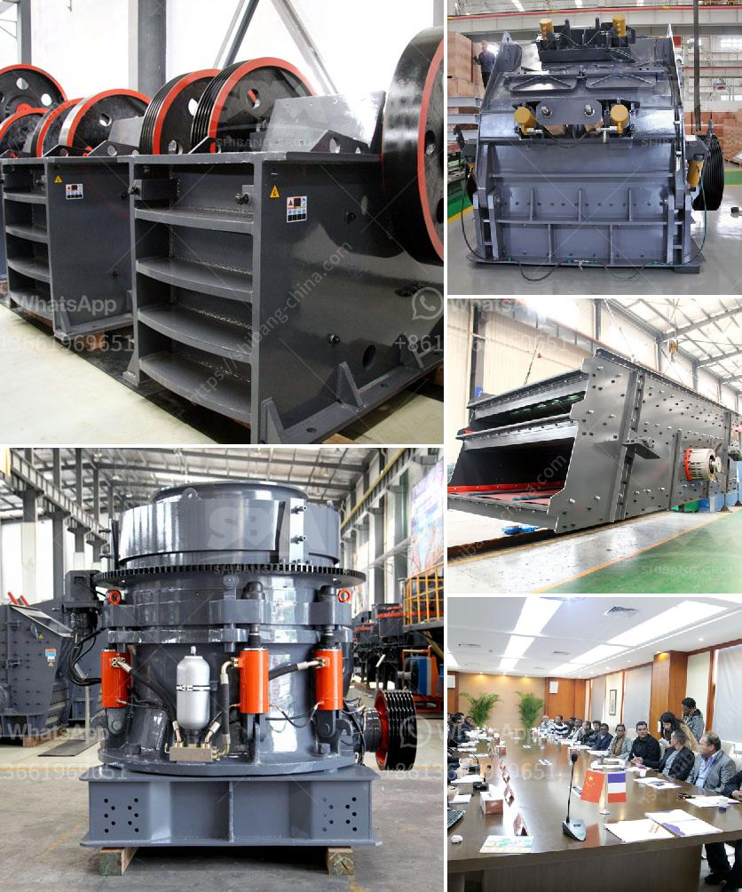

<h3>ball mill liners manufacturers</h3>
Ball mill is a key equipment to grind the crushed materials, and the ball mill is widely used in powder-making production line including cement, silicate, new-type building material, refractory material, fertilizer, ore dressing of ferrous metal and non-ferrous metal, glass ceramics, etc. And the ball mill can grind various ores and other materials with dry type and wet type. With the continuous development of mining machinery, ball mill liners are playing a vital role in the protection of ball mills.

Ball mill liners are the main components of the ball mill. They protect the inner shell of the cylinder from being impacted and worn directly by material and grind-ball. Ball mill liners are used to protect the cylinder from direct impact and friction from grinding media and materials. Different types of mill liners can be used to adjust the movement of materials, mainly using the liner of chute, wave crest, convex and concave shape, etc.

The importance of ball mill liners is often underestimated and sometimes overlooked. However, their role in the milling process cannot be ignored. The quality and lifespan of ball mill liners are crucial factors which influence the efficiency and productivity of ball mills. Therefore, it is essential to choose the right ball mill liner manufacturer.

There are many ball mill liner manufacturers in the market, and the quality and performance of their products vary greatly. To ensure the best performance and longest lifespan of ball mill liners, it is important to choose a manufacturer who has a strong reputation and expertise in the field. Here are some leading players in the industry:

Magotteaux is a worldwide supplier of mill liners and grinding media for the mining industry. They have a strong reputation for their high-quality products and expertise in this field. They offer a wide range of mill liners, including rubber mill liners, composite mill liners, and more. Magotteaux's mill liners are designed to provide exceptional performance and maximize the lifespan of ball mills.

Tega Industries is a leading manufacturer of mill liners used in various industries, including mining, power plants, and more. They offer a comprehensive range of mill liners, including rubber mill liners, composite mill liners, and more. Tega Industries' mill liners are known for their excellent abrasion resistance and are designed to withstand the toughest conditions.

Polycorp is a leading manufacturer of mill liners used in various industries, including mining, power plants, and more. They offer a wide range of mill liners, including rubber mill liners, composite mill liners, and more. Polycorp's mill liners are known for their high-quality construction and durability. They are designed to maximize the lifespan of ball mills and improve the overall efficiency of the milling process.

In conclusion, ball mill liners are essential components in the milling process, as they protect the inner shell of the cylinder from being impacted and worn directly by the materials and grinding media. Choosing the right ball mill liner manufacturer is crucial to ensure the best performance and longest lifespan of ball mill liners. Manufacturers like Magotteaux, Tega Industries, and Polycorp are leading players in the industry, known for their high-quality mill liners and expertise in the field. Investing in high-quality ball mill liners not only improves the efficiency of ball mills but also reduces downtime and maintenance costs, resulting in increased productivity and profitability.
<h3>Contact us</h3><ul><li><strong>Whatsapp:&nbsp;<a href="https://wa.me/8613661969651">+8613661969651</a></strong></li><li><a href="https://swt.shibang-china.com/?git&amp;zhl&amp;ball mill liners manufacturers"><strong>Online Service(chat now)</strong></a></li></ul><h3>Related</h3><ul><li><a href='jaw crusher machine in south africa.md'>jaw crusher machine in south africa</a></li><li><a href='manganese crushing machine in china.md'>manganese crushing machine in china</a></li><li><a href='fine grinding equipment.md'>fine grinding equipment</a></li><li><a href='mobile crusher capacity per hour.md'>mobile crusher capacity per hour</a></li><li><a href='chinese jaw crusher.md'>chinese jaw crusher</a></li></ul>