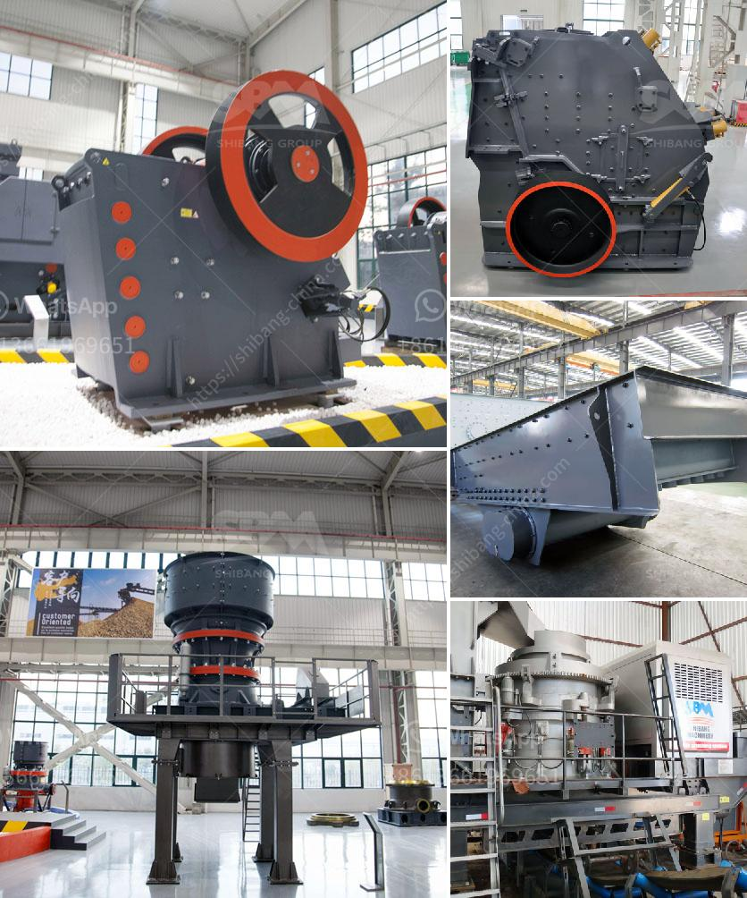

<h3>ball mill making from turkey</h3>
Ball mills are a type of grinding mill, which are employed in various industrial applications. Today, the term "ball mill" is often used interchangeably with "grinding mills" to denote the mill machinery used for various powder production processes. In Turkey, FABO Machinery is a professional manufacturer of mining machinery and equipment, producing mainly ball mills, crushers, and other auxiliary equipment. With cutting-edge technology and a dedicated workforce, FABO Machinery has been producing quality machinery for over a decade.

Ball mills are primarily used for fine grinding. They are key equipment in the mineral beneficiation process, used to grind various ores and other materials into smaller particles. The ball mill consists of a hollow cylindrical shell that rotates on its axis. Inside the cylinder, there are steel balls that grind the material as the cylinder rotates. The critical speed of the ball mill is the speed at which the centrifugal force is equal to the gravity on the inner surface of the mill, which means no ball falls from its position onto the mill shell. Ball mills are commonly used in the production of cement, silicate products, new building materials, refractory materials, fertilizers, black and non-ferrous metal dressings, and glass ceramics, among others.

Turkey, with its vibrant industrial sector, has a high demand for grinding mills. FABO Machinery has successfully met this demand with its high-quality ball mills. The company's ball mills are distinguished by their robust construction, excellent durability, and high grinding efficiency. These features have made FABO Machinery's ball mills highly sought after in Turkey and beyond.

FABO Machinery prides itself on its commitment to customer satisfaction. The company ensures that its ball mills are made with high-quality materials, employ the latest technology, and undergo strict quality control measures. Additionally, FABO Machinery offers comprehensive after-sales service, including technical support, maintenance, and spare part supply. This dedication to customer satisfaction has allowed FABO Machinery to establish itself as a trusted manufacturer of ball mills in Turkey.

In conclusion, FABO Machinery is a leading manufacturer of ball mills in Turkey. With its commitment to quality and customer satisfaction, the company has gained a strong reputation in the industry. Its ball mills are widely used in various industrial applications, offering high grinding efficiency and durability. FABO Machinery's success can be attributed to its skilled workforce, cutting-edge technology, and dedication to meeting the unique needs of its customers.
<h3>Contact us</h3><ul><li><strong>Whatsapp:&nbsp;<a href="https://wa.me/8613661969651">+8613661969651</a></strong></li><li><a href="https://swt.shibang-china.com/?git&amp;zhl&amp;ball mill making from turkey"><strong>Online Service(chat now)</strong></a></li></ul><h3>Related</h3><ul><li><a href='type of conveyors belt pdf.md'>type of conveyors belt pdf</a></li><li><a href='stone crushing machines.md'>stone crushing machines</a></li><li><a href='how much does gold mining licences in nigeria.md'>how much does gold mining licences in nigeria</a></li><li><a href='types of ball mill machine for gold.md'>types of ball mill machine for gold</a></li><li><a href='limestone powder machine in india.md'>limestone powder machine in india</a></li></ul>