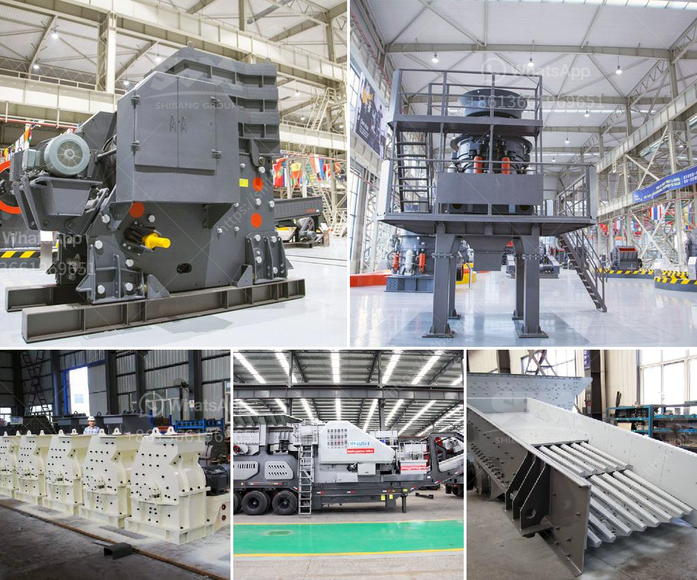

<h3>ball mill manufacturer in ahmedabad</h3>
Ahmedabad is well-known for its thriving textile and chemical industries. However, another industry that has experienced steady growth in the city is the manufacturing sector. One of the prominent manufacturers in Ahmedabad is the ball mill manufacturer.

Ball mills are used for grinding materials into fine powders after they have been crushed. They are widely used in cement, silicate products, new building materials, refractory materials, fertilizers, black and non-ferrous metal dressings, and glass ceramics. Ball mills are a key equipment to grind materials and are widely used in the production of cement, silicate products, new building materials, refractory materials, fertilizers, black and non-ferrous metal dressings, and glass ceramics.

In Ahmedabad, this industry has seen immense growth due to the increasing demand for ball mills in various sectors such as mining, cement, and pharmaceutical industries. This growth can be attributed to several factors, including the availability of skilled labor, a favorable business environment, and advanced manufacturing capabilities.

There are several ball mill manufacturers in Ahmedabad that offer high-quality products at competitive prices. Some of the key players in the industry include Rotech Engineers, Eros Engg Works, Aavishkar Machinery Pvt. Ltd., and Technomart India.

Rotech Engineers is a leading manufacturer of ball mills in Ahmedabad. They offer a wide range of ball mills that are designed to meet the diverse needs of different industries. Their ball mills are known for their robust construction, low maintenance requirements, and reliability. The company also offers customization options to meet specific customer requirements.

Eros Engg Works is another prominent ball mill manufacturer in Ahmedabad. They specialize in designing and manufacturing high-quality ball mills that are used in various industrial applications. The company's ball mills are known for their efficiency and durability. Moreover, they have a strong focus on customer satisfaction and offer excellent after-sales service.

Aavishkar Machinery Pvt. Ltd. is a well-established manufacturer of ball mills in Ahmedabad. They have been in the industry for several years and have gained a good reputation for their reliable products. The company's ball mills are known for their excellent performance, high productivity, and low maintenance requirements. They also provide excellent technical support to their customers.

Technomart India is a leading manufacturer of ball mills in Ahmedabad. They offer a wide range of ball mills that are suitable for different applications. The company's ball mills are known for their superior quality, high efficiency, and long service life. They also provide excellent technical support and ensure timely delivery of products to their customers.

In conclusion, the ball mill manufacturing industry in Ahmedabad has experienced significant growth due to the increasing demand for ball mills in various sectors. The city is home to several reputable manufacturers that offer high-quality products with competitive prices. These manufacturers strive to provide the best products and services to their customers, ensuring customer satisfaction and long-term success in the industry.
<h3>Contact us</h3><ul><li><strong>Whatsapp:&nbsp;<a href="https://wa.me/8613661969651">+8613661969651</a></strong></li><li><a href="https://swt.shibang-china.com/?git&amp;zhl&amp;ball mill manufacturer in ahmedabad"><strong>Online Service(chat now)</strong></a></li></ul><h3>Related</h3><ul><li><a href='secondary zinc production equipment.md'>secondary zinc production equipment</a></li><li><a href='mobile aggregate crusher.md'>mobile aggregate crusher</a></li><li><a href='sand making machine suppliers in coimbatore.md'>sand making machine suppliers in coimbatore</a></li><li><a href='ball mill for manufacturing.md'>ball mill for manufacturing</a></li><li><a href='screen vibrating screen for sand.md'>screen vibrating screen for sand</a></li></ul>