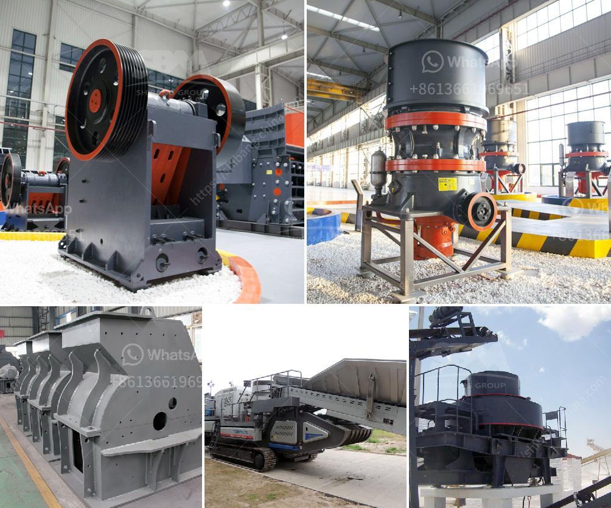

<h3>ball mill manufacturers china</h3>
Ball mills are widely used in the production of cement, silicate products, new building materials, refractory materials, fertilizers, black and non-ferrous metal dressings, and glass ceramics, among others. They are the vital equipment for grinding after the crushing process to meet the industry's demands. China, as a leader in the mining machinery industry, is undoubtedly among the most prominent ball mill manufacturers globally. With its extensive expertise in the production of various types of ball mills, China stands out in the market and is always ready to provide you with the most advanced technology and materials.

One of the primary reasons why China is a leader in ball mill manufacturing is its aim to improve manufacturing techniques. China's ball mill manufacturers have achieved remarkable success in reducing the energy consumption of the grinding process. As a result, customers can save substantial amounts of energy when using China-made ball mills. Additionally, the advanced technology and manufacturing processes employed by these manufacturers enable them to produce high-quality ball mills, ensuring greater durability and longer service life.

Furthermore, China's ball mill manufacturers understand the importance of innovation in the industry. They constantly strive to introduce new technological advancements to enhance the grinding process. These manufacturers invest heavily in research and development to create innovative solutions. As a result, China-made ball mills are equipped with the latest technology, such as intelligent operation systems, modular designs, and automatic control systems. These advancements greatly enhance the efficiency and productivity of the grinding process.

Chinese ball mill manufacturers also focus on environmental protection. They understand that sustainable development is crucial for the future of the industry. To reduce environmental impact, China-made ball mills are designed to minimize noise, dust, and emissions during operation. These manufacturers prioritize the use of eco-friendly materials and strictly comply with environmental regulations to ensure a cleaner and healthier working environment.

In addition to advanced technology and environmental considerations, Chinese ball mill manufacturers also excel in providing excellent customer service. They prioritize customer satisfaction and offer comprehensive after-sales support. Whether it is technical support, spare parts supply, or equipment maintenance, China's ball mill manufacturers are committed to providing prompt and efficient services to their customers worldwide.

In conclusion, China has emerged as a leading ball mill manufacturing hub due to its focus on technological innovation, energy efficiency, environmental protection, and customer satisfaction. These ball mill manufacturers are constantly striving to improve their products and services to meet the ever-growing demands of various industries. By opting for China-made ball mills, customers can benefit from high-quality, efficient, and eco-friendly grinding solutions.
<h3>Contact us</h3><ul><li><strong>Whatsapp:&nbsp;<a href="https://wa.me/8613661969651">+8613661969651</a></strong></li><li><a href="https://swt.shibang-china.com/?git&amp;zhl&amp;ball mill manufacturers china"><strong>Online Service(chat now)</strong></a></li></ul><h3>Related</h3><ul><li><a href='picture of a sand washing plant in uae.md'>picture of a sand washing plant in uae</a></li><li><a href='vertical shaft impact crusher.md'>vertical shaft impact crusher</a></li><li><a href='crossley economy x ball mill.md'>crossley economy x ball mill</a></li><li><a href='list of the price of crushing plant turkey.md'>list of the price of crushing plant turkey</a></li><li><a href='sayaji jaw crusher x specifiion.md'>sayaji jaw crusher x specifiion</a></li></ul>