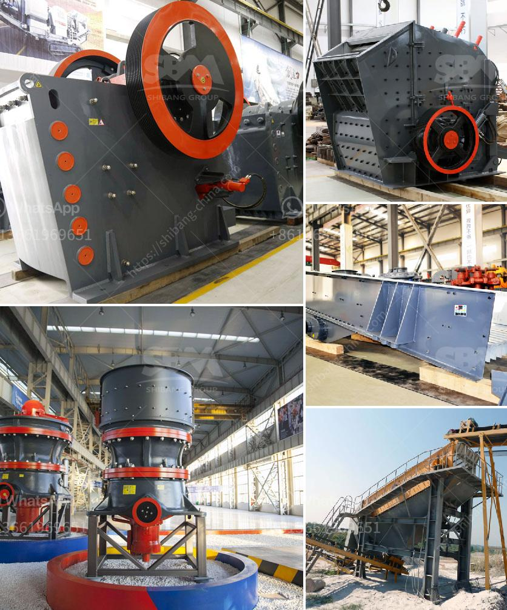

<h3>ball mill mesh output</h3>
A ball mill is a mechanical grinding device that utilizes steel balls as grinding media. It is typically used for grinding and blending materials in various industries such as cement, silicate, mineral processing, and others. Ball mills usually operate in a closed circuit where the product size is controlled by the size of the grinding media and the mill's operating conditions.

One of the important factors that determine the efficiency of a ball mill is the mesh size of the finished product. The mesh size refers to the number of openings or holes in a square inch of the screen through which the particles can pass. In other words, it indicates the size distribution of the ground material.

The mesh output of a ball mill is crucial because it directly affects the product's quality, reactivity, and further processing. For instance, in the cement industry, the fineness of the cement is typically controlled by the mesh size of the product from the ball mills. A finer mesh size results in a higher quality cement as it increases the reactivity and strength of the final product.

Various factors can influence the final mesh output of a ball mill. First and foremost is the size of the grinding media. Smaller media create finer particles, and vice versa. Adjusting the size of the media can be done by either changing the size of the balls or controlling their loading in the mill. The media size also affects the mill's grinding capacity and energy consumption.

Secondly, the speed of the mill also plays a significant role in determining the mesh output. The higher the rotational speed of the mill, the greater the centrifugal force exerted on the grinding media, resulting in finer particles. However, excessively high speeds can lead to overgrinding and increased wear of the mill liners.

Another critical factor is the duration of milling, commonly referred to as the residence time. The longer the residence time, the more chances there are for the particles to be ground to a smaller size. However, prolonged milling can also lead to particle agglomeration or excessive heat generation, affecting the product quality.

Other parameters, such as the feed rate, mill filling level, and mill diameter, should also be considered when optimizing the mesh output. These parameters are interrelated and require careful adjustment to achieve the desired product size distribution.

To conclude, the ball mill mesh output is a crucial indicator of grinding efficiency and product quality. It directly influences the reactivity and strength of the final product, making it an essential parameter to monitor and optimize in various industries. By controlling factors such as grinding media size, mill speed, residence time, and other operational parameters, manufacturers can ensure that their mills produce a consistent and high-quality product.
<h3>Contact us</h3><ul><li><strong>Whatsapp:&nbsp;<a href="https://wa.me/8613661969651">+8613661969651</a></strong></li><li><a href="https://swt.shibang-china.com/?git&amp;zhl&amp;ball mill mesh output"><strong>Online Service(chat now)</strong></a></li></ul><h3>Related</h3><ul><li><a href='double deck bunch crusher.md'>double deck bunch crusher</a></li><li><a href='mining process of mica crusher.md'>mining process of mica crusher</a></li><li><a href='alwar raymond mill manufacturers.md'>alwar raymond mill manufacturers</a></li><li><a href='production process of calcium carbonate.md'>production process of calcium carbonate</a></li><li><a href='industrial crusher machine.md'>industrial crusher machine</a></li></ul>