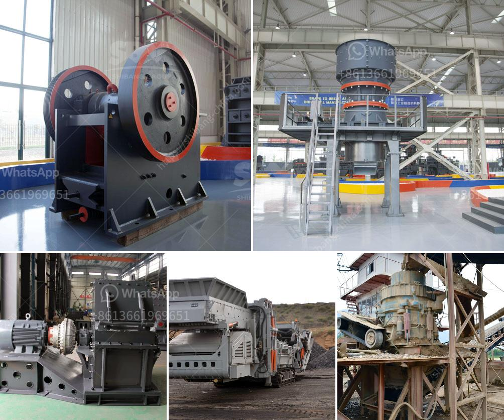

<h3>ball mill price supplier</h3>
In the mining and construction industry, ball mills are widely used to reduce the size of different materials for various purposes. In order to achieve the desired grinding outcome, it is essential to choose the right equipment. Price is an important factor when deciding on a ball mill supplier, as it will ultimately determine the investment cost. Let's delve into the key factors affecting ball mill prices and explore reputable suppliers in the market.

1. Equipment Quality: The quality of the ball mill significantly affects its price. High-quality materials and advanced production techniques are essential to ensure reliable performance and long-term durability. It is crucial to select a supplier known for manufacturing superior quality ball mills.

2. Production Capacity: The size and processing capacity of the ball mill can vary significantly across suppliers. Larger-sized ball mills usually have higher production capacities, which makes them more expensive. It is important to analyze the production requirements and choose a supplier capable of meeting those needs.

3. Technical Specifications: Different ball mills come with varying technical specifications, such as motor power, speed, and grinding media size. Technological advancements and customization options can also affect the price. Suppliers offering a wide range of specifications and customization options provide customers with more choices.

4. After-sales Service: It is important to consider the after-sales service provided by the supplier, as it impacts the overall cost-effectiveness of the equipment. Suppliers offering comprehensive maintenance and repair services ensure the smooth operation of the ball mill, minimizing downtime and reducing additional expenses.

1. Fote Machinery: Fote Machinery has been a prominent supplier of ball mills for years, known for its high-quality products and reliable service. With a wide range of models and specifications, Fote Machinery caters to various customer needs. Their ball mills are widely used in ore beneficiation, cement production, and other industries.

2. Henan Hongxing Mining Machinery Co., Ltd: Another trusted supplier in the market, Henan Hongxing Mining Machinery Co., Ltd offers ball mills with different specifications and capacities to meet diverse grinding requirements. With advanced technology and a strong focus on customer satisfaction, they have gained a loyal customer base worldwide.

3. Shanghai Zenith Minerals Co., Ltd: As a leading player in the mining and construction industry, Shanghai Zenith Minerals Co., Ltd provides high-quality ball mills at competitive prices. They have a diverse range of models suitable for both wet and dry grinding, ensuring versatility for customers.

In conclusion, choosing the right ball mill supplier is crucial for achieving efficient and cost-effective grinding operations. Factors such as equipment quality, production capacity, technical specifications, and after-sales service should be carefully considered. Reputable suppliers like Fote Machinery, Henan Hongxing Mining Machinery Co., Ltd, and Shanghai Zenith Minerals Co., Ltd can provide high-quality ball mills at competitive prices. Investing in reliable equipment will ultimately lead to long-term benefits and improved productivity.
<h3>Contact us</h3><ul><li><strong>Whatsapp:&nbsp;<a href="https://wa.me/8613661969651">+8613661969651</a></strong></li><li><a href="https://swt.shibang-china.com/?git&amp;zhl&amp;ball mill price supplier"><strong>Online Service(chat now)</strong></a></li></ul><h3>Related</h3><ul><li><a href='used vertical grinder mill for sale.md'>used vertical grinder mill for sale</a></li><li><a href='how to get aluminum from bauxite.md'>how to get aluminum from bauxite</a></li><li><a href='sand washinng plant makers in srilanka.md'>sand washinng plant makers in srilanka</a></li><li><a href='project report for starting a crusher plant in tamilnadu.md'>project report for starting a crusher plant in tamilnadu</a></li><li><a href='crushers for sale south africa.md'>crushers for sale south africa</a></li></ul>