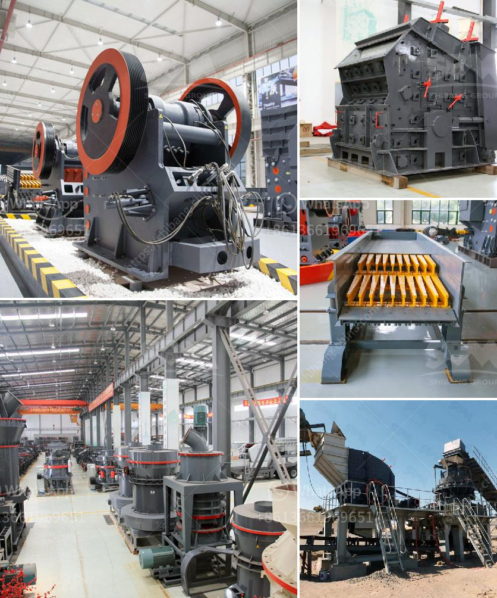

<h3>ball mill tons per hour capacity india</h3>
India is known for its immense coal reserves. According to the World Coal Association, India is the third-largest coal producer in the world, next to China and the United States. However, despite having abundant coal resources, the country still faces the challenge of meeting its growing energy demands.

To ensure that the coal mined in India is utilized efficiently, the country has invested in various technologies and equipment. One such equipment is the ball mill. Below is an article highlighting the benefits of ball mill tons per hour capacity India.

Crushing and pulverizing machines are essential equipment in several industries. For instance, in coal based thermal power plants, ball mills are used to pulverize coal before it is fed into the boilers. A ball mill consists of a rotating cylindrical shell filled with steel balls. The energy efficiency of ball mills can be enhanced by optimizing the rotational speed, grinding media size, and altering the grinding media shape.

The ball mill's working principle is simple: impact and attrition size reduction takes place as the balls drop from near the top of the shell. A ball mill consists of a hollow cylindrical shell rotating about its axis. The axis of the shell may be either horizontal or at a small angle to the horizontal. It is partially filled with balls or grinding media, predominantly steel balls or ceramic media.

The main objective of a ball mill is to grind large solid materials into a fine powder. Depending on the nature of the input material and the desired output size, the ball mill can be scaled up or down in size. With the capacity to handle tons of material per hour, ball mills play a critical role in India's energy-intensive industries.

India has a significant demand for power generation, and coal-based thermal power plants play a crucial role in meeting this demand. By pulverizing coal, ball mills ensure efficient combustion in the boilers, resulting in the production of high-quality steam or electricity.

A ball mill with a high capacity can generate more heat, which is beneficial for coal grinding, as the increased heat helps unlock the intrinsic properties of the coal and improves its combustibility. This leads to improved combustion efficiency and reduced environmental impact.

Furthermore, a ball mill with high capacity allows for lower maintenance costs and fewer shutdowns for repairs and replacements. This is particularly important for industries that heavily rely on ball mills for continuous operations.

The demand for ball mill tons per hour capacity in India has grown rapidly in recent years due to the country's industrialization and increasing energy needs. To meet this demand, Indian manufacturers have developed technologically advanced ball mills with improved efficiency and performance.

In conclusion, ball mill tons per hour capacity in India is an essential equipment for various industries, especially in the energy-intensive sectors such as power generation and mining. To ensure the optimal utilization of coal resources, Indian companies are investing in state-of-the-art ball mills with high capacities and advanced features. These equipment not only enhance energy efficiency but also contribute to reducing the environmental impact of coal utilization.
<h3>Contact us</h3><ul><li><strong>Whatsapp:&nbsp;<a href="https://wa.me/8613661969651">+8613661969651</a></strong></li><li><a href="https://swt.shibang-china.com/?git&amp;zhl&amp;ball mill tons per hour capacity india"><strong>Online Service(chat now)</strong></a></li></ul><h3>Related</h3><ul><li><a href='grinding mill machine price in chennai.md'>grinding mill machine price in chennai</a></li><li><a href='cost of the process of mining limestone.md'>cost of the process of mining limestone</a></li><li><a href='silica sand washing machine in south africa.md'>silica sand washing machine in south africa</a></li><li><a href='mobile crusher cone france.md'>mobile crusher cone france</a></li><li><a href='stone crusher machine uk.md'>stone crusher machine uk</a></li></ul>