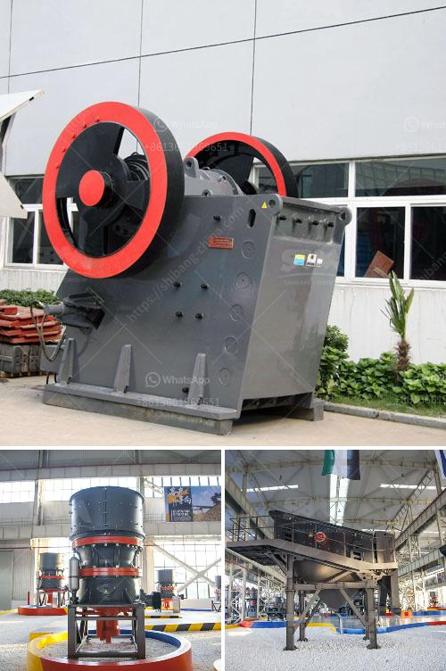

<h3>ball mill using industry</h3>
A ball mill is a type of grinder used to grind, blend, and sometimes for mixing of materials for use in mineral dressing processes, paints, pyrotechnics, ceramics, and selective laser sintering. It works on the principle of impact and attrition: size reduction is done by impact as the balls drop from near the top of the shell. A ball mill consists of a hollow cylindrical shell rotating about its axis. The axis of the shell may be either horizontal or at a small angle to the horizontal. It is partially filled with balls. The grinding media is the balls, which may be made of steel, stainless steel, ceramic, or rubber.

Ball mills are widely used in the production of cement, silicate products, new building materials, refractory materials, fertilizers, black and non-ferrous metal dressings, and glass ceramics, dry or wet grinding of various ores and other grindable materials. They are often used to remove edge materials such as tungsten slag in the cement industry or to grind mixed materials such as ores containing metal and non-metallic components.

In the mining industry, ball mills are commonly used to extract valuable minerals from ores. They are used for both primary and secondary grinding stages to reduce material sizes. Gold, copper, iron, and other base metal mines account for a large portion of ball mill market demand. These mills operate by rotating their cylindrical chambers to crush ore particles. As the balls inside them grind the material, they produce finer particles, allowing for efficient extraction of minerals.

Furthermore, the ball mill is extensively utilized in the construction industry as a key ingredient in the processing of lime and cement. Lime is widely used for soil stabilization and road construction, while cement is vital for constructing buildings, bridges, and infrastructure projects. The ball mill grinds the raw materials into fine powder, which can then be used to produce cement in the kiln.

In the chemical industry, ball mills are used to manufacture various chemicals, including black powder, explosives, and pyrotechnics. Black powder, which is used for civil construction and mining operations, can be ignited and explode. Pyrotechnics, on the other hand, are used for visual and auditory effects in entertainment, such as fireworks. Ball mills play a crucial role in the production of these chemicals by grinding and blending the necessary ingredients.

In conclusion, ball mills are indispensable tools in various industries across the globe. Whether it is cement production, mining, or chemical processing, ball mills are used to grind, blend, and mix materials to a fine powder. This enables efficient extraction of valuable minerals, production of construction materials, and the manufacturing of various chemicals. With their versatility and wide range of applications, ball mills have become an integral part of modern industry.
<h3>Contact us</h3><ul><li><strong>Whatsapp:&nbsp;<a href="https://wa.me/8613661969651">+8613661969651</a></strong></li><li><a href="https://swt.shibang-china.com/?git&amp;zhl&amp;ball mill using industry"><strong>Online Service(chat now)</strong></a></li></ul><h3>Related</h3><ul><li><a href='ball mill mesh output.md'>ball mill mesh output</a></li><li><a href='limestone ball milling.md'>limestone ball milling</a></li><li><a href='sand crusher machine hyderabad for sale.md'>sand crusher machine hyderabad for sale</a></li><li><a href='clay working clay powder making machine.md'>clay working clay powder making machine</a></li><li><a href='paint grinding ball mill.md'>paint grinding ball mill</a></li></ul>