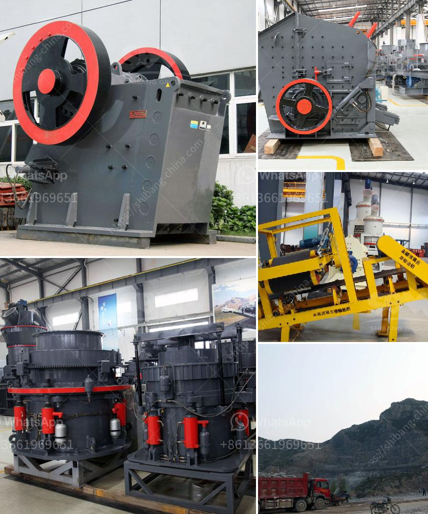

<h3>ball mill with high quality and best price</h3>
Ball mill is a key equipment for grinding materials, widely used in powder-making production line such as cement, silicate sand, new-type building material, refractory material, fertilizer, ore dressing of ferrous metal and non-ferrous metal, glass ceramics, etc. Ball mill can grind various ores and materials with dry type or wet type. There are two kinds of ball mills, grate type and overfall type due to different ways of discharging material.

When it comes to purchasing a ball mill, many customers would wonder how to choose a high-quality and cost-effective ball mill machine. Here, we will introduce the factors to be considered.

Firstly, the quality of the ball mill is crucial. The material of the mill barrel, lining, and grinding media should be the first thing to consider. In order to increase the service life of the ball mill, it is necessary to ensure that the material of the ball mill components is wear-resistant and durable. High-quality components will significantly reduce maintenance costs and improve the overall performance of the ball mill.

Secondly, the price is also an important factor to consider. While looking for a high-quality ball mill, it is essential to compare the prices of different suppliers. However, the lowest price does not necessarily mean the best deal. A low-priced ball mill might compromise on the quality or have limited functionality. It is crucial to find the right balance between quality and price.

In order to find the best price and high quality ball mill, it is recommended to do thorough research and comparisons. Look for reputable suppliers who have a good track record in manufacturing high-quality ball mills. Check their customer reviews and testimonials to ensure their credibility.

Additionally, consider the after-sales service provided by the supplier. A good supplier should offer reliable technical support, efficient delivery, and a warranty for their products. This will give you peace of mind knowing that if any issues arise with your ball mill, you can count on their assistance.

In conclusion, choosing a ball mill with high quality and best price is essential for the efficient grinding of materials. The factors to be considered are the quality of the mill barrel, lining, and grinding media, the reputation of the manufacturer, the after-sales service provided, and the overall cost-effectiveness. By carefully evaluating these factors, you can find a ball mill that meets your requirements and offers great value for your investment.

Investing in a high-quality ball mill will not only improve the efficiency of your grinding process but also contribute to the overall success of your production line. Make a well-informed decision and select a reliable supplier that can provide you with a ball mill with high quality and best price.
<h3>Contact us</h3><ul><li><strong>Whatsapp:&nbsp;<a href="https://wa.me/8613661969651">+8613661969651</a></strong></li><li><a href="https://swt.shibang-china.com/?git&amp;zhl&amp;ball mill with high quality and best price"><strong>Online Service(chat now)</strong></a></li></ul><h3>Related</h3><ul><li><a href='gyratory cone crusher manufacturers china.md'>gyratory cone crusher manufacturers china</a></li><li><a href='mobile crushing plant for sale.md'>mobile crushing plant for sale</a></li><li><a href='type of conveyors belt pdf.md'>type of conveyors belt pdf</a></li><li><a href='stone crusher price of 30 tons per hour.md'>stone crusher price of 30 tons per hour</a></li><li><a href='price pe 600 900 stone crusher.md'>price pe 600 900 stone crusher</a></li></ul>