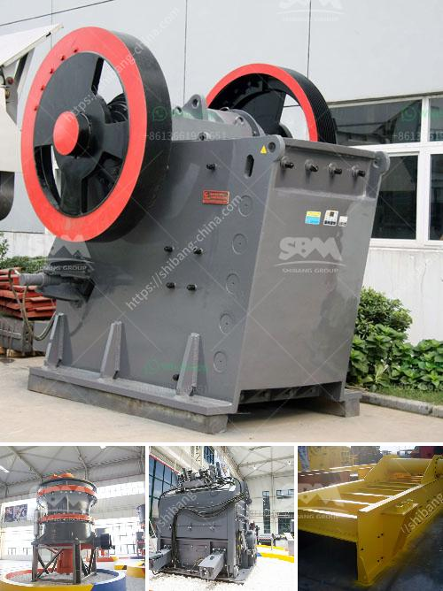

<h3>ball milling in bangalore</h3>
Bangalore, the vibrant capital of Karnataka, is renowned for its thriving industrial sector and technological advancements. Among the myriad of manufacturing processes, ball milling has emerged as a game-changer, offering numerous benefits to various industries. This article delves into the fascinating world of ball milling and its significance in Bangalore's industrial landscape.

Ball milling is a mechanical process that involves the use of grinding media (balls) to refine particles and reduce the size of solids. This versatile technique is widely employed in various industries, including materials science, pharmaceuticals, mining, and more. By subjecting materials to intense impacts and friction, ball milling promotes the creation of finely ground particles, ensuring desirable properties and enhanced performance.

Bangalore, often referred to as India's Silicon Valley, boasts an extensive network of research institutions, engineering colleges, and industries. Hence, the city provides a conducive environment for the development and application of advanced manufacturing techniques such as ball milling. With its abundant resources and skilled workforce, Bangalore has become a hub for innovation, attracting numerous companies keen on harnessing the potential of ball milling.

1. Materials Science: Ball milling plays a crucial role in the development of advanced materials with unique properties. By altering the size, shape, and composition of particles, researchers can tailor materials for specific applications. Bangalore-based research institutions and manufacturing companies are actively engaged in using ball milling to create advanced alloys, composites, and nanomaterials, which find applications in aerospace, automotive, and electronics industries.

2. Pharmaceuticals: The pharmaceutical industry in Bangalore heavily relies on ball milling to produce active pharmaceutical ingredients (APIs) and drug formulations. Ball milling ensures consistent particle size reduction, enabling better drug absorption and precise dosage control. This technique plays a critical role in the production of oral solid dosage forms, like tablets and capsules, thereby improving patient outcomes.

3. Mining and Mineral Processing: Bangalore, along with its neighboring regions, is home to several mines and mineral processing facilities. Ball milling is extensively used in the mining industry to crush and grind ores efficiently. This process ensures optimal liberation of valuable minerals, allowing for improved resource recovery and reduced environmental impact. Additionally, ball milling enables the production of finely ground mineral powders used in ceramics, paints, and coatings.

Despite its numerous advantages, ball milling is not without challenges. Process optimization, equipment maintenance, and high energy consumption are areas that require continuous attention. However, with endeavors towards research and development, Bangalore has the potential to overcome these challenges and further establish itself as a leading center for ball milling expertise.

Furthermore, the integration of ball milling with advanced manufacturing technologies, such as additive manufacturing and machine learning, holds tremendous potential for new breakthroughs. Collaborative efforts between academia, research institutions, and industries are essential to unlock the incredible possibilities presented by ball milling in Bangalore and beyond.

Ball milling has emerged as a crucial process in Bangalore's industrial landscape, providing immense opportunities for innovation and progress. Its applications across materials science, pharmaceuticals, mining, and more highlight its versatility and impact on enhancing product quality and performance. Bangalore's strong research infrastructure and skilled workforce position the city ideally to capitalize on the potential benefits of ball milling, promoting advancements in various industries and fostering economic growth.
<h3>Contact us</h3><ul><li><strong>Whatsapp:&nbsp;<a href="https://wa.me/8613661969651">+8613661969651</a></strong></li><li><a href="https://swt.shibang-china.com/?git&amp;zhl&amp;ball milling in bangalore"><strong>Online Service(chat now)</strong></a></li></ul><h3>Related</h3><ul><li><a href='crusher manufacturers in hyderabad.md'>crusher manufacturers in hyderabad</a></li><li><a href='cobble stone machine nigeria.md'>cobble stone machine nigeria</a></li><li><a href='ball milling in bangalore.md'>ball milling in bangalore</a></li><li><a href='companies of conveyor belts in mexico.md'>companies of conveyor belts in mexico</a></li><li><a href='hammer crusher parts.md'>hammer crusher parts</a></li></ul>